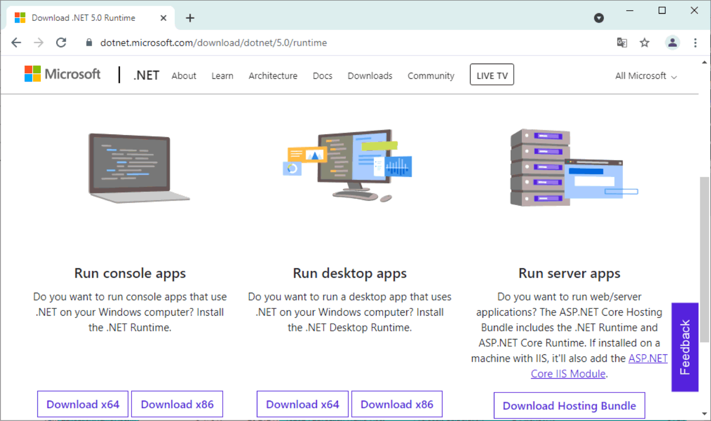
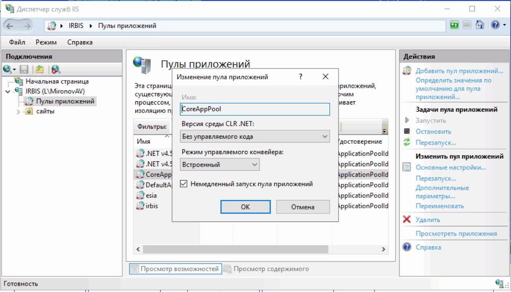
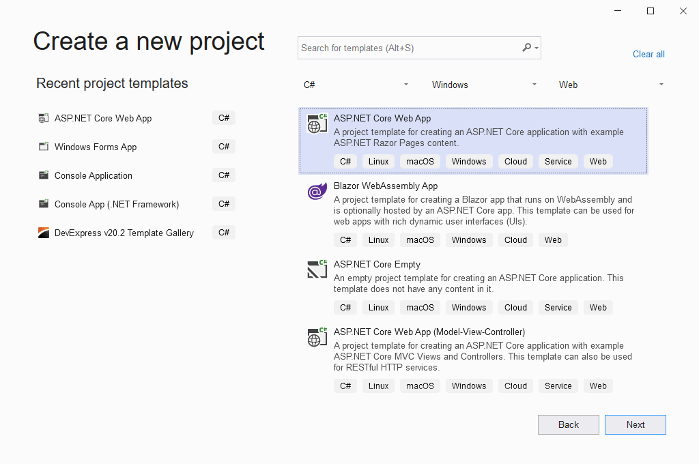
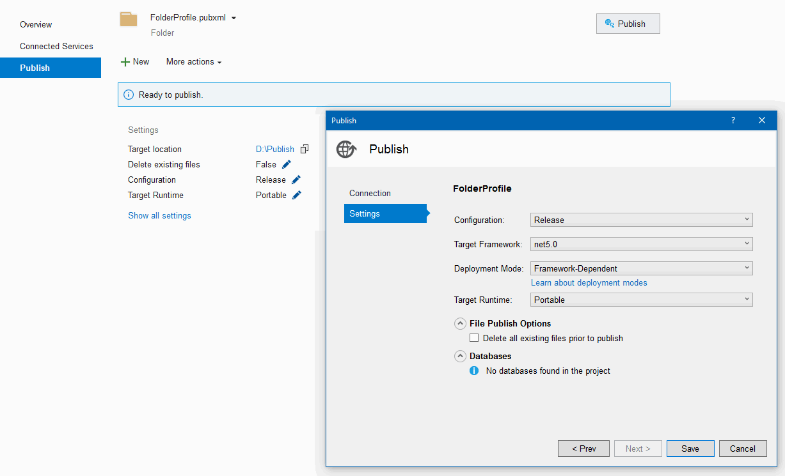
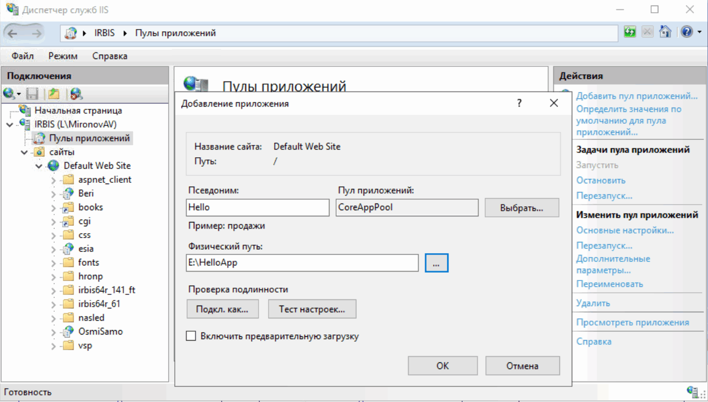
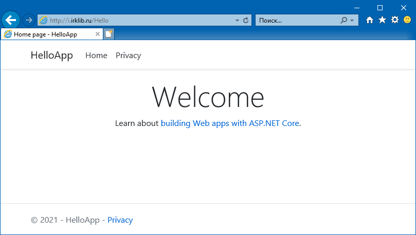

### Как опубликовать приложение ASP.NET Core на IIS

Допустим, у нас есть Windows Server с функционирующим IIS, и нам захотелось размещать на нем новейшие приложения, созданные с помощью ASP.NET 5. Вот как это делается.

Прежде всего, идём на https://dot.net и загружаем оттуда Hosting Bundle.

Установщик делает две вещи: 1) развертывает на машине рантайм ASP.NET Core и 2) устанавливает в IIS специальный обработчик, умеющий правильно запускать dotnet.exe. По окончании установки инсталлятор попросит нас перезапустить IIS, мы, конечно же, так и сделаем.

Теперь нам нужно создать пул для приложений ASP.NET Core. Как ни странно, нужно выставить «Без управляемого кода».

Отвлечемся на время от IIS и запустим Visual Studio, чтобы создать проект типа «ASP.NET Core Web App»

Назовем его бесхитростно «HelloApp» и просто согласимся с тем, что нам предложит Visual Studio. Наше приложение умеет выводить большую надпись «Welcome» — этого вполне достаточно для начала. Можно публиковать 🙂

Выберем папку `D:\Publish` (просто, чтобы было проще ее найти), с остальными настройками по умолчанию согласимся. Нажав на «Publish», получим россыпь файлов общим объемом примерно 4.6 Мб (большую часть из них составляют JavaScript-библиотеки, заботливо добавленные Microsoft в наш проект). Копируем их на сервер с IIS в папку, которую назовем, например, `E:\HelloApp`. Создаем в нашем сайте приложение «Hello», не забывая указать свежесозданный пул:

На всякий случай напомню, что IIS должен иметь права на чтение и запуск кода в папке `E:\HelloApp`, иначе ничего не получится. Осталось только зайти на сайт по адресу `/Hello` и убедиться, что надпись «Welcome» таки выводится.

Это было несложно.
