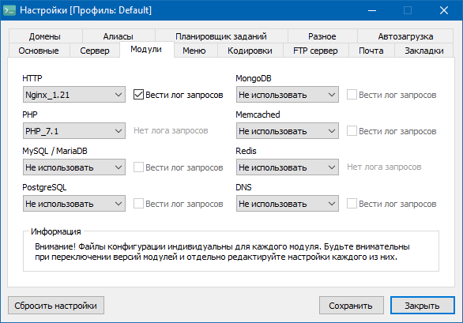
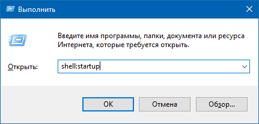
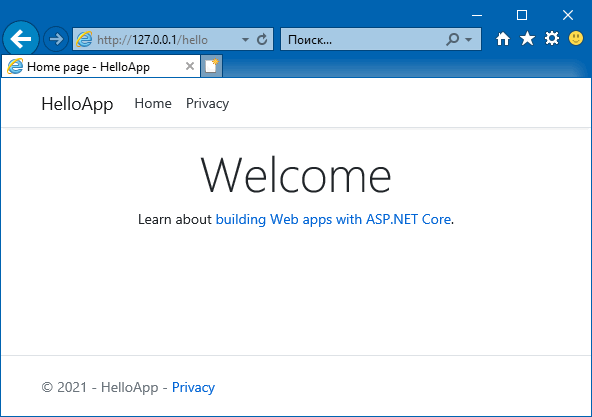

### ASP.NET 5 на Open Server

Конечно, ASP.NET имеет собственный HTTP-сервер, но может случиться так, что нам потребуется запустить ASP.NET-приложение на машине с Open Server Panel. Это нетрудно.

Во-первых, пишем стандартное Web-приложение:

```c#
using System;
using System.Collections.Generic;
using System.Linq;
using System.Threading.Tasks;
using Microsoft.AspNetCore.Builder;
using Microsoft.AspNetCore.Hosting;
using Microsoft.AspNetCore.HttpsPolicy;
using Microsoft.Extensions.Configuration;
using Microsoft.Extensions.DependencyInjection;
using Microsoft.Extensions.Hosting;
 
namespace HelloApp
{
    public class Startup
    {
        public Startup(IConfiguration configuration)
        {
            Configuration = configuration;
        }
 
        public IConfiguration Configuration { get; }
 
        // This method gets called by the runtime. Use this method to add services to the container.
        public void ConfigureServices(IServiceCollection services)
        {
            services.AddRazorPages();
        }
 
        // This method gets called by the runtime. Use this method to configure the HTTP request pipeline.
        public void Configure(IApplicationBuilder app, IWebHostEnvironment env)
        {
            if (env.IsDevelopment())
            {
                app.UseDeveloperExceptionPage();
            }
            else
            {
                app.UseExceptionHandler("/Error");
                // The default HSTS value is 30 days. You may want to change this for production scenarios, see https://aka.ms/aspnetcore-hsts.
                app.UseHsts();
            }
 
            // приложение не в корне
            app.UsePathBase("/hello");
             
            // HTTPS не надо
            // app.UseHttpsRedirection();
            app.UseStaticFiles();
 
            app.UseRouting();
 
            // пока не надо
            // app.UseAuthorization();
 
            app.UseEndpoints(endpoints => { endpoints.MapRazorPages(); });
        }
    }
}
```

Во-вторых, включаем в OSPanel NginX:



Добавляем в Nginx_N.NN_server.conf волшебные строчки (лучше через стандартный конфигуратор OSPanel!)

```
location /hello {
proxy_pass http://127.0.0.1:5000;
proxy_http_version 1.1;
}
```

В-третьих, каким-нибудь способом обеспечиваем автоматический запуск HelloApp.exe. Можно банально добавить его в автозагрузку, перетащив ярлык в папку «Startup»:



Можно пойти более сложным путем: сделать ASP.NET-приложение с помощью TopShelf и зарегистрировать его как сервис.

Запускаем, радуемся:



* * *

«Хорошо, если можно использовать NginX! А если Apache?», скажете Вы, уважаемый читатель, и будете совершенно правы. Вот как можно справиться с бедой в лице апача.

Во-первых, через конфигуратор OSPanel редактируем конфигурационный файл Apache_X.X_YYYYY_server.conf, раскомментируем в нем строчки

```
LoadModule   proxy_module            modules/mod_proxy.so
LoadModule   proxy_http_module       modules/mod_proxy_http.so
```

а в секцию VirtualHost добавляем строчку ProxyPass:

```
<VirtualHost *:%httpport%>
DocumentRoot            "%sprogdir%/modules/system/html/default"
ServerName              "default"
ServerAlias             "default"

    ProxyPass        "/hello" "http://127.0.0.1:5000/hello"
 
    <Location /openserver/server-status>
        SetHandler          server-status
        Require             all denied
        Require             ip 127.0.0.0/8 ::1/128
        Require             ip %ips%
        %allow%Require      all granted
    </Location>
 
    <Location /openserver/server-info>
        SetHandler          server-info
        Require             all denied
        Require             ip 127.0.0.0/8 ::1/128
        Require             ip %ips%
        %allow%Require      all granted
    </Location>

</VirtualHost>
```

Во-вторых, не забываем перезапустить апача. 🙂
