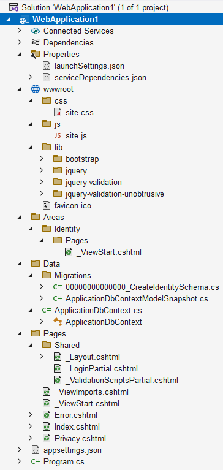

### Структура проекта

Свежесозданный проект Razor-приложения выглядит так:

* **wwwroot**: здесь хранятся статические файлы. CLI и IDE услужливо помещают сюда Bootstrap, JQuery и заготовки для наших CSS/Javascript-скриптов.

* **Pages**: как правило, именно сюда помещают все Razor-страницы. При желании местоположение может быть изменено. Здесь же располагается инфраструктурные файлы:

* **\_Layout.cshtml**: мастер-страница, в которую вставляются Razor-страницы

* **\_ViewStart.cshtml**: файл с настройками мастер-страницы

* **\_ViewImports.cshtml**: определяет директивы Razor, которые добавляются на каждую страницу Razor

* **\_ValidationScriptsPartial.cshtml**: частичное представление, которое подключает js-скрипты валидации на стороне клиента

* **Areas**: ???

* **Data**: организация работы с данными, в частности `DbContext` для подключения к базе данных пользователей и папка **Migrations** с миграциями, создаваемыми Entity Framework

* **Index.cshtml**, **Error.cshtml** и **Privacy.cshtml**: начальные Razor-страницы, которые предлагается наполнить содержимым по вкусу.

* **appsettings.json**: хранит конфигурацию приложения

* **Program.cs**: точка входа в приложение.
