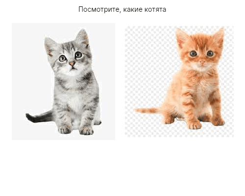

### Ресурсы

```xaml
<Window xmlns="https://github.com/avaloniaui"
        xmlns:x="http://schemas.microsoft.com/winfx/2006/xaml"
        Width="500"
        Height="400"
        x:Class="AvaloniaApp1.MainWindow"
        Title="AvaloniaApp1">
    <StackPanel
        Orientation="Vertical"
        >
        <TextBlock
            HorizontalAlignment="Center"
            Margin="10"
            >Посмотрите, какие котята</TextBlock>
        <StackPanel
            Orientation="Horizontal"
            HorizontalAlignment="Center"
            >
            <Image
                Source="/Assets/first.jpg"
                Margin="10" />
            <Image
                Source="/Assets/second.jpg"
                Margin="10" />
        </StackPanel>
    </StackPanel>
</Window>
```


