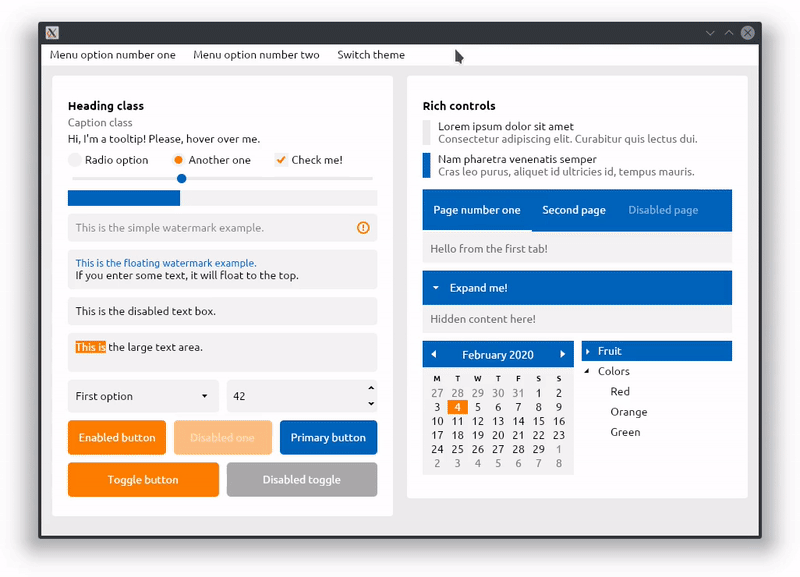

### Тема Citrus

Тема Fluent, входящая в стандартную поставку Avalonia, вполне пригодна к использованию, однако, выглядит довольно пресно. Дело в том, что она создана на основе Metro – стиля, разработанного для Windows 8. Он далеко не всем нравится. Поэтому в сообществе разработчиков существует запрос на более привлекательные и/или модерновые темы. Одной из таких тем является [Citrus](https://github.com/AvaloniaUI/Citrus.Avalonia) – бесплатная тема с открытым исходным кодом (картинка заимствована из проекта Citrus).



Как её использовать? Очень просто: достаточно подключить [NuGet-пакет](https://www.nuget.org/packages/Citrus.Avalonia) `Citrus.Avalonia` и поменять в App.axaml всего одну строчку

```xaml
<Application xmlns="https://github.com/avaloniaui"
             xmlns:x="http://schemas.microsoft.com/winfx/2006/xaml"
             x:Class="YourNamespace.App">
  <Application.Styles>
    <!-- The line below is the only thing you need to get started.
         Tested with Avalonia 0.9.0 only, although not with all controls. -->
    <StyleInclude Source="avares://Citrus.Avalonia/Citrus.xaml"/>
 
    <!-- To use other themes:
         1. Comment out *all* of the <StyleInclude /> lines.
         2. Uncomment *one* of the <StyleInclude /> lines below. -->
    <!-- <StyleInclude Source="avares://Citrus.Avalonia/Sea.xaml"/> -->
    <!-- <StyleInclude Source="avares://Citrus.Avalonia/Rust.xaml"/> -->
    <!-- <StyleInclude Source="avares://Citrus.Avalonia/Candy.xaml"/> -->
    <!-- <StyleInclude Source="avares://Citrus.Avalonia/Magma.xaml"/> -->
  </Application.Styles>
</Application>
```

Вместо NuGet-пакета можно включить Citrus в свой проект в качестве субмодуля git:

```sh
mkdir ./external
git submodule add git@github.com:worldbeater/Citrus.Avalonia.git ./external/citrus
# Reference the ../external/citrus/src/Citrus.Avalonia/Citrus.Avalonia.csproj project then.
# The ../external/citrus/src/Citrus.Avalonia.Sandbox/Citrus.Avalonia.Sandbox.csproj is 
# the sandbox where you can browse the markup samples.
```
