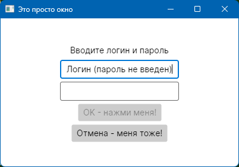

### Реактивные команды

Подключаем к приложению пакеты `ReactiveUI`, `ReactiveUI.Fody` и `Avalonia.Reactive` и организуем работу с командами правильно. Главное - не забыть дописать строчку `UseReactiveUI()` в создание приложения!



```csharp
using Avalonia;

using System;
using System.Diagnostics;

using Avalonia.Controls;
using Avalonia.Controls.ApplicationLifetimes;
using Avalonia.Data;
using Avalonia.Layout;
using Avalonia.ReactiveUI;
using Avalonia.Themes.Fluent;

using ReactiveUI;
using ReactiveUI.Fody.Helpers;

namespace AvaloniaApplication7;

internal static class Program
{
    [STAThread]
    public static void Main (string[] args) => BuildAvaloniaApp()
        .StartWithClassicDesktopLifetime (args);

    private static AppBuilder BuildAvaloniaApp()
        => AppBuilder.Configure<MyApp>()
            .UseReactiveUI()
            .UsePlatformDetect()
            .LogToTrace();
}

internal sealed class MyApp
    : Application
{
    public override void OnFrameworkInitializationCompleted()
    {
        var baseUri = new Uri ("avares://Avalonia.ThemeManager/Styles");
        Styles.Add (new FluentTheme (baseUri) { Mode = FluentThemeMode.Light });

        if (ApplicationLifetime is ClassicDesktopStyleApplicationLifetime classic)
        {
            classic.MainWindow = new MainWindow();
        }

        base.OnFrameworkInitializationCompleted();
    }
}

internal sealed class MyModel
    : ReactiveObject
{
    [Reactive] public string? SomeName { get; set; }

    [Reactive] public string? SomePassword { get; set; }
}

internal sealed class MainWindow
    : ReactiveWindow<MyModel>
{
    public MainWindow()
    { 
        Title = "Это просто окно";
        Width = 400;
        Height = 250;

        DataContext = new MyModel();

        Content = new StackPanel
        {
            HorizontalAlignment = HorizontalAlignment.Center,
            VerticalAlignment = VerticalAlignment.Center,
            Spacing = 5,
            Margin = new Thickness (10),
            Children =
            {
                new Label
                {
                    HorizontalAlignment = HorizontalAlignment.Center,
                    HorizontalContentAlignment = HorizontalAlignment.Center,
                    Content = "Вводите логин и пароль"
                },
                
                new TextBox
                {
                    Width = 200,
                    [!TextBox.TextProperty] = new Binding (nameof (MyModel.SomeName))
                },
                
                new TextBox
                {
                    Width = 200,
                    [!TextBox.TextProperty] = new Binding (nameof (MyModel.SomePassword))
                },
                
                new Button
                {
                    IsDefault = true,
                    HorizontalAlignment = HorizontalAlignment.Center,
                    Content = "OK - нажми меня!",
                    Command = ReactiveCommand.Create 
                        (
                            OkClicked,
                            OkEnabled()
                        )
                },
                
                new Button
                {
                    IsCancel = true,
                    HorizontalAlignment = HorizontalAlignment.Center,
                    Content = "Отмена - меня тоже!",
                    Command = ReactiveCommand.Create (CancelClicked)
                }
            }
        };
    }

    private IObservable<bool> OkEnabled()
    {
        return ViewModel!.WhenAnyValue 
            (
                x => x.SomeName,
                y => y.SomePassword,
                (x, y) => !string.IsNullOrEmpty (x) 
                          && !string.IsNullOrEmpty (y)
            );
    }

    private void OkClicked()
    {
        Debug.WriteLine ("OK");
        Close (true);
    }
    
    private void CancelClicked()
    {
        Debug.WriteLine ("Cancel");
        Close (false);
    }
}
```
