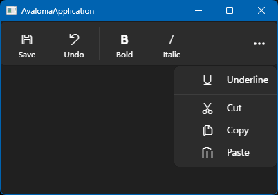

### Библиотека FluentAvaloniaUI

Полезная библиотека контролов и прочих нужных в хозяйстве вещей. GitHub: https://github.com/amwx/FluentAvalonia, NuGet: https://www.nuget.org/packages/FluentAvaloniaUI, документация, к сожалению, практически отсутствует :(

В App.axaml нужно не забыть подключить стили

```xaml
<Application xmlns="https://github.com/avaloniaui"
             xmlns:x="http://schemas.microsoft.com/winfx/2006/xaml"
             xmlns:sty="using:FluentAvalonia.Styling"
             x:Class="AvaloniaApplication.App">
    <Application.Styles>
        <FluentTheme Mode="Light"/>
        <sty:FluentAvaloniaTheme />
    </Application.Styles>
</Application>
```

Что нам доступно? Например, удобные векторные иконки


```xaml
<Window xmlns="https://github.com/avaloniaui"
        xmlns:x="http://schemas.microsoft.com/winfx/2006/xaml"
        xmlns:d="http://schemas.microsoft.com/expression/blend/2008"
        xmlns:mc="http://schemas.openxmlformats.org/markup-compatibility/2006"
        xmlns:ui="using:FluentAvalonia.UI.Controls"
        mc:Ignorable="d"
        Width="400" Height="250"
        x:Class="AvaloniaApplication.MainWindow"
        Title="AvaloniaApplication">
 
    <StackPanel
        HorizontalAlignment="Center"
        VerticalAlignment="Center"
        Spacing="8">
         
        <Label HorizontalAlignment="Center">Метка сверху</Label>
         
        <ui:SymbolIcon Symbol="Save" FontSize="32" />
         
        <Label HorizontalAlignment="Center">Метка снизу</Label>
 
    </StackPanel>
 
</Window>
```

или иконки на основе шрифта


```xaml
<ui:FontIcon Glyph="Ж" FontSize="32"
      FontFamily="Arial" FontWeight="Bold" FontStyle="Normal" />
```

Навигационное меню


```xaml
<ui:NavigationView x:Name="nvSample" Height="460" PaneDisplayMode="Left">
    <ui:NavigationView.MenuItems>
        <ui:NavigationViewItem Content="Menu Item1" Tag="SamplePage1" Icon="Play"/>
        <ui:NavigationViewItem Content="Menu Item2" Tag="SamplePage2" Icon="Save" />
        <ui:NavigationViewItem Content="Menu Item3" Tag="SamplePage3" Icon="Refresh" />
        <ui:NavigationViewItem Content="Menu Item4" Tag="SamplePage4" Icon="Download" />
    </ui:NavigationView.MenuItems>
</ui:NavigationView>
```

Табы


```xaml
<ui:TabView AddTabButtonClick="TabView_AddButtonClick"
  TabCloseRequested="TabView_TabCloseRequested" AttachedToVisualTree="TabView_Loaded" />
```

Полоска с командами-кнопками



```xaml
<ui:CommandBar>
    <ui:CommandBar.PrimaryCommands>
        <ui:CommandBarButton Icon="Save" Label="Save" />
        <ui:CommandBarButton Icon="Undo" Label="Undo" />
        <ui:CommandBarSeparator />
        <ui:CommandBarToggleButton Icon="Bold" Label="Bold" />
        <ui:CommandBarToggleButton Icon="Italic" Label="Italic" />
        <ui:CommandBarToggleButton Icon="Underline" Label="Underline" />
    </ui:CommandBar.PrimaryCommands>
    <ui:CommandBar.SecondaryCommands>
        <ui:CommandBarButton Icon="Cut" Label="Cut" />
        <ui:CommandBarButton Icon="Copy" Label="Copy" />
        <ui:CommandBarButton Icon="Paste" Label="Paste" />
    </ui:CommandBar.SecondaryCommands>
</ui:CommandBar>
```

Полоска с информацией


```xaml
<ui:InfoBar Title="Title"
        IsOpen="True"
        Severity="Success"
        Message="Essential app message for your users to be informed of, acknowledge, or take action on." />
```

Бэджики


```xaml
<StackPanel Spacing="5">
     
    <TextBlock Text="Attention" />
    <StackPanel Orientation="Horizontal" Spacing="20">
        <ui:InfoBadge Classes="Attention Icon" HorizontalAlignment="Right" />
        <ui:InfoBadge Classes="Attention" Value="1012323" HorizontalAlignment="Right" />
        <ui:InfoBadge Classes="Attention Dot" VerticalAlignment="Center" />
    </StackPanel>
 
    <TextBlock Text="Informational" />
    <StackPanel Orientation="Horizontal" Spacing="20">
        <ui:InfoBadge Classes="Informational Icon" HorizontalAlignment="Right" />
        <ui:InfoBadge Classes="Informational" Value="10" HorizontalAlignment="Right" />
        <ui:InfoBadge Classes="Informational Dot" VerticalAlignment="Center" />
    </StackPanel>
 
    <TextBlock Text="Success" />
    <StackPanel Orientation="Horizontal" Spacing="20">
        <ui:InfoBadge Classes="Success Icon" HorizontalAlignment="Right" />
        <ui:InfoBadge Classes="Success" Value="10" HorizontalAlignment="Right" />
        <ui:InfoBadge Classes="Success Dot" VerticalAlignment="Center" />
    </StackPanel>
 
    <TextBlock Text="Caution" />
    <StackPanel Orientation="Horizontal" Spacing="20">
        <ui:InfoBadge Classes="Caution Icon" HorizontalAlignment="Right" />
        <ui:InfoBadge Classes="Caution" Value="10" HorizontalAlignment="Right" />
        <ui:InfoBadge Classes="Caution Dot" VerticalAlignment="Center" />
    </StackPanel>
 
    <TextBlock Text="Critical" />
    <StackPanel Orientation="Horizontal" Spacing="20">
        <ui:InfoBadge Classes="Critical Icon" HorizontalAlignment="Right" />
        <ui:InfoBadge Classes="Critical" Value="10" HorizontalAlignment="Right" />
        <ui:InfoBadge Classes="Critical Dot" VerticalAlignment="Center" />
    </StackPanel>
</StackPanel>
```

FluentAvalonia поддерживает режим `High Contrast` Windows


Переключение режимов (светлый, темный, высокий контраст) темы осуществляется очень легко и просто:

```csharp
using FluentAvalonia.Styling;
...
 
var faTheme = AvaloniaLocator.Current.GetService<FluentAvaloniaTheme>();
faTheme!.RequestedTheme = "HighContrast"; // или "Light" или "Dark"
 
// если мы хотим автоматический "подхват" темы Windows, 
// устанавливаем следующее свойство
public bool PreferSystemTheme { get; set; } = true;
 
// можно использовать системные шрифты на Windows
public bool UseSystemFontOnWindows { get; set; } = true;
 
// для отдельного окна можно включить отрисовку стандартного заголовка
var thm = AvaloniaLocator.Current.GetService<FluentAvaloniaTheme>();
thm.ForceNativeTitleBarToTheme (window); // the Window object you want to force
```
