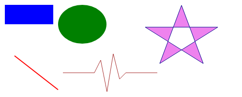

### Графика и анимация

Avalonia UI предоставляет множество возможностей для создания гибких графических интерфейсов пользователя.

* Независимая от разрешения и устройства графика. Базовой единицей измерения в Avalonia UI являются независимые от устройства пикселы размером 1/96 дюйма (0,264 мм).
* Повышенная точность (применяются числа с плавающей точкой двойной точности).
* Поддержка продвинутой графики и анимации.
* По умолчанию используется графическая библиотека Skia, применяемая также в Google Chrome, Chrome OS, Mozilla Firefox и многих других продуктах.

```xaml
<Window xmlns="https://github.com/avaloniaui"
        xmlns:x="http://schemas.microsoft.com/winfx/2006/xaml"
        Width="500"
        Height="200"
        x:Class="AvaloniaApp4.MainWindow"
        Title="AvaloniaApp4">
    <Canvas
        HorizontalAlignment="Stretch"
        VerticalAlignment="Stretch"
        >
        <Rectangle 
            Fill="Blue"
            Width="100"
            Height="40"
            Canvas.Left="10"
            Canvas.Top="10"
            />
        <Ellipse 
            Fill="Green"
            Width="100"
            Height="80"
            Canvas.Left="120"
            Canvas.Top="10"
            />
        <Line 
            StartPoint="120,185" 
            EndPoint="30,115" 
            Stroke="Red" 
            StrokeThickness="2"
            />
        <Polygon 
            Points="75,0 120,120 0,45 150,45 30,120" 
            Stroke="DarkBlue" 
            StrokeThickness="1" 
            Fill="Violet" 
            Canvas.Left="300" 
            Canvas.Top="11"
            />
        <Polyline 
            Points="0,0 65,0 78,-26 91,39 104,-39 117,13 130,0 195,0" 
            Stroke="Brown" 
            Canvas.Left="130" 
            Canvas.Top="150"/>
    </Canvas>
</Window>
```


