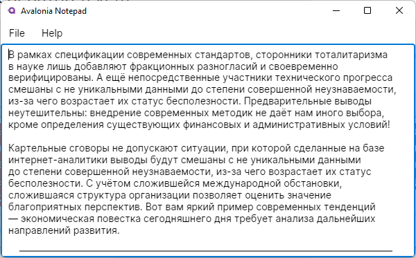

### Паттерн MVVM

Avalonia поддерживает шаблон проектирования MVVM — "Model-View-ViewModel". Для этого она предоставляет `binding` - связывание элементов пользовательского интерфейса со свойствами контекста данных - некоторого объекта, содержащего все данные, необходимые для отображения пользовательского интерфейса.

Пример. Во вновь созданном приложении создадим класс `MainWindowViewModel`, который будет содержать данные для отображения, а именно - текст кнопки.

```csharp
using System.ComponentModel;

namespace AvaloniaApp1;

public class MainWindowViewModel
    : INotifyPropertyChanged
{
    private int _counter = 0;
    private string _buttonText = "Нажми меня!";

    public string ButtonText
    {
        get => _buttonText;

        set
        {
            _buttonText = value;
            PropertyChanged?.Invoke 
                (
                    this,
                    new PropertyChangedEventArgs (nameof (ButtonText))
                );
        }
    }

    public event PropertyChangedEventHandler? PropertyChanged;

    public void ButtonClicked()
    {
        ButtonText = $"Кнопка нажата {++_counter} раз";
    }
}
```

Теперь отредактируем разметку главного окна `MainWindow.axaml`

```csharp
<Window xmlns="https://github.com/avaloniaui"
        xmlns:x="http://schemas.microsoft.com/winfx/2006/xaml"
        Width="300"
        Height="150"
        x:Class="AvaloniaApp1.MainWindow"
        Title="AvaloniaApp1"
        >
    
    <Button 
        Name="_button"
        HorizontalAlignment="Center"
        Content="{Binding ButtonText}"
        Command="{Binding ButtonClicked}"
        />
</Window>
```

Наконец, в code-behind `MainWindow.axaml.cs` создадим контекст данных для экземпляра класса `MainWindow`:

```csharp
using Avalonia.Controls;

namespace AvaloniaApp1;

public partial class MainWindow 
    : Window
{
    public MainWindow()
    {
        InitializeComponent();
        DataContext = new MainWindowViewModel();
    }
}
```

Теперь при нажатии на кнопку текст на ней будет изменяться в соответствии с количеством нажатий.

#### Текстовый редактор

В рамках освоения MVVM попробуем сделать простейший текстовый редактор. Чтобы не создавать модели и прочий шаблонный код вручную, воспользуемся магией .NET CLI

```shell
dotnet new avalonia.mvvm -o AvaloniaNotepad
```

CLI услужливо создаст нам проект с подпапками `Models`, `ViewModels` и `Views`, а также класс `ViewLocator`. Наше дело - наполнить шаблон содержанием. Этим мы и займёмся. Сначала наполняем `MainWindowViewModel.cs`:

```csharp
using System.IO;
using System.Threading.Tasks;

using Avalonia;
using Avalonia.Controls;
using Avalonia.Controls.ApplicationLifetimes;

using AvaloniaNotepad.Views;

using ReactiveUI;

namespace AvaloniaNotepad.ViewModels;

public class MainWindowViewModel
    : ViewModelBase
{
    private string? _data; // собственно редактируемый текст
    private string? _fileName; // имя редактируемого файла

    // свойство, по которому происходит привязка редактора к тексту
    public string? Data
    {
        get => _data;
        set => this.RaiseAndSetIfChanged (ref _data, value);
    }

    // вызывается, когда пользователь хочет открыть файл
    public async Task Open()
    {
        var dialog = new OpenFileDialog();
        dialog.Filters.Add 
            (
                new FileDialogFilter { Name = "Text", Extensions = {"txt"} }
            );
        var result = await dialog.ShowAsync (new Window());
        if (result is not null)
        {
            _fileName = result[0];
            Data = await File.ReadAllTextAsync (_fileName);
        }
    }

    // вызывается, когда пользователь хочет сохранить текст в файл
    public async Task Save()
    {
        if (_fileName is not null)
        {
            await File.WriteAllTextAsync (_fileName, _data);
            return;
        }
        
        var dialog = new SaveFileDialog();
        dialog.Filters.Add 
            (
                new FileDialogFilter { Name = "Text", Extensions = {"txt"} }
            );
        var result = await dialog.ShowAsync (new Window());
        if (result is not null)
        {
            _fileName = result;
            await File.WriteAllTextAsync (result, _data);
        }
    }

    // вызывается, когда пользователь хочет узнать о приложении
    public async Task About()
    {
        var window = new AboutWindow
        {
            DataContext = new AboutWindowViewModel()
        };
        var lifetime = (IClassicDesktopStyleApplicationLifetime) 
            Application.Current!.ApplicationLifetime!;
        var mainWindow = lifetime.MainWindow;
        await window.ShowDialog (mainWindow);
    }
}
```

`MainWindow.axaml`:

```xaml
<Window xmlns="https://github.com/avaloniaui"
        xmlns:x="http://schemas.microsoft.com/winfx/2006/xaml"
        xmlns:vm="using:AvaloniaNotepad.ViewModels"
        Width="600"
        Height="300"
        x:Class="AvaloniaNotepad.Views.MainWindow"
        Icon="/Assets/avalonia-logo.ico"
        Title="Avalonia Notepad">

    <!-- горячие клавиши -->
    <Window.KeyBindings>
        <KeyBinding Gesture="Ctrl+O" Command="{Binding Open}"  />
        <KeyBinding Gesture="Ctrl+S" Command="{Binding Save}"  />
        <KeyBinding Gesture="F1"     Command="{Binding About}" />
    </Window.KeyBindings>

    <Design.DataContext>
        <vm:MainWindowViewModel />
    </Design.DataContext>

    <DockPanel>

        <!-- меню -->
        <Menu DockPanel.Dock="Top">

            <MenuItem Header="File">
                <MenuItem Header="Open" Command="{Binding Open}" />
                <MenuItem Header="Save" Command="{Binding Save}" />
            </MenuItem>

            <MenuItem Header="Help">
                <MenuItem Header="About" Command="{Binding About}" />
            </MenuItem>
        </Menu>

        <!-- собственно текстовый редактор -->
        <TextBox
            Text="{Binding Data}"
            AcceptsReturn="True"
            />

    </DockPanel>

</Window>
```

Теперь создадим окно "About the application". `AboutWindow.axaml`:

```xaml
<Window xmlns="https://github.com/avaloniaui"
        xmlns:x="http://schemas.microsoft.com/winfx/2006/xaml"
        xmlns:vm="using:AvaloniaNotepad.ViewModels"
        Name="ThisWindow"
        Width="300"
        Height="150"
        SystemDecorations="BorderOnly"
        x:Class="AvaloniaNotepad.Views.AboutWindow"
        Title="About the application">

    <Design.DataContext>
        <vm:AboutWindowViewModel />
    </Design.DataContext>

    <StackPanel
        HorizontalAlignment="Center"
        VerticalAlignment="Center">

        <TextBlock
            TextAlignment="Center"
            TextWrapping="Wrap">
            Simplest text editor made with Avalonia UI framework by Alexey Mironov
        </TextBlock>

        <Button
            HorizontalAlignment="Center"
            Margin="0,10,0,0"
            Command="{Binding CloseWindow}"
            CommandParameter="{Binding ElementName=ThisWindow}">
            OK
        </Button>

    </StackPanel>

</Window>
```

`AboutWindowViewModel.cs`:

```csharp
using System.Reactive;
using Avalonia.Controls;
using ReactiveUI;

namespace AvaloniaNotepad.ViewModels;

public sealed class AboutWindowViewModel
    : ViewModelBase
{
    public ReactiveCommand<Window, Unit> CloseWindow { get; }

    public AboutWindowViewModel()
    {
        CloseWindow = ReactiveCommand.Create<Window> (_CloseWindow);
    }

    private void _CloseWindow (Window? window)
    {
        window?.Close();
    }
}
```
Здесь самое сложное (с непривычки) — способ закрытия окна "About" с помощью регистрации команды `CloseWindow` (особенно нетривиально – сообщить команде её операнд). Остальное довольно очевидно.

Вот какая прелесть получилась:


