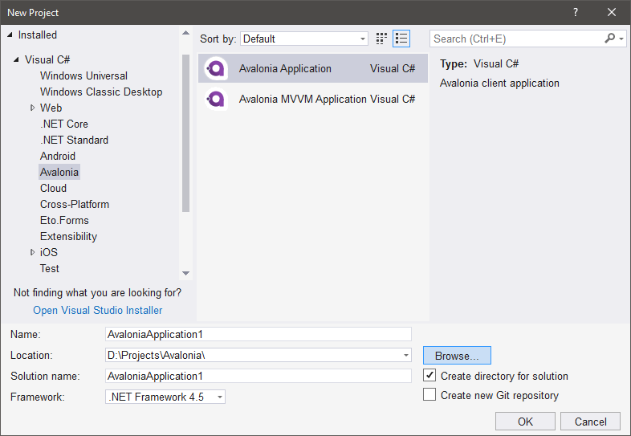
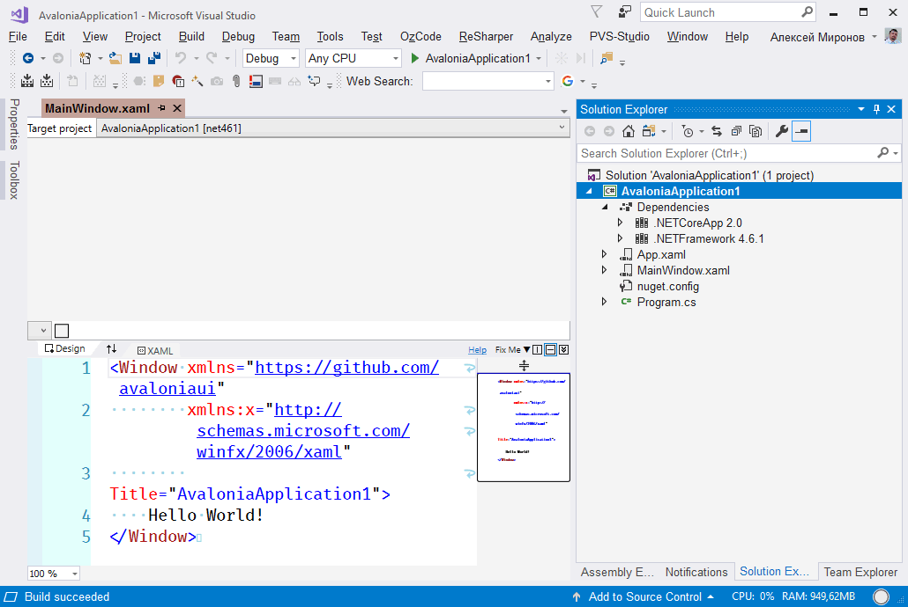
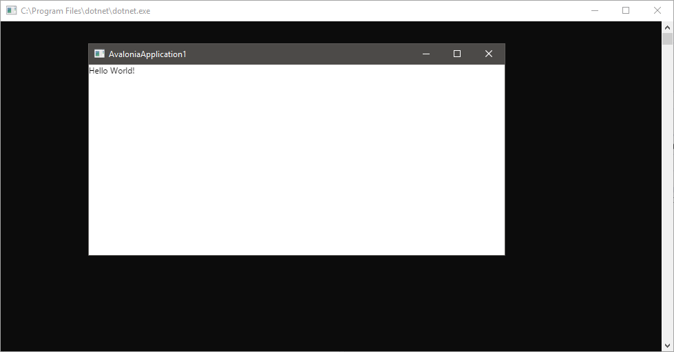
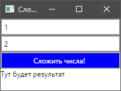

### Быстрое начало

Хотя все необходимые операции можно проделать вручную, проще скачать из VS Marketplace и установить расширение [«Avalonia for Visual Studio»](https://marketplace.visualstudio.com/items?itemName=AvaloniaTeam.AvaloniaforVisualStudio), которое умеет создавать проект приложения сразу с нужными настройками. После его установки появляются два дополнительных пункта в мастере «New Project»:



Мастер создает такой проект:

```xml
<Project Sdk="Microsoft.NET.Sdk">
  <PropertyGroup>
    <OutputType>Exe</OutputType>
    <TargetFrameworks>netcoreapp2.0;net461</TargetFrameworks>
  </PropertyGroup>
  <ItemGroup>
    <Compile Update="**\*.xaml.cs">
      <DependentUpon>%(Filename)</DependentUpon>
    </Compile>
    <EmbeddedResource Include="**\*.xaml">
      <SubType>Designer</SubType>
    </EmbeddedResource>
  </ItemGroup>
  <ItemGroup>
    <PackageReference Include="Avalonia" Version="0.6.1" />
    <PackageReference Include="Avalonia.Desktop" Version="0.6.1" />
  </ItemGroup>
</Project>
```

Обратите внимание: мастер создаёт проект с двумя целями: .NET Core 2.0 и .NET Framework 4.6.1. Мы можем на наше усмотрение убрать ненужные цели или оставить их как есть.

Проект можно создать и с помощью .NET Core CLI, в этом случае цель будет только одна: .NET Core 2.0.

После первой сборки проекта дизайнер XAML для главного окна приложения выглядит так:



Результат запуска проекта вполне предсказуем:



На данный момент код главного окна прост до невозможности:

```xml
<Window xmlns="https://github.com/avaloniaui"
        xmlns:x="http://schemas.microsoft.com/winfx/2006/xaml"
        Title="AvaloniaApplication1">
    Hello World!
</Window>
```

Можно начинать добавлять контролы. Например, кнопку с белым текстом по синему фону:

```xml
<Window xmlns="https://github.com/avaloniaui"
        xmlns:x="http://schemas.microsoft.com/winfx/2006/xaml"
        Title="AvaloniaApplication1">
    <Button Background="Blue" Foreground="White">Hello World!</Button>
</Window>
```

Пусть наша программа делает что-нибудь полезное. Например, складывает два числа. Доработаем XAML окна:

```xml
<Window xmlns="https://github.com/avaloniaui"
        xmlns:x="http://schemas.microsoft.com/winfx/2006/xaml"
        Title="Сложение чисел"
        Width="200"
        Height="120">
  <StackPanel>
    <TextBox Name="firstInput">1</TextBox>
    <TextBox Name="secondInput">2</TextBox>
    <Button Background="Blue"
            Foreground="White"
            Name="addButton">
            Сложить числа!</Button>
    <TextBlock Name="resultBlock">Тут будет результат</TextBlock>
  </StackPanel>
</Window>
```

Окно должно теперь выглядеть так:



Добавим в C#-код обработку событий:

```csharp
using Avalonia;
using Avalonia.Controls;
using Avalonia.Markup.Xaml;

namespace AvaloniaApplication1
{
    public class MainWindow : Window
    {
        public MainWindow()
        {
            InitializeComponent();
#if DEBUG
            this.AttachDevTools();
#endif
        }

        private TextBox _firstInput, _secondInput;
        private Button _addButton;
        private TextBlock _resultBlock;

        private void InitializeComponent()
        {
            AvaloniaXamlLoader.Load(this);

            _firstInput = this.FindControl<TextBox>("firstInput");
            _secondInput = this.FindControl<TextBox>("secondInput");
            _addButton = this.FindControl<Button>("addButton");
            _resultBlock = this.FindControl<TextBlock>("resultBlock");

            _addButton.Click += (sender, args) =>
            {
                int firstNumber = int.Parse(_firstInput.Text);
                int secondNumber = int.Parse(_secondInput.Text);
                int resultNumber = firstNumber + secondNumber;
                _resultBlock.Text = resultNumber.ToString();
            };
        }
    }
}
```

Как говорится, это было несложно. Теперь у нас есть переносимое приложение, которое можно запустить хоть на Windows, хоть на Linux.

Теперь можно опубликовать наше супер-приложение:

```
dotnet publish -c Release -f netcoreapp2.0 -r win-x64 --self-contained
```

Получаем милый набор файлов DLL и EXE, который можно передать пользователю — пусть складывает числа и ни в чем себе не отказывает. Для .NET Core 2.0 получается примерно 74 Мб, для .NET Framework 4.6.1 — 33 Мб.

