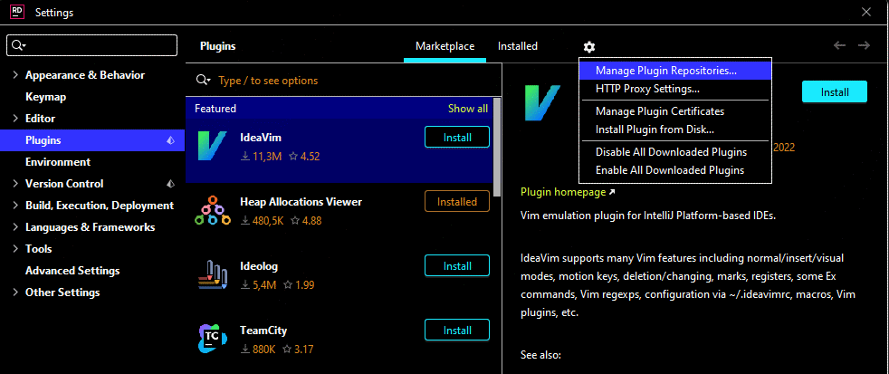

## Поддержка Avalonia в Rider

Чтобы установить плагин, необходимо вручную добавить репозиторий

URL для источника: https://plugins.jetbrains.com/plugins/dev/14839

После этого становится доступным плагин `AvaloniaRider`.

