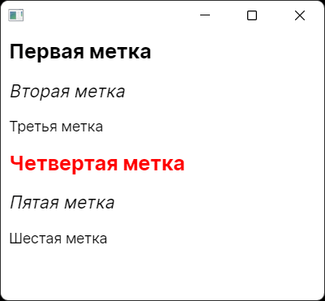

### Стили

На первый взгляд, стили в Avalonia UI устроены так же, как в WPF. Разве что вместо `TargetType` полагается писать `Selector`. На самом же деле авалонские стили мощнее порядка на три, если не больше. Например, есть возможность работать с классами (аналогичными классам CSS/HTML):

```xaml
<Window xmlns="https://github.com/avaloniaui"
        xmlns:x="http://schemas.microsoft.com/winfx/2006/xaml"
        x:Class="AvaloniaApp11.MainWindow">
 
    <Window.Styles>
         
        <Style Selector="Label">
            <Setter Property="Margin" Value="5" />
        </Style>
         
        <Style Selector="Label.h1">
            <Setter Property="FontSize" Value="20" />
            <Setter Property="FontWeight" Value="Bold" />
        </Style>
         
        <Style Selector="Label.h2">
            <Setter Property="FontSize" Value="17" />
            <Setter Property="FontStyle" Value="Italic" />
        </Style>
         
        <Style Selector="Label.danger">
            <Setter Property="Foreground" Value="Red" />
        </Style>
         
    </Window.Styles>
     
    <StackPanel>
        <Label Classes="h1">Первая метка</Label>
        <Label Classes="h2">Вторая метка</Label>
        <Label>Третья метка</Label>
        <Label Classes="h1 danger">Четвертая метка</Label>
        <Label Classes="h2">Пятая метка</Label>
        <Label>Шестая метка</Label>
    </StackPanel>
 
</Window>
```



Итак, какие селекторы поддерживаются.

#### Тип контрола

```xaml
<Style Selector="Button">
<Style Selector="local|Button">
```

#### Имя контрола

```xaml
<Style Selector="#myButton">
<Style Selector="Button#myButton">
```

#### Класс (классы)

```xaml
<Style Selector="Button.large">
<Style Selector="Button.large:focus">
<Style Selector="Button.red.large:focus"> <!-- оба класса сразу -->
```

#### Is
Похоже на отбор по классу, но находит также классы-потомки.

```xaml
<Style Selector=":is(Button)">
<Style Selector=":is(local|Button)">
```

#### Child

Находит непосредственного потомка контрола (проще говоря, вложенный контрол со степенью вложенности равной единице).

```xaml
<Style Selector="StackPanel > Button">
```

#### Descendant

Находит всех потомков контрола (проще говоря, вложенный контрол с любой степенью вложенности).

```xaml
<Style Selector="StackPanel Button">
```

#### Значение свойства

Свойство должно иметь указанное значение.

```xaml
<Style Selector="Button[IsDefault=true]">
```

#### Псевдоклассы

По аналогии с CSS можно задавать значения свойств для состояний вроде «мышь зависла над контролом» и т. п.

```xaml
<StackPanel Margin="10">
    <StackPanel.Styles>
        <Style Selector="Border:pointerover">
            <Setter Property="Background" Value="Red"/>
        </Style>
    </StackPanel.Styles>
    <Border>
        <TextBlock>I will have red background when hovered.</TextBlock>
    </Border>
</StackPanel>
```

Можно завести собственные псевдоклассы и активировать их из кода

```csharp
PseudoClasses.Set (":className", bool);
```

#### Шаблон
Можно сослаться на контрол внутри шаблона.

```xaml
<Style Selector="Button /template/ ContentPresenter">
```

#### Отрицание

```xaml
<Style Selector="TextBlock:not(.h1)">
```

#### Или

```xaml
<Style Selector="TextBlock, Button">
```

#### Подсчет детей

```xaml
<Style Selector="TextBlock:nth-child(2n+3)">

<!-- счет с конца -->
<Style Selector="TextBlock:nth-last-child(2n+3)">
```

#### Загрузка стилей из ресурсов

```xaml
<Window xmlns="https://github.com/avaloniaui"
        xmlns:x="http://schemas.microsoft.com/winfx/2006/xaml">
    <Window.Styles>
        <StyleInclude Source="/CustomStyles.xaml" />
    </Window.Styles>

    <TextBlock Classes="h1">I'm a Heading!</TextBlock>
</Window>
```

#### Работа со стилями из кода

```csharp
control.Classes.Add ("blue");
control.Classes.Remove ("red");

new Style (x => x.OfType<Button>());
new Style (x => x.OfType (typeof (Button)));
new Style (x => x.Name ("myButton"));
new Style (x => x.OfType<Button>().Name ("myButton"));
new Style (x => x.OfType<Button>().Class ("large"));
new Style (x => x.OfType<Button>().Class ("large").Class (":focus"));
new Style (x => x.Is<Button>());
new Style (x => x.Is (typeof (Button)));
new Style (x => x.OfType<StackPanel>().Child().OfType<Button>());
new Style (x => x.OfType<StackPanel>().Descendant().OfType<Button>());
new Style (x => x.OfType<Button>().PropertyEquals (Button.IsDefaultProperty, true));
new Style (x => x.OfType<Button>().Template().OfType<ContentPresenter>());
new Style (x => x.OfType<TextBlock>().Not(y => y.Class ("h1")));
new Style (x => Selectors.Or (x.OfType<TextBlock>(), x.OfType<Button>()))
new Style (x => x.OfType<TextBlock>().NthChild (2, 3));
new Style (x => x.OfType<TextBlock>().NthLastChild (2, 3));
```
