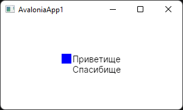
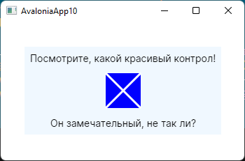

### Пользовательские контролы

Создадим простейший контрол вроде чекбокса: когда он «отмечен», он должен рисовать заполненный прямоугольник, иначе – пустой, при щелчке мышью должен менять свое состояние на противоположное, вот и вся функциональность.

Щелкаем правой кнопкой мыши на проекте, выбираем «Add -> Avalonia User Control». Rider услужливо создает для нас болванку, наше дело дополнить её до следующего состояния:

```csharp
using Avalonia;
using Avalonia.Controls;
using Avalonia.Input;
using Avalonia.Markup.Xaml;

namespace AvaloniaApp1;

public partial class CustomCheckBox
    : UserControl
{
    // текст, который будет выводиться рядом с боксом
    public static readonly StyledProperty<object?> TitleProperty
        = AvaloniaProperty.Register<CustomCheckBox, object?> (nameof (Title));

    // состояние: отмечен или нет
    public static readonly StyledProperty<bool> IsCheckedProperty 
        = AvaloniaProperty.Register<CustomCheckBox, bool> (nameof (IsChecked));

    public CustomCheckBox()
    {
        InitializeComponent();
        DataContext = this;
        
        AddHandler (PointerPressedEvent, PointerPressedHandler);
    }

    private void PointerPressedHandler (object? sender, PointerPressedEventArgs e)
    {
        IsChecked = !IsChecked;
    }

    public object? Title
    {
        get { return (object?) GetValue (TitleProperty); }
        set { SetValue (TitleProperty, value); }
    }

    public bool IsChecked
    {
        get { return (bool) GetValue (IsCheckedProperty); }
        set { SetValue (IsCheckedProperty, value); }
    }

    private void InitializeComponent()
    {
        AvaloniaXamlLoader.Load (this);
    }
}
```

```xaml
<UserControl xmlns="https://github.com/avaloniaui"
             xmlns:x="http://schemas.microsoft.com/winfx/2006/xaml"
             xmlns:d="http://schemas.microsoft.com/expression/blend/2008"
             xmlns:mc="http://schemas.openxmlformats.org/markup-compatibility/2006"
             xmlns:my="clr-namespace:AvaloniaApp1"
             mc:Ignorable="d" d:DesignWidth="800" d:DesignHeight="450"
             x:Class="AvaloniaApp1.CustomCheckBox">

    <Design.PreviewWith>
        <my:CustomCheckBox Title="Заголовок" IsChecked="True" />
    </Design.PreviewWith>

    <UserControl.Styles>
        <Style Selector="my|CustomCheckBox[IsChecked=True] /template/ Rectangle#Check">
            <Setter Property="Fill" Value="Blue" />
        </Style>
        
        <Style Selector="my|CustomCheckBox /template/ Rectangle#Check">
            <Setter Property="Fill" Value="Transparent" />
        </Style>
    </UserControl.Styles>

    <UserControl.Template>
        <ControlTemplate>
            <WrapPanel>
                <Rectangle Name="Check" Margin="0, 0, 2, 0" Width="16" Height="16" />
                <TextBlock Text="{Binding Title}" />
            </WrapPanel>
        </ControlTemplate>
    </UserControl.Template>
    
</UserControl>
```

Собственно, это всё. Контрол создан и готов к употреблению. Употребляется так:

```xaml
<Window xmlns="https://github.com/avaloniaui"
        xmlns:x="http://schemas.microsoft.com/winfx/2006/xaml"
        Width="300" Height="150"
        xmlns:my="clr-namespace:AvaloniaApp1"
        x:Class="AvaloniaApp1.MainWindow"
        Title="AvaloniaApp1">
    
    <StackPanel HorizontalAlignment="Center" VerticalAlignment="Center">
        <my:CustomCheckBox Title="Приветище" IsChecked="True" />
        <my:CustomCheckBox Title="Спасибище" IsChecked="False" />
    </StackPanel>
    
</Window>
```

Выглядит так:



#### Шаблоны элементов

Если не стоит задача о дополнительной функциональности, то можно обойтись без создания отдельного контрола, впихнув всю разметку в шаблон элемента списка:


```xaml
<Window xmlns="https://github.com/avaloniaui"
        xmlns:x="http://schemas.microsoft.com/winfx/2006/xaml"
        Width="600" Height="300"
        x:Class="AvaloniaApp1.MainWindow"
        Title="AvaloniaApp1">

    <Window.DataContext>
        <my:CountryDataSource />
    </Window.DataContext>

    <DockPanel>
        <Label DockPanel.Dock="Top" FontWeight="Bold">
            Вот список стран со столицами
        </Label>
        <ListBox Items="{Binding}">
            <ListBox.ItemTemplate>
                <DataTemplate>
                    <WrapPanel Orientation="Horizontal">
                        <Label>*</Label>
                        <Label Foreground="Blue" FontWeight="Bold" Content="{Binding Name}" />
                        <Label Foreground="Green" FontWeight="Normal" Content="{Binding Capital}" />
                    </WrapPanel>
                </DataTemplate>
            </ListBox.ItemTemplate>
        </ListBox>
    </DockPanel>

</Window>
```

#### Саморисующийся контрол

Хотите создать нетривиальный контрол для Avalonia UI? Оказывается, это очень просто. Судите сами:

```csharp
using Avalonia;
using Avalonia.Controls;
using Avalonia.Media;
 
namespace AvaloniaApp10;
 
public sealed class XControl
    : Control
{
    public static StyledProperty<Color> LineColorProperty
        = AvaloniaProperty.Register<XControl, Color> (nameof (LineColor));
 
    public Color LineColor
    {
        get => GetValue (LineColorProperty);
        set => SetValue (LineColorProperty, value);
    }
 
    public XControl()
    {
        LineColor = Colors.Blue;
    }
 
    public override void Render 
        (
            DrawingContext context
        )
    {
        // рисуем перечеркнутый квадрат
 
        // сначала заливаем фон синим цветом
        var backgroundBrush = Brushes.Blue;
        var rect = new Rect (0, 0, Width, Height);
        context.FillRectangle (backgroundBrush, rect);
         
        // затем заданным пользователем цветом рисуем
        // два перекрещивающихся отрезка
        var foregroundBrush = new SolidColorBrush (LineColor);
        var pen = new Pen (foregroundBrush, 3.0);
        context.DrawLine (pen, new Point (0, 0), new Point (Width, Height));
        context.DrawLine (pen, new Point (0, Height), new Point (Width, 0));
    }
}
```

Используется самописный контрол точно так же, как и все остальные:

```xaml
<Window xmlns="https://github.com/avaloniaui"
        xmlns:x="http://schemas.microsoft.com/winfx/2006/xaml"
        Width="350" Height="200"
        xmlns:my="clr-namespace:AvaloniaApp10"
        x:Class="AvaloniaApp10.MainWindow"
        Title="AvaloniaApp10">
     
    <StackPanel
        HorizontalAlignment="Center"
        VerticalAlignment="Center"
        Background="AliceBlue"
        >
         
        <Label
            Margin="5"
            HorizontalAlignment="Center"
            HorizontalContentAlignment="Center">
            Посмотрите, какой красивый контрол!
        </Label>
         
        <my:XControl
            Margin="5"
            Width="50"
            Height="50"
            LineColor="White" />
 
        <Label
            Margin="5"
            HorizontalAlignment="Center"
            HorizontalContentAlignment="Center">
            Он замечательный, не так ли?
        </Label>
         
    </StackPanel>
     
</Window>
```


