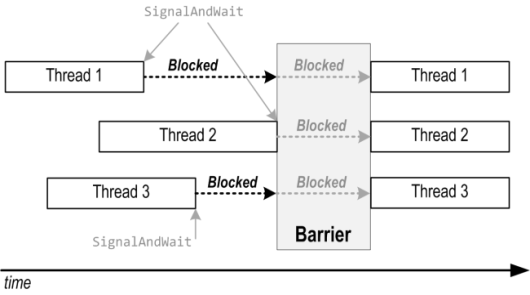

### Класс Barrier

Класс Barrier появился в .NET 4.0. Он представляет новый метод синхронизации потоков, так сказать «с другой стороны баррикад». С его помощью несколько потоков исполнения могут «встретиться» в определённом месте (конечно же, предварительно «сговорившись») и при этом им не нужен дополнительный поток, который бы их дожидался, они сами задают точку сбора. Вот картинка, иллюстрирующая этот подход (позаимствована у Джозефа Албахари):



Итак, как пользоваться Barrier:

1. Создать экземпляр Barrier, указав количество потоков, которые должны встретиться у барьера. Каждый из этих потоков должен иметь ссылку на данный экземпляр барьера.
2. Каждый поток вызывает SignalAndWait, барьер блокирует его до прибытия последнего ожидаемого потока, после чего все они дружно продолжают работать.
3. Если необходимо, барьер может выполнить некий код (Action) после прибытия последнего потока и перед запуском всех потоков.

Пример от Албахари:
```csharp
// ожидаем три потока,
// после прибытия последнего переводим каретку на консоли
static Barrier _barrier = new Barrier (3, barrier => Console.WriteLine());
 
static void Main()
{
  new Thread (Speak).Start();
  new Thread (Speak).Start();
  new Thread (Speak).Start();
}
  
static void Speak()
{
  for (int i = 0; i < 5; i++)
  {
    Console.Write (i + " ");
    // останавливаемся у барьера
    _barrier.SignalAndWait();
  }
}
```
На консоль будет выведено:
```
0 0 0
1 1 1
2 2 2
3 3 3
4 4 4
```
