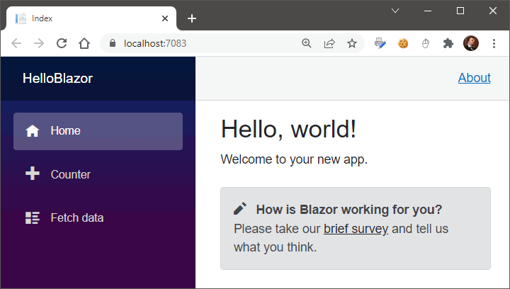

### Первое приложение

Традицинное приложение "Здравствуй, мир", на сей раз с применением Blazor.

```sh
dotnet new blazorserver -o HelloBlazor
cd HelloBlazor
dotnet run
```

Результат должен выглядеть примерно так:



Доступны следующие настройки приложения при вызове `dotnet new`:

* **--auth** - использовать аутентификацию: *None* (по умолчанию), *Individual*, *IndividualB2C*, *SingleOrg*, *MultiOrg*, *Windows*;
* **--aad-b2c-instance** - подключаться к указанному экземпляру Azure Active Directory B2C (при аутентификации IndividualB2C);  
* **--susi-policy-id** - идентификатор политики "sign-in and sign-up" (при аутентификации IndividualB2C), по умолчанию `b2c_1_susi`;
* **--SignedOutCallbackPath** - глобальный адрес обратного вызова для выхода из системы (для аутентификации IndividualB2C), по умолчанию `/signout/B2C_1_susi`;
* **--reset-password-policy-id** - идентификатор политики сброса пароля (для аутентификации IndividualB2C), по умолчанию `b2c_1_reset`;
* **--edit-profile-policy-id** - идентификатор политики редактирования профиля (для аутентификации IndividualB2C), по умолчанию `b2c_1_edit_profile`;
* **--aad-instance** - экземпляр Azure Active Directory, к которому планируется подключаться при использовании аутентификации SingleOrg или MultiOrg, по умолчанию `https://login.microsoftonline.com/`;
* **--client-id** - идентификатор Client ID для данного проекта (используется с аутентификацией IndividualB2C, SingleOrg или MultiOrg auth), по умолчанию `11111111-1111-1111-11111111111111111`;
* **--domain** - домен, используемый с аутентификацией SingleOrg или IndividualB2C, по умолчанию `qualified.domain.name`;
* **--tenant-id** - идентификатор TenantId, используемый с аутентификацией SingleOrg, по умолчанию `22222222-2222-2222-2222-222222222222`;
* **--callback-path** - путь, используемый при запросе с аутентификацией SingleOrg или IndividualB2C, по умолчанию `/signin-oidc`; 
* **--org-read-access** - разрешать ли данному приложению чтение директории (используется только при аутентификации SingleOrg или MultiOrg), по умолчанию `false`;
* **--exclude-launch-settings** - не включать 'launchSettings.json' в сгенерированный проект, по умолчанию `false`;
* **--no-https** - отключение HTTPS (имеет смысл только, если не установлен режим аутентификации Individual, IndividualB2C, SingleOrg или MultiOrg), по умолчанию `false`;
* **--use-local-db** - вместо SQLite использовать LocalDB (имеет смысл только при применении аутентификации Individual или IndividualB2C), по умолчанию `false`;
* **--framework** - фреймворк назначения: `net5.0`, `net6.0`, `net7.0`, `netcoreapp3.1`, по умолчанию совпадает с версией используемого .NET SDK;
* **--called-api-url** - URL для API, вызываемого из приложения (имеет смысл только для аутентификации SingleOrg, MultiOrg или IndividualB2C), по умолчанию `https://graph.microsoft.com/beta`;
* **--calls-graph** - включение доступа приложения к Microsoft Graph (имеет смысл только для аутентификации SingleOrg или MultiOrg), по умолчанию `false`;
* **--called-api-scopes** - указание областей, запрашиваемых приложением при вызове API (имеет смысл только для аутентификации SingleOrg или MultiOrg);
* **--no-restore** - не выполнять восстановление NuGet-пакетов после создания проекта, по умолчанию `false`;

### Анатомия

Основные файлы вновь созданного приложения (.NET 6.0).

**HelloBlazor.csproj**

```msbuild
<Project Sdk="Microsoft.NET.Sdk.Web">

  <PropertyGroup>
    <TargetFramework>net6.0</TargetFramework>
    <Nullable>enable</Nullable>
    <ImplicitUsings>enable</ImplicitUsings>
  </PropertyGroup>

</Project>
```

**Program.cs**

```c#
using Microsoft.AspNetCore.Components;
using Microsoft.AspNetCore.Components.Web;
using HelloBlazor.Data;

var builder = WebApplication.CreateBuilder(args);

// Add services to the container.
builder.Services.AddRazorPages();
builder.Services.AddServerSideBlazor();
builder.Services.AddSingleton<WeatherForecastService>();

var app = builder.Build();

// Configure the HTTP request pipeline.
if (!app.Environment.IsDevelopment())
{
    app.UseExceptionHandler("/Error");
    // The default HSTS value is 30 days. You may want to change this for production scenarios, see https://aka.ms/aspnetcore-hsts.
    app.UseHsts();
}

app.UseHttpsRedirection();

app.UseStaticFiles();

app.UseRouting();

app.MapBlazorHub();
app.MapFallbackToPage("/_Host");

app.Run();
```
**App.razor**

```xml
<Router AppAssembly="@typeof(App).Assembly">
    <Found Context="routeData">
        <RouteView RouteData="@routeData" DefaultLayout="@typeof(MainLayout)" />
        <FocusOnNavigate RouteData="@routeData" Selector="h1" />
    </Found>
    <NotFound>
        <PageTitle>Not found</PageTitle>
        <LayoutView Layout="@typeof(MainLayout)">
            <p role="alert">Sorry, there's nothing at this address.</p>
        </LayoutView>
    </NotFound>
</Router>
```

**_Imports.razor**


```
@using System.Net.Http
@using Microsoft.AspNetCore.Authorization
@using Microsoft.AspNetCore.Components.Authorization
@using Microsoft.AspNetCore.Components.Forms
@using Microsoft.AspNetCore.Components.Routing
@using Microsoft.AspNetCore.Components.Web
@using Microsoft.AspNetCore.Components.Web.Virtualization
@using Microsoft.JSInterop
@using HelloBlazor
@using HelloBlazor.Shared
```

**Shared/MainLayout.razor**

```html
@inherits LayoutComponentBase

<PageTitle>HelloBlazor</PageTitle>

<div class="page">
    <div class="sidebar">
        <NavMenu />
    </div>

    <main>
        <div class="top-row px-4">
            <a href="https://docs.microsoft.com/aspnet/" target="_blank">About</a>
        </div>

        <article class="content px-4">
            @Body
        </article>
    </main>
</div>
```

**Shared/NavMenu.razor**

```html
<div class="top-row ps-3 navbar navbar-dark">
    <div class="container-fluid">
        <a class="navbar-brand" href="">HelloBlazor</a>
        <button title="Navigation menu" class="navbar-toggler" @onclick="ToggleNavMenu">
            <span class="navbar-toggler-icon"></span>
        </button>
    </div>
</div>

<div class="@NavMenuCssClass" @onclick="ToggleNavMenu">
    <nav class="flex-column">
        <div class="nav-item px-3">
            <NavLink class="nav-link" href="" Match="NavLinkMatch.All">
                <span class="oi oi-home" aria-hidden="true"></span> Home
            </NavLink>
        </div>
        <div class="nav-item px-3">
            <NavLink class="nav-link" href="counter">
                <span class="oi oi-plus" aria-hidden="true"></span> Counter
            </NavLink>
        </div>
        <div class="nav-item px-3">
            <NavLink class="nav-link" href="fetchdata">
                <span class="oi oi-list-rich" aria-hidden="true"></span> Fetch data
            </NavLink>
        </div>
    </nav>
</div>

@code {
    private bool collapseNavMenu = true;

    private string? NavMenuCssClass => collapseNavMenu ? "collapse" : null;

    private void ToggleNavMenu()
    {
        collapseNavMenu = !collapseNavMenu;
    }
}
```

**Pages/_Host.cshtml**

```html
@page "/"
@namespace HelloBlazor.Pages
@addTagHelper *, Microsoft.AspNetCore.Mvc.TagHelpers
@{
    Layout = "_Layout";
}

<component type="typeof(App)" render-mode="ServerPrerendered" />
```

**Pages/_Layout.cshtml**

```html
@using Microsoft.AspNetCore.Components.Web
@namespace HelloBlazor.Pages
@addTagHelper *, Microsoft.AspNetCore.Mvc.TagHelpers

<!DOCTYPE html>
<html lang="en">
<head>
    <meta charset="utf-8" />
    <meta name="viewport" content="width=device-width, initial-scale=1.0" />
    <base href="~/" />
    <link rel="stylesheet" href="css/bootstrap/bootstrap.min.css" />
    <link href="css/site.css" rel="stylesheet" />
    <link href="HelloBlazor.styles.css" rel="stylesheet" />
    <component type="typeof(HeadOutlet)" render-mode="ServerPrerendered" />
</head>
<body>
    @RenderBody()

    <div id="blazor-error-ui">
        <environment include="Staging,Production">
            An error has occurred. This application may no longer respond until reloaded.
        </environment>
        <environment include="Development">
            An unhandled exception has occurred. See browser dev tools for details.
        </environment>
        <a href="" class="reload">Reload</a>
        <a class="dismiss">🗙</a>
    </div>

    <script src="_framework/blazor.server.js"></script>
</body>
</html>
```

**Pages/Index.razor**

```html
@page "/"

<PageTitle>Index</PageTitle>

<h1>Hello, world!</h1>

Welcome to your new app.

<SurveyPrompt Title="How is Blazor working for you?" />
```

**Pages/Counter.razor**

```html
@page "/counter"

<PageTitle>Counter</PageTitle>

<h1>Counter</h1>

<p role="status">Current count: @currentCount</p>

<button class="btn btn-primary" @onclick="IncrementCount">Click me</button>

@code {
    private int currentCount = 0;

    private void IncrementCount()
    {
        currentCount++;
    }
}
```

### TODO List

Теперь попробуем добавить страничку с простейшим списком дел:

```html
@page "/todo"

<PageTitle>What to do</PageTitle>

<h3 class="alert alert-info">What to do</h3>

<ul>
    <div class="row">
        <div class="col-4 offset-4">
            <table class="table table-striped table-hover">
                <thead class="table-primary bg-gradient">
                <tr>
                    <th class="text-center">Done</th>
                    <th>What to do</th>
                    <th class="text-center">x</th>
                </tr>
                </thead>
                <tbody>

                @foreach (var todo in _todos)
                {
                    <tr>
                        <td class="text-center">
                            <input class="form-check-input" type="checkbox" @bind="todo.IsDone"/>
                        </td>
                        <td>
                            <input class="form-control" @bind="todo.Title"/>
                        </td>
                        <td class="text-center">
                            <button class="btn btn-outline-primary btn-sm"
                                    @onclick="() => _todos.Remove (todo)">
                                x
                            </button>
                        </td>
                    </tr>
                }

                </tbody>

                <tfoot>
                <tr class="table-primary bg-gradient">
                    <td class="text-primary text-center" style="font-weight: bold;">
                        @(_todos.Count (todo => !todo.IsDone))
                    </td>
                    <td>
                        <input class="form-control" placeholder="Something todo" @bind="_newTodo"/>
                    </td>
                    <td class="text-center">
                        <button class="btn btn-primary" @onclick="AddTodo">Add</button>
                    </td>
                </tr>
                </tfoot>

            </table>
        </div>
    </div>
</ul>


@code
{
    internal sealed class TodoItem
    {
        public string? Title { get; set; }
        public bool IsDone { get; set; }
    }

    private readonly List<TodoItem> _todos = new();
    private string? _newTodo;

    protected override void OnInitialized()
    {
        _todos.Add (new() { Title = "Read one book" });
        _todos.Add (new() { Title = "Read one more book" });
        _todos.Add (new() { Title = "And all the rest" });
    }

    private void AddTodo()
    {
        if (!string.IsNullOrEmpty (_newTodo))
        {
            _todos.Add (new TodoItem { Title = _newTodo });
            _newTodo = string.Empty;
        }
    }
}
```
