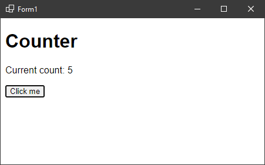

### Blazor в приложении WinForms

Оказывается, существует штатная возможность засунуть веб-сайт, сделанный на Blazor в приложение WinForms. Вот как это делается в семь шагов.

1. В Visual Studio создаем обычное WinForms-приложение (конечно же, на .NET 6), назовем его, скажем, `WinFormsBlazor`.

2. Подключаем NuGet-пакет `Microsoft.AspNetCore.Components.WebView.WindowsForms` (пока доступен только в Preview-версии).

3. Открываем в редакторе `WinFormsBlazor.csproj` и правим корневой элемент, чтобы получилось

```xml
<Project Sdk="Microsoft.NET.Sdk.Razor">
...
</Project>
```

Заодно дописываем три строчки

```xml
<ItemGroup>
  <Content Update="wwwroot\**" CopyToOutputDirectory="PreserveNewest" />
</ItemGroup>
```

Сохраняем файл проекта, закрываем.

4. Теперь нужно добавить в проект несколько файлов. Первый – `_Imports.razor` следующего содержания:

```c#
@using Microsoft.AspNetCore.Components.Web
```

Создаем псевдосайт (со всеми полагающимися прибамбасами, о них чуть позже) в подпапке `wwwroot` (именно она упоминается в csproj). Файл `index.html`:

```html
<!DOCTYPE html>
<html lang="en">
<head>
    <meta charset="utf-8" />
    <meta name="viewport" content="width=device-width, initial-scale=1.0" />
    <title>WinFormsBlazor</title>
    <base href="/" />
    <link href="css/app.css" rel="stylesheet" />
    <link href="WinFormsBlazor.styles.css" rel="stylesheet" />
</head>

<body>

    <div id="app">Loading...</div>
 
    <div id="blazor-error-ui">
        An unhandled error has occurred.
        <a href="" class="reload">Reload</a>
        <a class="dismiss">🗙</a>
    </div>
 
    <script src="_framework/blazor.webview.js"></script>

</body>

</html>
```

и `css\app.css`

```css
html, body {
font-family: 'Helvetica Neue', Helvetica, Arial, sans-serif;
}

.valid.modified:not([type=checkbox]) {
outline: 1px solid #26b050;
}

.invalid {
outline: 1px solid red;
}

.validation-message {
color: red;
}

#blazor-error-ui {
    background: lightyellow;
    bottom: 0;
    box-shadow: 0 -1px 2px rgba(0, 0, 0, 0.2);
    display: none;
    left: 0;
    padding: 0.6rem 1.25rem 0.7rem 1.25rem;
    position: fixed;
    width: 100%;
    z-index: 1000;
}

    #blazor-error-ui .dismiss {
        cursor: pointer;
        position: absolute;
        right: 0.75rem;
        top: 0.5rem;
    }
```

5. На этом предварительные телодвижения заканчиваются, можно переходить к собственно компонентам приложения. Мы не будем оригинальничать и сделаем очередной счетчик `Counter.razor` в корне проекта

```html
<h1>Counter</h1>

<p>Current count: @currentCount</p>

<button class="btn btn-primary" @onclick="IncrementCount">Click me</button>

@code {
private int currentCount = 0;

    private void IncrementCount()
    {
        currentCount++;
    }
}
```

6. Настало время отобразить наше творение на экране. Для этого надо найти на панели Toolbox компонент `BlazorWebView` и бросить его на форму. Заключительные штрихи в `Form1.cs`

```c#
using Microsoft.AspNetCore.Components.WebView.WindowsForms;
using Microsoft.Extensions.DependencyInjection;

namespace WinFormsBlazor
{
public partial class Form1 : Form
{
public Form1()
{
InitializeComponent();

            var services = new ServiceCollection();
            services.AddBlazorWebView();
            blazorWebView1.HostPage = "wwwroot\\index.html";
            blazorWebView1.Services = services.BuildServiceProvider();
            blazorWebView1.RootComponents.Add<Counter>("#app");
        }
    }
}
```

7. Компилируем, запускаем, любуемся результатом:



Неопубликованное результирующее приложение весит 10.5 Мб, опубликованное self-contained 161 Мб, что не может не вызывать уважения (после первого запуска добавится еще примерно 8 Мб, будет распакован WebView2).
