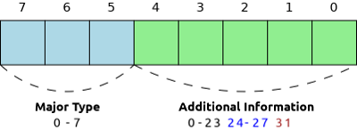

# Формат CBOR

https://en.wikipedia.org/wiki/CBOR

Concise Binary Object Representation (CBOR) is a binary data serialization format loosely based on JSON authored by C. Bormann. Like JSON it allows the transmission of data objects that contain name–value pairs, but in a more concise manner. This increases processing and transfer speeds at the cost of human readability. It is defined in IETF RFC 8949.

Amongst other uses, it is the recommended data serialization layer for the CoAP Internet of Things protocol suite and the data format on which COSE messages are based. It is also used in the Client-to-Authenticator Protocol (CTAP) within the scope of the FIDO2 project

CBOR was inspired by MessagePack, which was developed and promoted by Sadayuki Furuhashi. CBOR extended MessagePack, particularly by allowing to distinguish text strings from byte strings, which was implemented in 2013 in MessagePack.

Concise Binary Object Representation (сжатое бинарное представление объекта) — формат данных, который был спроектирован таким образом, чтобы обеспечить максимально простой код реализации, формирования компактных выходных данных и возможность расширения формата без необходимости обмена информацией о версии.

Стандарт формата CBOR был официально анонсирован комитетом IETF в октябре 2013 года в новом документе RFC 7049, авторами которого являются Carsten Bormann и Paul Hoffman. Взглянув на имя первого автора, можно предположить другую причину происхождения аббревиатуры для названия формата, но возможно это просто совпадение. Формат CBOR получил MIME-тип application/cbor.

На данный момент существует, вероятно, сотни всевозможных бинарных форматов для представления структурированных данных, ряд которых стандартизирован, популярен и широко применяется (например, BER и DER для ASN.1, MessagePack и BSON). Все существующие стандарты решают поставленные перед ними задачи, и CBOR здесь не исключение. К формату было предъявлено семь важных требований, и, поскольку ни один из существующих форматов в полной мере не мог им удовлетворить, был создан новый.

### Требования к новому бинарному формату

1. Недвусмысленное кодирование большинства популярных в Интернете стандартов типов данных. Формат должен уметь кодировать базовые типы данных и структур, используя бинарное представление. При этом нет требования к уникальному кодированию для абсолютно всех типов данных, например число 7 можно представить и как строку, и как целое.
2. Компактная реализация для кодировщика/декодировщика, которая позволяла бы создавать реализации, не требовательные к возможностям процессора и доступному объёму памяти. Формат должен использовать привычные машинные реализации форматов (например, для целых чисел или чисел с плавающей запятой — IEEE 754)
3. Отсутствие схемы описания. Также, как JSON-формат самоописывает представленные данные (объект, массив, строка и т.д.). Отсутствие схемы описания позволяет создать простой и универсальный декодировщик. 
4. Сериализация данных должна быть как можно более компактной, но не в ущерб простоте написания (де)кодировщика. За верхнюю планку объёма закодированных данных принимается объём представления в JSON-формате.
5. Формат должен быть одинаково применим как в приложениях на ограниченных ресурсах, так и в приложениях работающих с огромными объёмами данных. Здесь подразумевается, что реализация должна быть одинакова бережлива к CPU при кодировании и декодировании данных.
6. Формат должен поддерживать все существующие типы в JSON для конвертирования данных из и в JSON.
7. Формат должен быть расширяемым и расширенный формат должен успешно декодироваться ранними версиями декодировщика.
Предполагается, что формат будет использоваться десятилетиями и при этом сохранять обратную совместимость, таким образом, чтобы будущие версии стандарта формата могли нормально обрабатываться декодировщиком для ранних версий. Чтобы в случае обнаружения неизвестного расширения, всё равно иметь возможность раскодировать сообщение.

Как видно из требований, CBOR ориентируется на модель данных JSON, но не ограничивается ею, добавляя популярные типы данных и позволяя расширять формат в будущем.

### Спецификация CBOR


Чтобы понять, насколько успешно формат решает поставленные задачи, и, чтобы иметь возможность сравнить его с другими форматами, рассмотрим процесс кодирования данных в формат CBOR.

Каждый элемент данных начинается с байта, который содержит описание основного типа (`major type`) данных и дополнительной информации (`additional info`). Основной тип занимает 3 старших бита и может иметь значения от 0 до 7. Дополнительная информация может получать значения от 0 до 31.



Как видно на иллюстрации, в значении дополнительной информации выделено три условных диапазона:

1. Если значение от 0 до 23, то данное значение используется непосредственно как целое число. Например, если основной тип — это целое число, то значение дополнительной информации — это и есть значение элемента. Если основной тип — это строка, то данное число указывает на длину строки.
2. Если значение от 24 до 27, то последующие байты содержат целое число переменной длины, соответственно 1-, 2-, 4- и 8-байтные неотрицательные целые. Например, если основной тип это целое число, то в последующих байтах содержится его значение, а если строка — то её длина.
3. Значение 31 является специальным и указывает на то, что длина элемента не определена. Например, в случае строки, это означает, что длина строки неизвестна.

Значения 28-30 зарезервированы для будущих версий стандарта.

Как уже было показано в примерах, в зависимости от значения основного типа разный смысл приобретает значение дополнительной информации. Рассмотрим основные типы данных.

### Тип 0: неотрицательное целое

Дополнительная информация содержит значения числа (если оно меньше 24), в других случаях дополнительная информация указывает на размер целого числа, которое последует далее. Если 24 — то это `uint8_t`, 25 — `uint16_t`, 26 — `uint32_t` и 27 — `uint64_t`.

Например, число `16` кодируется в `0x10`, а число `500` в последовательность из трёх байт `0x19, 0x01f4` (500)

### Тип 1: отрицательное целое

Значение кодируется по аналогии с типом 0, с тем лишь отличием, что из абсолютного значения вычитается единица. Например, `-16` кодируется в `0x2F`, а число `-500` — `0x39, 0x01f3` (499)

### Тип 2: байтовая строка

Для байтовой строки дополнительная информация кодирует длину строки в байтах. Например, в случае байтовой строки длиной в 16 байт будет закодировано в `0x50` (тип 2, значение 16) с последующими 16 байтами, содержащие байтовую строку. А для строки длиной в 500 байт — трёхбайтный заголовок: `0x59` (тип 2, значение 25), `0x01f4` (500), с последующими 500 байтами данных строки.

### Тип 3: текстовая строка

Текстовая строка представляет собой строку, состоящую из Unicode-символов в кодировке UTF-8. Также, как и в случае байтовой строки, дополнительная информация кодирует длину строки в байтах. В отличие от формата JSON, в текстовой строке не требуется выполнять экранирование символов переноса стоки, в виде `\n` или `\u000a` и т.п.

Тип 4: массив элементов

По аналогии с типом строки, дополнительная информация указывает на длину массива, но не в байтах, а в количестве элементов. Элементы в массиве необязательно должны быть одинакового типа, это могут быть набор строк, чисел и т.д. После заголовка, непосредственно следуют элементы массива. Например, массив `[0,"A"]` кодируется так:

```
82 - массив из 2-х элементов,
    00 - целое число 0,
    61 - текстовая строка в 1 байт,
        41 - "A"
```

### Тип 5: карта пар (ассоциативный массив, хэш, словарь, JSON-объект...)

Данный тип определяет карту, состоящую из пар «ключ» — «значение». Дополнительная информация определяет количество таких пар. Например, карта из 9 пар кодируется как `0xa9` (тип 5 + значение 9), после чего следует 9 пар элементов: первый ключ, первое значение, второй ключ и т.д. Ключи могут быть разных типов, но как правило, такое редко бывает востребованно.

### Тип 6: семантическое тегирование других базовых типов

Данный тип открывает широкие возможности по расширению стандарта. Дополнительная информация задаёт целочисленный номер тега, что задаёт диапазон тегов от 0 до 18446744073709551615. Тег ссылается на какое-то определённое представление базовых типов, позволяя безгранично расширять поддерживаемые типы данных.

Например, стандартом определенно, что тег 0 задаёт текстовую строку даты-времени в формате, описанном в RFC 3339 (с поправками из RFC 4287). К примеру, при кодирования времени 1970-01-01T00:00Z получим:

```
С0 - элемент с тегом 0
    71 - текстовая строка длиной 17 байт
        31 39 37 30 2d 30 31 2d  30 31 54 30 30 3a 30 30 5a - непосредственно строка 1970-01-01T00:00Z
```

Обратите внимание, что даже если декодер не знает, что означает тег 0, он всё равно сможет декодировать данные, так как после тега идёт элемент базового типа 3 — текстовая строка.

На данный момент стандартом определены несколько тегов, сопровождением списка тегов занимается IANA, текущее распределение можно увидеть по ссылке

Стоит отдельно отметить тег `55799`, который означает, что далее идут данные в формате CBOR. По сути он не несёт никакой полезной нагрузки, но, например, при сохранении данных в формате CBOR в файл, этот тег образует последовательность `0xd9d9f7` в начале, которая может использоваться утилитами, как магическое значение для определения типа файла. Кроме того данная последовательность не встречается ни в одной из существующих кодировок Unicode, поэтому позволяет быстро отличать CBOR от текстовых данных.

### Тип 7: числа с плавающей запятой и другие простые типы данных

Данный тип позволяет описывать простые (simple) значения, а также числа с плавающей запятой. Дополнительная информация несёт следующее смысловое значение:

* 0..23 — Простое значение (код от 0 до 23)
* 24 — Простое значение (код от 24 до 255)
* 25 — IEEE 754 число с плавающей запятой половинной точности (16 бит)
* 26 — IEEE 754 число с плавающей запятой одинарной точности (32 бит)
* 27 — IEEE 754 число с плавающей запятой двойной точности (64 бит)
* 28-30 — не определено
* 31 — Стоп-код прерывания (break) для элементов с неопределённой длиной

Данным стандартом определены несколько кодов простых значений:

* 20 — False
* 21 — True
* 22 — Null
* 23 — Undefined

Регистрацией других простых значений также занимается IANA, на текущий момент список простых значений доступен по ссылке.

Неопределённая длина элементов некоторых основных типов

Четыре основных типа: массив, карта, байтовая и текстовая строка могут иметь неопределённое значение элементов (что задаётся значением 31 в дополнительной информации). Это позволяет начать кодирование элементов, количество которых ещё неизвестно. Такое может быть востребовано в приложениях, которые ведут потоковую передачу данных.

В случае массивов и карт элементы просто следуют один за другим, и, для индикации завершения используется стоп-код прерывания. Сразу после последнего элемента массива или карты следует элемент типа 7 с дополнительной информацией 31 — это байт 0xFF.

В случае строк используется другой подход. Строки передаются частями конечной длины, которые позже объединяются в одну строку (это может сделать как декодировщик, так и конечное приложение). Индикатором завершения последовательности частей строк также служит стоп-код прерывания 0xFF. В случае текстовых строк при передаче фрагментов важно, чтобы разделение строки не происходило внутри кодовой последовательности Unicode-символа, т.е. все части строки должны содержать валидные последовательности Unicode-символов.

Пример:

```
5F           -- Старт байтовой строки неопределённой длины
    44         -- Байтовая строка длиной 4 байта
        aabbccdd -- Содержимое первого фрагмента
    43         -- Байтовая строка длиной 3 байта
        eeff99   -- Содержимое следующего фрагмента
    FF         -- "break"
```

После декодирования все фрагменты объединяются в одну строку: aabbccddeeff99

### Каноническая реализация формата

Стандарт CBOR определяет несколько правил, которые должны позволить разным реализациям при равных входных данных создавать одинаковый выходной результат. При этом всё же допускается, если есть определённые требования приложения, допускать отхождения от стандарта, если это в целом не нарушает валидности создаваемого документа.

* Использование наиболее сжатого представления для кодируемых данных. Например, если кодируется целое число 500, то должно выбираться представление uint16_t, а не, скажем, uint64_t. При кодировании числа 0.0 кодировщик должен выполнить преобразование к целому типу, так как это даст более сжатое представление. Если число с плавающей запятой может быть представлено с одинарной точностью без потери значимых разрядов, то кодировщик не должен использовать двойную точность и т.д.
* Ключи ассоциативных массивов должны быть отсортированы в возрастающем порядке (байтовая сортировка, сначала идут более короткие ключи)
* При возможности элементы с неопределённой длиной заменяются с фиксированной длиной
* Каноническая реализация не должна использовать теги, но при обработке данных с тегами, должна сохранять их

### Обработка ошибок

Стандарт CBOR допускает различный подход к обработке ошибок в формате. Ошибки могут быть связаны как с самим форматом (неизвестные значения в дополнительной информации, простых значений, некорректное число элементов массива и т.д.), так и со значениями (например, невалидный UTF-8 код в текстовой строке или дублирующиеся ключи в ассоциативном массиве).

Декодировщик может выдавать предупреждения на некорректных данных, может выполнять преобразования, чтобы исправить ошибку, может игнорировать ошибки или прекращать обработку сразу при обнаружении первой ошибки. Стандарт предлагает использование строгого (strict) режима в случае если данные пришли из ненадёжного источника, в этом случае декодировщик должен отклонять все данные, которые не прошли валидацию или могут быть по разному восприняты разными декодировщиками. Нестрогий режим используется, если данные из надёжного источника и больше важна скорость обработки (например, не проверять валидность UTF-8 строк).

Сравнение с другими бинарными форматами


В тексте стандарта приводится сравнительная таблица как кодируется массивы в разных существующих форматах. Первый массив состоит из двух элементов, со вложенным массивом. Второй массив неопределённой длины (для этого используется условный символ _) также содержит вложенный массив (конечной длины).

```
+---------------+-------------------------+-------------------------+
| Format        | [1, [2, 3]]             | [_ 1, [2, 3]]           |
+---------------+-------------------------+-------------------------+
| RFC 713       | c2 05 81 c2 02 82 83    |                         |
|               |                         |                         |
| ASN.1 BER     | 30 0b 02 01 01 30 06 02 | 30 80 02 01 01 30 06 02 |
|               | 01 02 02 01 03          | 01 02 02 01 03 00 00    |
|               |                         |                         |
| MessagePack   | 92 01 92 02 03          |                         |
|               |                         |                         |
| BSON          | 22 00 00 00 10 30 00 01 |                         |
|               | 00 00 00 04 31 00 13 00 |                         |
|               | 00 00 10 30 00 02 00 00 |                         |
|               | 00 10 31 00 03 00 00 00 |                         |
|               | 00 00                   |                         |
|               |                         |                         |
| UBJSON        | 61 02 42 01 61 02 42 02 | 61 ff 42 01 61 02 42 02 |
|               | 42 03                   | 42 03 45                |
|               |                         |                         |
| CBOR          | 82 01 82 02 03          | 9f 01 82 02 03 ff       |
+---------------+-------------------------+-------------------------+
```

Как видно самый компактный вид представления у MessagePack и CBOR, при этом возможность для кодирования бесконечных последовательностей есть только у BER, UBJSON и CBOR.

### Существующие реализации CBOR

Сразу после выпуска стандарта стали появляться и первые реализации (де)кодировщиков на различных языках программирования. Например, C, Perl, Ruby, Python, Java, Go и множество других (правда, бегло поискав на github, я пока не нашёл реализации на JavaScript...).

Не все из этих реализаций полностью поддерживают стандарт и возможно существуют или появятся ещё много других. Всё это отлично подтверждает, что основная цель стандарта достигнута: реализация (де)кодировщика — это задача небольшой сложности. Вполне вероятно, что скоро на собеседованиях программистов начнут просить реализовать нестрогий декодировщик CBOR в качестве тестового задания.
