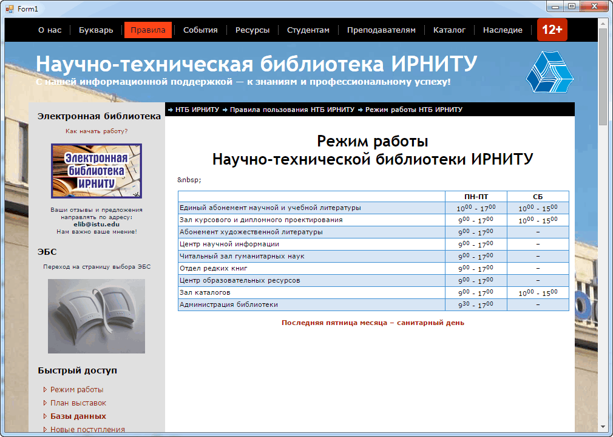

### Встраивание Chrome в приложение WinForms

WinForms с незапамятных времён поддерживает встраивание в приложение Internet Explorer. В большинстве случаев этого вполне достаточно. Но иногда программист начинает «хотеть странного». Например, его не устраивает уровень поддержки HTML, JavaScript и CSS, предоставляемый установленным в системе пользователя браузером (там запросто может оказаться Internet Explorer 7).

На помощь приходит проект Chromium – ядро популярного браузера Google Chrome, которое можно встроить в своё приложение. Для программистов на платформе .NET имеется обёртка над Chromium, называемая CefSharp. Использовать Chromium в своих приложениях WinForms оказывается ничуть не сложнее, чем пользоваться встроенным контролом WebBrowser. Исходники проекта живут в GitHub.com, документация по проекту в GitHub.io.

CefSharp требует .NET 4.0 и выше, работает как на x86, так и на x64. Он не полагается на установленные в системе браузеры, всё необходимое носит с собой, что, конечно же, сказывается на итоговом размере приложения.

Для начала во вновь созданный проект WinForms (состоящий из единственной пока пустой формы) подключаем пакет NuGet CefSharp.WinForms (он притащит с собой кучу файлов). Вас попросят определиться, будет ли Ваш проект x86 или же x64, т. к. под AnyCPU обёртка не работает. Пусть будет x86, так универсальнее. Если прямо сейчас откомпилировать проект, мы получим около 88 Мб файлов в папке bin\x86\Debug. Неплохо!  🙂

К сожалению, иконки контрола в тулбоксе, которую можно было бы бросить на форму, нет. Придётся добавлять контрол в форму самостоятельно. Сделать это можно примерно так:

```csharp
using System.Windows.Forms;
 
using CefSharp;
using CefSharp.WinForms;
 
public partial class Form1 : Form
{
    public Form1()
    {
        InitializeComponent();
 
        _InitializeBrowser();
    }
 
    private ChromiumWebBrowser _browser;
 
    private void _InitializeBrowser()
    {
        CefSettings settings = new CefSettings
        {
            IgnoreCertificateErrors = true
        };
 
        Cef.Initialize(settings);
 
        _browser = new ChromiumWebBrowser
            (
                "http://library.istu.edu/rules/regime"
            );
        Controls.Add(_browser);
        _browser.Dock = DockStyle.Fill;
    }
 
    private void Form1_FormClosing
        (
            object sender, 
            FormClosingEventArgs e
        )
    {
        Cef.Shutdown();
    }
}
```

Вот что получается в итоге:



Кратко о достоинствах и особенностях CefSharp:

* Позволяет создать свои обработчики протоколов, так что данные для отображения в браузере мы можем брать откуда угодно, в том числе из ресурсов нашего приложения. Также мы можем «прикрутить» любое шифрование, да хоть голубиную почту, если захотим.
* Мы можем «прокидывать» свои функции в пространство JavaScript, и наоборот, вызывать методы JavaScript из управляемого кода.
* Позволяет обрабатывать события навигации, скачивания файлов и другие.
* Предоставляется довольно много событий, к которым мы можем подключить свои обработчики:

```csharp
browser.LoadingStateChanged += OnLoadingStateChanged;
browser.ConsoleMessage += OnBrowserConsoleMessage;
browser.StatusMessage += OnBrowserStatusMessage;
browser.TitleChanged += OnBrowserTitleChanged;
browser.AddressChanged += OnBrowserAddressChanged;
```

И «на закуску»: имеется версия CefSharp.Offline, предназначенная для «заэкранного» рендеринга страниц. Это здорово!

* Метод Load(string) является аналогом Navigate(string) в WebBrowser, т. е. заставляет браузер перейти по указанному адресу.
* Загрузка текста страницы в виде HTML: метод LoadHtml(string, string).
* Методы Back() и Forward(), свойства CanGoBack и CanGoForward с говорящими за себя именами.
* Свойство IsLoading, указывающее на то, что браузер занят загрузкой страницы.
* Совершенно потрясающий метод ShowDevTools().

Пример взаимодействия с JavaScript:

```csharp
public class Person
{
    public Person( string firstName, string lastName, DateTime birthDate)
    {
        FirstName = firstName;
        LastName = lastName;
        DateOfBirth = birthDate;
    }
 
    public string FirstName { get; set; }
    public string LastName { get; set; }
    public DateTime DateOfBirth { get; set; }
    public int SkillLevel { get; set; }
}
 
public class JavaScriptInteractionObj
{
    public Person m_theMan = null;
 
    public JavaScriptInteractionObj()
    {
        m_theMan = new Person("Bat", "Man" , DateTime.Now);
    }
 
    public string SomeFunction()
    {
        return "yippieee";
    }
 
    public string GetPerson()
    {
        var p1 = new Person("Bruce", "Banner" , DateTime.Now );
 
        string json = JsonConvert.SerializeObject(p1);
        return json;
    }
 
    public string ErrorFunction()
    {
        return null;
    }
 
    public string GetListOfPeople()
    {
        List<Person> peopleList = new List< Person>();
 
        peopleList.Add(new Person("Scooby", "Doo" , DateTime.Now));
        peopleList.Add(new Person("Buggs", "Bunny" , DateTime.Now));
        peopleList.Add(new Person("Daffy", "Duck" , DateTime.Now));
        peopleList.Add(new Person("Fred", "Flinstone" , DateTime.Now));
        peopleList.Add(new Person("Iron", "Man" , DateTime.Now));
 
        string json = JsonConvert.SerializeObject(peopleList);
        return json;
    }
 }
 
private void buttonRegisterCSharpObject_Click(object sender, EventArgs e)
{
    m_chromeBrowser.RegisterJsObject("winformObj", new JavaScriptInteractionObj());
 
    string page = string.Format("{0}HTMLEmbeddedResources/html/WinformInteractionExample.html" , 
                  EmbeddedResourceUtils.GetAppLocation());
    m_chromeBrowser.Load(page);
}
```

В HTML-файле:

```js
function CallWinformFunc()
{
     var list = winformObj.getListOfPeople(); // Call C# Function
     for (var nLoopCnt = 0; nLoopCnt < list.length; nLoopCnt++) {
           var person = list[nLoopCnt];
     }
}

...

<button onclick="CallWinformFunc()">Test Winform Interaction</button>
```

Пример вызова JavaScript-кода из управляемого кода:

```csharp
private void buttonExecJavaScriptFromWinforms_Click(object sender, EventArgs e)
{
    var script = "document.body.style.backgroundColor = 'red';";
 
    m_chromeBrowser.ExecuteScriptAsync(script);
}
```

Пример перехвата JavaScript-события из управляемого кода:

```csharp
public class BoundObject
{
    public void OnFrameLoadEnd (object sender, FrameLoadEndEventArgs e)
    {
      if(e.Frame.IsMain)
      {
        browser.ExecuteScriptAsync(@"
          document.body.onmouseup = function()
          {
            bound.onSelected(window.getSelection().toString());
          }
        ");
      }
    }
 
    public void OnSelected(string selected)
    {
        MessageBox.Show("The user selected some text [" + selected + "]");
    }
}
 
// ...
 
// After your ChromiumWebBrowser has been instantiated 
// (for WPF directly after `InitializeComponent();` in the control constructor).
var obj = new BoundObject();
browser.RegisterJsObject("bound", obj);
browser.FrameLoadEnd += obj.OnFrameLoadEnd ;
```

**Предупреждение**: на пользовательской машине должен быть установлен пакет [Visual C++ 2012 Redistributable](https://www.microsoft.com/en-in/download/details.aspx?id=30679), иначе программа будет падать с воплем «System.IO.FileNotFoundException». Начиная с версии 45 Chromium требует [Visual C++ Runtime 2013](https://www.microsoft.com/en-in/download/details.aspx?id=40784).

**Предупреждение**: последние версии не поддерживают Windows XP/Server 2003, по крайней мере официально. Это связано с переходом на Visual Studio 2013, runtime которой не поддерживает XP/2003.

