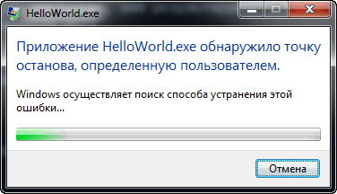
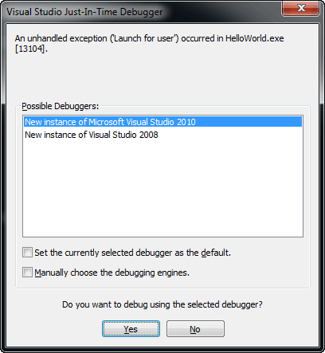
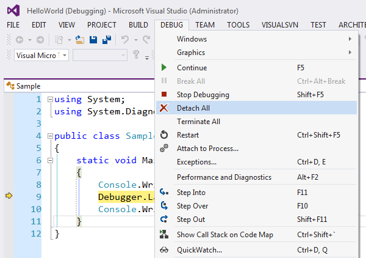

### Класс Debugger

Этот класс является замечательным дополнением к ранее рассмотренным классам Debug и Trace. Он предназначен для оперативной связи с отладчиком пользовательского уровня, таким как Visual Studio. [Отметим в скобках, что отладчики уровня ядра здесь не при делах. Да и отладчики пользовательского режима, не предоставляющие соответствующие интерфейсы, тоже окажутся за пределами понимания класса Debugger.]

Свойство `IsAttached` – выдаёт true, если отладчик подключен к программе. Следует иметь в виду, что антиотладочные трюки, основанные на Debugger.IsAttached, пресекаются опытными хакерами на уровне рефлексов.

Метод `Break` вызывает (полную) остановку программы в отладчике на данном методе, как если бы в отладчике была установлена точка останова. Если отладчик не подключен к приложению, появится окно с предложением запустить отладчик. В отсутствие отладчика система просто прекратит выполнение программы:



Метод может вызвать исключение `SecurityException`, если не установлено разрешение System.Security.Permissions.UIPermission, в этом случае система тоже может прекратить выполнение программы.

Метод `IsLogging` возвращает true, если к программе подключен отладчик и в нём разрешено логирование.

Метод `Launch` запускает отладчик и подключает его к программе, если он ещё не запущен. У пользователя появляется окно, похожее на следующее:



Если прошло успешно, и отладчик подключен к программе, метод возвращает true, иначе false. Подключение отладчика остановит программу, и пользователь должен будет явно затребовать её продолжение, например, нажав F5 в Visual Studio. Метод может вызвать исключение SecurityException, если не установлено разрешение System.Security.Permissions.UIPermission, в этом случае система тоже может прекратить выполнение программы.

Метод `Log` выводит некое сообщение в подключенном отладчике (обратите внимание: категория сообщения должна быть короче 256 символов, лишние будут обрезаны!):
```csharp
public static void Log
(
    int level,       // Условная важность сообщения
    string category, // Произвольная категория сообщения
    string message   // Собственно сообщение
);
```
Если отладчик не подключен, метод ничего не делает.

Метод `NotifyOfCrossThreadDependency` сообщает подключенному отладчику, что исполнение программы может вызвать межпоточные зависимости (cross-thread dependency).

Новые версии Visual Studio научились не только подключаться к требующим отладки программам, но и отключаться от них, так что однажды проверенное свойство Debugger.Attached не гарантирует постоянного подключения отладчика в дальнейшем.


