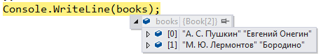

### DebuggerDisplayAttribute


`System.Diagnostics.DebuggerDisplayAttribute` появился ещё в .NET 2.0 и, к сожалению, до сих пор не получил того внимания прикладных программистов, которого он заслуживает. А ведь приносимая им польза несопоставимо велика по сравнению с усилиями, которые нужно затратить. Вот простейший пример.

```csharp
using System;
using System.Diagnostics;
 
[DebuggerDisplay("{Author} {Title}")]
class Book
{
    public string Author { get; set; }
    public string Title { get; set; }
}
 
class Program
{
    static void Main()
    {
        Book book = new Book
            {
                Author = "А. С. Пушкин",
                Title = "Евгений Онегин"
            };
        Console.WriteLine(book);
    }
}
```

Если теперь мы приостановим выполнение программы на строке Console.WriteLine, то увидим всплывающую подсказку:


Всего одна строчка — и мы можем увидеть содержимое самых важных полей/свойств объекта во всплывающей подсказке. Ну не чудо ли?

`DebuggerDisplayAttribute` используется также для показа элементов массивов/коллекций и членов классов, а также для всех переменных в окнах Watches, Locals и прочих:



Можно задавать поясняющий текст:

```csharp
[DebuggerDisplay("Author={Author} Title={Title}")]
class Book
{
   ...
}
```

Для DebuggerDisplayAttribute нет «запрещённых» полей/свойств, в нём можно обращаться к private и internal членам класса:

```csharp
[DebuggerDisplay("{FullDescription}")]
class Book
{
   ...
 
   internal string FullDescription { get { return Author + " " + Title; } }
}
```

А теперь — на сладкое — малоизвестные аспекты DebuggerDisplayAttribute:

* Можно отключить кавычки, которые отладчик добавляет к строкам, написав DebuggerDisplay(«{FullDescription,nq}»).

* Можно вызывать методы класса: DebuggerDisplay(«String value is {getString()}»).

* Можно вызывать использовать выражения: DebuggerDisplay(«Count={Count — 2}»).

* Можно задать, что будет показываться в колонке Name: DebuggerDisplay(«{TheValue}», Name=»{TheName}»).

* Аналогично можно задать, что будет показываться в колонке Type: DebuggerDisplay(«{TheValue}», Name=»{TheType}»). Вот пример для DebuggerDisplay(«{Author} {Title}», Name = «Книга», Type = «Тип книги»):


* Если установлен флажок «Show raw structure of objects in variables window», атрибут DebuggerDisplayAttribute игнорируется


* В папке `%Мои документы%\Visual Studio 20XX\Visualizers\` водится интереснейший файл `autoexp.cs`. В него можно дописать по аналогии интересующие нас типы (в том числе, расположенные в «чужих» сборках) и наслаждаться удобством отладки (не забыть перекомпилировать `autoexp.cs`!).

* Аналогично можно создать в своём проекте файл с `DebuggerDisplayAttribute` для интересующих нас типов. `#if DEBUG … #endif` убережёт релизную версию сборки от замусоривания.

