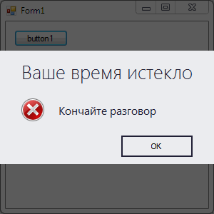
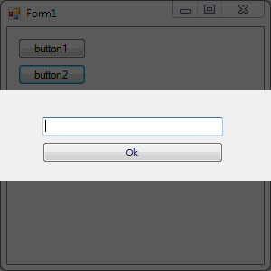

### DevExpress Flyout

Windows 8, кроме прочих нововведений, ввела в оборот новый тип диалога с пользователем. Кому-то такие диалоги нравятся, кому-то нет, но теперь и мы, простые пользователи DevExpress, можем радовать пользователя такими диалогами.



```c#
using DevExpress.XtraBars.Docking2010.Views.WindowsUI;
 
FlyoutMessageBox.Show
   (
      "Кончайте разговор", 
      "Ваше время истекло", 
      MessageBoxButtons.OK, 
      MessageBoxIcon.Stop,
      MessageBoxDefaultButton.Button1
   );
```

Альтернативный вариант:

```c#
using DevExpress.XtraBars.Docking2010.Customization;
using DevExpress.XtraBars.Docking2010.Views.WindowsUI;
 
FlyoutAction action = new FlyoutAction
   {
      Caption = "Ваше время истекло",
      Description = "Кончайте разговор",
      Image = SystemIcons.Error.ToBitmap()
   };
action.Commands.Add(FlyoutCommand.OK);
FlyoutDialog.Show(this, action);
```

Получается то же самое, просто с бо́льшей степенью контроля над результатом.

В таком стиле можно показывать любые пользовательские диалоги:



```c#
UserControl control = new UserControl
   {
       Padding = new Padding(0, 30, 0, 20), 
       Size = new Size(200, 100)
   };
TextBox textEdit = new TextBox
   {
       Dock = DockStyle.Top, 
       Parent = control
   };
Button okButton = new Button
   {
       Dock = DockStyle.Bottom,
       Text = "Ok",
       DialogResult = DialogResult.OK,
       Parent = control
   };
FlyoutDialog.Show(this, control);
```