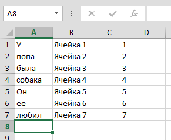

### DevExpress Spreadsheet

Допустим, у нас есть табличка Excel, имеющая хотя бы такой вид:


и нам очень-очень нужно прочитать её из своей программы, что-нибудь вычислить и записать результат обратно в формате Excel. Оказывается, это сделать легко и просто, хоть из консольного приложения, хоть из WinForms, хоть из ASP.NET, если у нас есть волшебный компонент DevExpress Document Server, точнее, класс Workbook, обитающий в сборке DevExpress.Docs.v15.1.dll (вместо v15 подставьте актуальный для вас номер версии).

```c#
using System;
 
using DevExpress.Spreadsheet;
 
class Program
{
    static void Main()
    {
        Workbook workbook = new Workbook();
        // Загружаем документ
        workbook.LoadDocument("Workbook1.xlsx"); 
        Worksheet worksheet = workbook.Worksheets[0];
        for (int row = 0; row < 7; row++)
        {
           // Читаем значение
           var cellValue = worksheet.Cells[row,0].Value;
 
           // Делаем с ним что-нибудь полезное, например,
           // выводим на экран
           Console.WriteLine(cellValue);
 
           // Вычисляем новые значения, помещаем их
           // в соседние ячейки
           worksheet.Cells[row, 1].Value 
               = string.Format("Ячейка {0}", row+1); // Текст
           worksheet.Cells[row, 2].Value
               = (double)(row+1); // Число с плавающей точкой
       }
 
       // Сохраняем документ (можно в тот же файл,
       // а можно и в другой)
       workbook.SaveDocument("Workbook2.xlsx");
   }
}
```

Вот и вся магия! Получается примерно такая таблица:



Нашей программке придётся таскать с собой следующие сборки:

* DevExpress.Charts.v15.1.Core.dll
* DevExpress.Data.v15.1.dll
* DevExpress.Docs.v15.1.dll
* DevExpress.Office.v15.1.Core.dll
* DevExpress.Spreadsheet.v15.1.Core.dll
* DevExpress.Utils.v15.1.dll