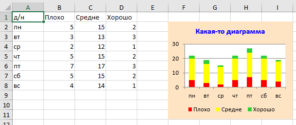
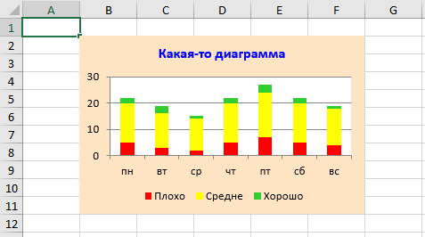

### Программная генерация диаграмм в DevExpress

Генерировать диаграммы для DevExpress Spreadsheet легко и приятно. 🙂 Программная модель интуитивно понятная, и, если вы раньше создавали диаграммы в Excel «вручную», то без труда сможете сделать это с помощью C#. В качестве доказательства сгенерируем такую диаграммку:



Создаём в Visual Studio консольную программку, добавляем в неё ссылки на System.Drawing, DevExpress.Charts.v18.1.Core, DevExpress.Data.v18.1, DevExpress.Docs.v18.1, DevExpress.Office.v18.1.Core, DevExpress.Spreadsheet.v18.1.Core, DevExpress.Utils.v18.1. Далее текст самой программы:

```c#
using System.Drawing;
 
using DevExpress.Spreadsheet;
using DevExpress.Spreadsheet.Charts;
 
class Program
{
    static void Main(string[] args)
    {
        Workbook workbook = new Workbook();
        Worksheet worksheet = workbook.Worksheets[0];
 
        // Имитируем получение данных и их добавление в таблицу
        worksheet.Cells[0, 0].Value = "д/н";
        worksheet.Cells[1, 0].Value = "пн";
        worksheet.Cells[2, 0].Value = "вт";
        worksheet.Cells[3, 0].Value = "ср";
        worksheet.Cells[4, 0].Value = "чт";
        worksheet.Cells[5, 0].Value = "пт";
        worksheet.Cells[6, 0].Value = "сб";
        worksheet.Cells[7, 0].Value = "вс";
 
        worksheet.Cells[0, 1].Value = "Плохо";
        worksheet.Cells[1, 1].Value = 5;
        worksheet.Cells[2, 1].Value = 3;
        worksheet.Cells[3, 1].Value = 2;
        worksheet.Cells[4, 1].Value = 5;
        worksheet.Cells[5, 1].Value = 7;
        worksheet.Cells[6, 1].Value = 5;
        worksheet.Cells[7, 1].Value = 4;
 
        worksheet.Cells[0, 2].Value = "Средне";
        worksheet.Cells[1, 2].Value = 15;
        worksheet.Cells[2, 2].Value = 13;
        worksheet.Cells[3, 2].Value = 12;
        worksheet.Cells[4, 2].Value = 15;
        worksheet.Cells[5, 2].Value = 17;
        worksheet.Cells[6, 2].Value = 15;
        worksheet.Cells[7, 2].Value = 14;
 
        worksheet.Cells[0, 3].Value = "Хорошо";
        worksheet.Cells[1, 3].Value = 2;
        worksheet.Cells[2, 3].Value = 3;
        worksheet.Cells[3, 3].Value = 1;
        worksheet.Cells[4, 3].Value = 2;
        worksheet.Cells[5, 3].Value = 3;
        worksheet.Cells[6, 3].Value = 2;
        worksheet.Cells[7, 3].Value = 1;
 
        // Создаём собственно диаграмму
        Chart chart = worksheet.Charts.Add(ChartType.ColumnStacked);
 
        // Местоположение диаграммы
        chart.TopLeftCell = worksheet.Cells[1, 5];
        chart.BottomRightCell = worksheet.Cells[10, 8];
 
        // Заголовок диаграммы
        chart.Title.SetValue("Какая-то диаграмма");
        chart.Title.Font.Size = 12.0;
        chart.Title.Font.Color = Color.Blue;
        chart.Title.Visible = true;
 
        // Легенда
        chart.Legend.Position = LegendPosition.Bottom;
        chart.Legend.Visible = true;
 
        // Общее оформление
        chart.Outline.SetNoFill(); // без рамки
        chart.Fill.SetSolidFill(Color.Bisque); // заливка фона
 
        // Добавляем ряды данных на диаграмму
        chart.Series.Add
            (
                worksheet.Cells[0, 1], // имя ряда
                worksheet.Range.FromLTRB(0, 1, 0, 7), // аргументы
                worksheet.Range.FromLTRB(1, 1, 1, 7)  // значения
            );
        chart.Series[0].Fill.SetSolidFill(Color.Red); // цвет
 
        chart.Series.Add
            (
                worksheet.Cells[0, 2], // имя ряда
                worksheet.Range.FromLTRB(0, 1, 0, 7), // аргументы
                worksheet.Range.FromLTRB(2, 1, 2, 7)  // значения
            );
        chart.Series[1].Fill.SetSolidFill(Color.Yellow); // цвет
 
        chart.Series.Add
            (
                worksheet.Cells[0, 3], // имя ряда
                worksheet.Range.FromLTRB(0, 1, 0, 7), // аргументы
                worksheet.Range.FromLTRB(3, 1, 3, 7)  // значения
            );
        chart.Series[2].Fill.SetSolidFill(Color.LimeGreen); // цвет
 
        // Всё готово, можно сохранять файл
        workbook.SaveDocument("data.xlsx");
    }
}
```

Данные для диаграммы можно брать не из таблицы, а вообще откуда угодно. Вот пример:

```c#
using System.Drawing;
 
using DevExpress.Spreadsheet;
using DevExpress.Spreadsheet.Charts;
 
class Program
{
    static void Main(string[] args)
    {
        Workbook workbook = new Workbook();
        Worksheet worksheet = workbook.Worksheets[0];
 
        Chart chart = worksheet.Charts.Add(ChartType.ColumnStacked);
        chart.TopLeftCell = worksheet.Cells[1, 1];
        chart.BottomRightCell = worksheet.Cells[10, 5];
        chart.Title.SetValue("Какая-то диаграмма");
        chart.Title.Font.Size = 12.0;
        chart.Title.Font.Color = Color.Blue;
        chart.Title.Visible = true;
        chart.Legend.Position = LegendPosition.Bottom;
        chart.Legend.Visible = true;
        chart.Outline.SetNoFill(); // без рамки
        chart.Fill.SetSolidFill(Color.Bisque);
 
        CellValue[] arguments = {"пн", "вт", "ср", "чт", "пт", "сб", "вс"};
 
        chart.Series.Add
            (
                "Плохо",
                arguments,
                ChartData.FromArray(new CellValue[]{5, 3, 2, 5, 7, 5, 4})
            );
        chart.Series[0].Fill.SetSolidFill(Color.Red);
 
        chart.Series.Add
            (
                "Средне",
                arguments,
                ChartData.FromArray(new CellValue[]{15, 13, 12, 15, 17, 15, 14})
            );
        chart.Series[1].Fill.SetSolidFill(Color.Yellow);
 
        chart.Series.Add
            (
                "Хорошо",
                arguments,
                ChartData.FromArray(new CellValue[]{2, 3, 1, 2, 3, 2, 1})
            );
        chart.Series[2].Fill.SetSolidFill(Color.LimeGreen);
 
        workbook.SaveDocument("data.xlsx");
    }
}
```

Вот, что получается в итоге:

