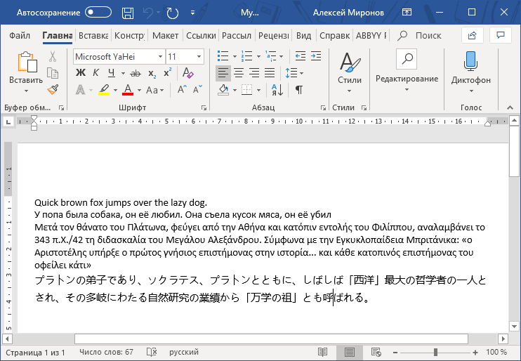

### WordApi - генерация документа Word с помощью DevExpress

DevExpress включает т. наз. WordApi - набор классов для работы со структурой документов Word. WordApi, насколько я могу судить, поддерживает все необходимые манипуляции - начиная с создания документа и заканчивая его экспортом в PDF. Самое замечательное в WordApi - то, что собственно Word на пользовательской машине не нужен. Наша программа может сама создать документ, сама показать его пользователю, позволить ему внести правки и распечатать документ - всё совершенно самостоятельно. Наше приложение может быть не только WinForms, но и консольным или ASP.NET. 

Что ж, пора испытать хвалёный WordApi! Создаём консольный проект для .NET FW 4.5 или выше, добавляем ссылки на сборки:

* System.Drawing.dll;
* DevExpress.Data.v19.1.dll;
* DevExpress.Office.v19.1.Core.dll;
* DevExpress.RichEdit.v19.1.Core.dll;
* DevExpress.Printing.v19.1.Core.dll;
* DevExpress.Pdf.v19.1.Core.dll;
* DevExpress.Utils.v19.1.dll.

Для начала убедимся, что DevExpress легко справляется с Unicode:

```c#
using DevExpress.XtraRichEdit;
using DevExpress.XtraRichEdit.API.Native;
 
class Program
{
    static void Main()
    {
        const string fileName = "MyFirstDocument.docx";
 
        using (RichEditDocumentServer server = new RichEditDocumentServer())
        {
            Document document = server.Document;
            document.AppendText("Quick brown fox jumps over the lazy dog.");
            document.Paragraphs.Append();
            document.AppendText("У попа была собака, он её любил. "
                + "Она съела кусок мяса, он её убил");
            document.Paragraphs.Append();
            document.AppendText("Μετά τον θάνατο του Πλάτωνα, φεύγει "
                + "από την Αθήνα και κατόπιν εντολής του Φιλίππου, "
                + "αναλαμβάνει το 343 π.Χ./42 τη διδασκαλία του Μεγάλου "
                + "Αλεξάνδρου. Σύμφωνα με την Εγκυκλοπαίδεια Μπριτάνικα: "
                + "«ο Αριστοτέλης υπήρξε ο πρώτος γνήσιος επιστήμονας "
                + "στην ιστορία... και κάθε κατοπινός επιστήμονας "
                + "του οφείλει κάτι»");
            document.Paragraphs.Append();
            document.AppendText("プラトンの弟子であり、ソクラテス、"
                + "プラトンとともに、しばしば「西洋」最大の哲学者の一人とされ、"
                + "その多岐にわたる自然研究の業績から「万学の祖」とも呼ばれる。");
            server.SaveDocument(fileName, DocumentFormat.OpenXml);
        }
    }
}
```

Вот как понимает Word сгенерированный файл:
 

 
Как видим, DevExpress не пугают даже иероглифы. Поэтому можем перейти к программному форматированию текста:
 
```c#
// Например, поменяем цвет символов
CharacterProperties cp = document
    .BeginUpdateCharacters(document.Paragraphs[0].Range);
cp.ForeColor = System.Drawing.Color.Red;
cp.Italic = true;
document.EndUpdateCharacters(cp);
 
// Например, поменяем выравнивание абзаца
ParagraphProperties pp = document
    .BeginUpdateParagraphs(document.Paragraphs[1].Range);
pp.Alignment = ParagraphAlignment.Right;
document.EndUpdateParagraphs(pp);
```

Можно также добавлять текст, форматированный вручную (обратите внимание на скобки `{\rtf1 ... }` — без них не работает!):

```c#
document.AppendRtfText(@"{\rtf1 Hello, \b Word\b0!"
    + @"\par Hello \i again\i0!}");
```

Радует возможность сохранить документ в самых различных форматах, например, EPUB, или экспортировать в PDF:

```c#
server.SaveDocument("test.epub", DocumentFormat.ePub);
server.ExportToPdf("test.pdf");
```

Работа со стилями. Стиль символов:

```c#
Document document = server.Document;
server.LoadDocument("Documents\\Grimm.docx", DocumentFormat.OpenXml);
CharacterStyle cstyle = document.CharacterStyles["MyCStyle"];
if (cstyle == null)
{
    cstyle = document.CharacterStyles.CreateNew();
    cstyle.Name = "MyCStyle";
    cstyle.Parent = document.CharacterStyles["Default Paragraph Font"];
    cstyle.ForeColor = System.Drawing.Color.DarkOrange;
    cstyle.Strikeout = StrikeoutType.Double;
    cstyle.FontName = "Verdana";
    document.CharacterStyles.Add(cstyle);
}
DocumentRange myRange = document.Paragraphs[0].Range;
CharacterProperties charProps =
    document.BeginUpdateCharacters(myRange);
charProps.Style = cstyle;
document.EndUpdateCharacters(charProps);
```

Стиль параграфа:

```c#
Document document = server.Document;
document.LoadDocument("Documents\\Grimm.docx", DocumentFormat.OpenXml);
ParagraphStyle pstyle = document.ParagraphStyles["MyPStyle"];
if (pstyle == null)
{
    pstyle = document.ParagraphStyles.CreateNew();
    pstyle.Name = "MyPStyle";
    pstyle.LineSpacingType = ParagraphLineSpacing.Double;
    pstyle.Alignment = ParagraphAlignment.Center;
    document.ParagraphStyles.Add(pstyle);
}
document.Paragraphs[2].Style = pstyle;
```

Вставка картинок:

```c#
Document document = server.Document;
DocumentPosition pos = document.Range.Start;
document.Images.Insert(pos, 
   DocumentImageSource.FromFile("Documents\\beverages.png"));
 
// или так
Document document = server.Document;
document.AppendText("Line One\nLine Two\nLine Three");
Shape myPicture = document.Shapes.InsertPicture(document.CreatePosition(15),
    System.Drawing.Image.FromFile("Documents\\beverages.png"));
myPicture.HorizontalAlignment = ShapeHorizontalAlignment.Center;
```

Вставка таблицы

```c#
Document document = server.Document;
// Insert new table. 
Table tbl = document.Tables.Create(document.Range.Start, 1, 3, 
   AutoFitBehaviorType.AutoFitToWindow);
// Create a table header. 
document.InsertText(tbl[0, 0].Range.Start, "Name");
document.InsertText(tbl[0, 1].Range.Start, "Size");
document.InsertText(tbl[0, 2].Range.Start, "DateTime");
// Insert table data. 
DirectoryInfo dirinfo = new DirectoryInfo("C:\\");
try
{
    tbl.BeginUpdate();
    foreach (FileInfo fi in dirinfo.GetFiles())
    {
        TableRow row = tbl.Rows.Append();
        TableCell cell = row.FirstCell;
        string fileName = fi.Name;
        string fileLength = String.Format("{0:N0}", fi.Length);
        string fileLastTime = String.Format("{0:g}", fi.LastWriteTime);
        document.InsertSingleLineText(cell.Range.Start, fileName);
        document.InsertSingleLineText(cell.Next.Range.Start, fileLength);
        document.InsertSingleLineText(cell.Next.Next.Range.Start, 
           fileLastTime);
    }
    // Center the table header. 
    foreach (Paragraph p in document.Paragraphs.Get(tbl.FirstRow.Range))
    {
        p.Alignment = ParagraphAlignment.Center;
    }
}
finally
{
    tbl.EndUpdate();
}
tbl.Cell(2, 1).Split(1, 3);
```

Отправить документ на печать:

```c#
server.Print();
 
// Можно применить нестандартные настройки печати:
PrinterSettings printerSettings = new PrinterSettings();
printerSettings.FromPage = 2;
printerSettings.ToPage = 3;
printerSettings.Copies = 2;
server.Print(printerSettings);
```

Можно подключить DevExpress Printing Library для ещё более тонких настроек (например, отключить сообщения об ошибках):

```c#
private static void PrintViaLink(RichEditDocumentServer srv)
{
    if (!srv.IsPrintingAvailable) return;
    PrintableComponentLink link 
        = new PrintableComponentLink(new PrintingSystem());
    link.Component = srv;
    // Disable warnings. 
    link.PrintingSystem.ShowMarginsWarning = false;
    link.PrintingSystem.ShowPrintStatusDialog = false;
    // Find a printer containing 'Canon' in its name. 
    string printerName = String.Empty;
    for (int i = 0; i < PrinterSettings.InstalledPrinters.Count; i++) {
        string pName = PrinterSettings.InstalledPrinters[i];
        if (pName.Contains("Canon")) {
            printerName = pName;
            break;
        }
    }
    // Print to the specified printer. 
    link.Print(printerName);
}
```

Кроме создания файла с нуля, можно загрузить уже имеющийся и вносить изменения в него. В этом нам помогут методы

* `RichEditDocumentServer.LoadDocument` и `Document.LoadDocument` — загрузка документа (заметьте, поддерживается не только DOC с DOCX, но и другие форматы, включая HTML, EPUB и т. д.);
* `RichEditDocumentServer.LoadDocumentTemplate` — загрузка шаблона;
* `SubDocument.InsertDocumentContent` и `SubDocument.AppendDocumentContent` — вставка субдокумента;

Единственное, что тут расстраивает — импортировать PDF нельзя, можно только экспортировать.

Короче, API замечательный, надо пользоваться!
