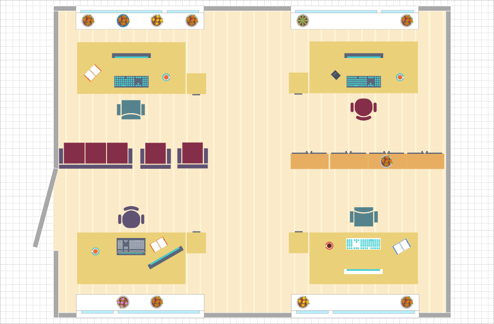
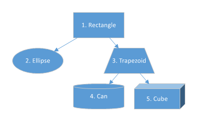

### Программная генерация диаграмм с помощью DevExpress

В состав DevExpress входит замечательный DiagramControl, с помощью которого пользователь может создавать такие вот шедевры (картинка честно украдена из официального Demo):



Однако, кроме рисования диаграмм «вручную», мы можем наполнять канву DiagramControl элементами с помощью соответствующего API, даже в консольном приложении или в ASP.NET. Вот простой пример генерации диаграммы из пяти элементов консольным приложением (чтобы всё заработало, необходимо добавить ссылки на сборки DevExpress.Data.v16.1, DevExpress.Diagram.v16.1.Core, DevExpress.Utils.v16.1, DevExpress.XtraDiagram.v16.1, DevExpress.XtraEditors.v16.1 и, само собой, System.Drawing с System.Windows.Forms):

```c#
using System.Drawing;
using System.Windows.Forms;
 
using DevExpress.Diagram.Core;
using DevExpress.Utils;
using DevExpress.XtraDiagram;
 
class Program
{
    static void Main()
    {
        DiagramControl diagram = new DiagramControl();
 
        DiagramShape shape1 = new DiagramShape
        {
            Shape = BasicShapes.Rectangle,
            Size = new SizeF(100, 50),
            Content = "1. Rectangle"
        };
        diagram.Items.Add(shape1);
 
        DiagramShape shape2 = new DiagramShape
        {
            Shape = BasicShapes.Ellipse,
            Size = new SizeF(100, 50),
            Content = "2. Ellipse"
        };
        diagram.Items.Add(shape2);
 
        DiagramShape shape3 = new DiagramShape
        {
            Shape = BasicShapes.Trapezoid,
            Size = new SizeF(100, 50),
            Content = "3. Trapezoid"
        };
        diagram.Items.Add(shape3);
 
        DiagramShape shape4 = new DiagramShape
        {
            Shape = BasicShapes.Can,
            Size = new SizeF(100, 50),
            Content = "4. Can"
        };
        diagram.Items.Add(shape4);
 
        DiagramShape shape5 = new DiagramShape
        {
            Shape = BasicShapes.Cube,
            Size = new SizeF(100, 50),
            Content = "5. Cube"
        };
        diagram.Items.Add(shape5);
 
        diagram.Items.AddRange
            (
                new DiagramConnector
                    (
                        ConnectorType.Straight,
                        shape1,
                        shape2
                    ),
                new DiagramConnector
                    (
                        ConnectorType.Straight,
                        shape1,
                        shape3
                    ),
                new DiagramConnector
                    (
                        ConnectorType.Straight,
                        shape3,
                        shape4
                    ),
                new DiagramConnector
                    (
                        ConnectorType.Straight,
                        shape3,
                        shape5
                    )
        );
 
        // Просим контрол расположить элементы автоматически
        // в виде дерева, растущего вниз
        diagram.ApplyTreeLayout(Direction.Down);
 
        // Уменьшаем канву контрола до минимально необходимого размера
        diagram.FitToDrawing();
 
        // Сохраняем получившуюся диаграмму в файл
        diagram.ExportDiagram("diagram.png");
    }
}
```

Вот что получается в итоге.



По-моему,очень мило.