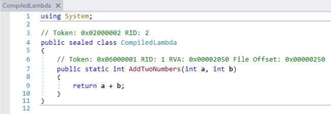

### Expression Trees

Для начала простейший пример:
```csharp
using System;
using System.Linq.Expressions;
  
class Program
{
    static void Main()
    {
        Expression<Func<int, int>> expression = x => (x + 1) * 2;
        Func<int, int> func = expression.Compile();
        for (int i = 0; i < 10; i++)
        {
            Console.WriteLine(func(i));
        }
    }
}
```

Теперь сгенерируем простую лямбду `(a, b) => a + b` вручную:
```csharp
// сначала опишем параметры лямбды
var parameterA = Expression.Parameter(typeof(int), "a"); // первый параметр
var parameterB = Expression.Parameter(typeof(int), "b"); // второй параметр
var expr = Expression.Lambda<Func<int,int,int>>
    (
        Expression.Add(parameterA, parameterB), // тело лямбды
        parameterA, // её параметры: первый
        parameterB  // и второй
    );
Console.WriteLine(expression); // (a, b) => a + b
var func = expr.Compile(); // получаем скомпилированный метод
 
// вызываем делегат
Console.WriteLine(func(2, 3)); // 5
```

Аналогично делается доступ к полям/свойствам объектов:
```csharp
using System;
using System.Linq.Expressions;
 
// какой-то класс, к свойствам которого мы хотим получить доступ
class Person
{
    public string Name { get; set; }
    public int Age { get; set; }
}
 
class Program
{
    static void Main()
    {
        var parameterP = Expression.Parameter(typeof(Person), "p");
        var expression = Expression.Lambda<Func<Person, string>>
            (
                Expression.Property(parameterP,"Name"), // тело лямбды
                parameterP // её параметр
            );
        Console.WriteLine(expression); // p => p.Name
        var func = expression.Compile();
 
        // пробуем обратиться к свойству объекта
        Person person = new Person { Name = "Старик Хоттабыч", Age = 8942 };
        Console.WriteLine(func(person)); // Старик Хоттабыч
    }
}
```

Теперь вызовем какой-нибудь метод (обратите внимание, никаких препятствий для вызова приватных методов чужих классов нет!):
```csharp
using System;
using System.Linq.Expressions;
using System.Reflection;
 
class Person
{
    public string Name { get; set; }
    public int Age { get; set; }
 
    // какой-то метод, вычисляющий нечто очень нужное нам
    static string SomeMethod(string text)
    {
        return text.Substring(7);
    }
}
 
class Program
{
    static void Main()
    {
        var parameterP = Expression.Parameter(typeof(Person), "p");
        var methodInfo = typeof(Person).GetMethod // получаем метод
            (
                "SomeMethod",
                BindingFlags.Static|BindingFlags.NonPublic
            );
        var expression = Expression.Lambda<Func<Person, string>>
            (
                Expression.Call
                    ( 
                        methodInfo, // вызываемый метод
                        Expression.Property(parameterP, "Name") // аргумент
                    ),
                parameterP
            );
        Console.WriteLine(expression); // p => SomeMethod(p.Name)
        var func = expression.Compile();
 
        // пробуем обратиться к свойству объекта
        Person person = new Person { Name = "Старик Хоттабыч", Age = 8942 };
        Console.WriteLine(func(person)); // Хоттабыч
    }
}
```

Естественно, нет никаких проблем со встраиванием вызова уже имеющейся лямбды в дерево:
```csharp
using System;
using System.Linq.Expressions;
 
class Person
{
    public string Name { get; set; }
    public int Age { get; set; }
}
 
class Program
{
    static void Main()
    {
        // пусть у нас уже есть какая-то лямбда, неважно откуда полученная
        Expression<Func<Person, int>> lambda = p => p.Name.Length / 2 + 1;
 
        // встроим её вызов (Invoke) в нашу лямбду
        var parameterP = Expression.Parameter(typeof(Person), "p");
        var expression = Expression.Lambda<Func<Person, int>>
            (
                Expression.Multiply
                    (
                        Expression.Invoke(lambda, parameterP), // вызов
                        Expression.Property(parameterP, "Age")
                    ),
                parameterP
            );
        Console.WriteLine(expression);
        // p => (((p.Name.Length / 2) + 1) * p.Age)
 
        var func = expression.Compile();
        Person person = new Person { Name = "Старик Хоттабыч", Age = 8942 };
        Console.WriteLine(func(person)); // 71536
    }
}
```

Как установить значение свойства прямым вызовом метода-сеттера:
```csharp
using System;
using System.Linq;
using System.Linq.Expressions;
 
class Person
{
    public string Name { get; set; }
    public int Age { get; set; }
}
 
class Program
{
    static void Main()
    {
        var personParameter = Expression.Parameter(typeof(Person), "person");
        var nameParameter = Expression.Parameter(typeof(string), "name");
        var propertyInfo = typeof(Person).GetProperty("Name");
 
        // получаем акцессоры (геттер и сеттер) данного свойства
        var accessors = propertyInfo.GetAccessors();
 
        // выбираем тот, который ничего не возвращает, или вылетаем с ошибкой
        var methodInfo = accessors.First(m => m.ReturnType == typeof(void));
        var body = Expression.Call
            (
                personParameter,
                methodInfo,
                nameParameter
            );
        var expression = Expression.Lambda<Action<Person, string>>
            (
                body,
                personParameter,
                nameParameter
            );
        Console.WriteLine(expression);
        // (person, name) => person.set_Name(name)
 
        var setter = expression.Compile();
 
        Person person = new Person();
        setter(person, "Старик Хоттабыч");
        Console.WriteLine(person.Name);
    }
}
```

Можно обойтись простым присвоением значения свойству/полю:
```csharp
var personParameter = Expression.Parameter(typeof(Person), "person");
var nameParameter = Expression.Parameter(typeof(string), "name");
var access = Expression.PropertyOrField(personParameter, "Name");
var expression = Expression.Lambda<Action<Person, string>>
    (
        Expression.Assign(access, nameParameter),
        personParameter,
        nameParameter
    );
Console.WriteLine(expression); // (person, name) => (person.Name = name)
var setter = expression.Compile();
```

Как проинициализировать объект со свойствами:
```csharp
using System;
using System.Linq.Expressions;
 
class Person
{
    public string Name { get; set; }
    public int Age { get; set; }
}
 
class Program
{
    static void Main()
    {
        var namePar = Expression.Parameter(typeof(string), "name");
        var agePar = Expression.Parameter(typeof(int), "age");
        var body = Expression.MemberInit // инициализация
            (
                Expression.New(typeof(Person)), // вызов конструктора
                Expression.Bind // первое свойство
                    (
                        typeof(Person).GetProperty("Name"),
                        namePar // чем инициализируем
                    ),
                Expression.Bind // второе свойство
                    (
                        typeof(Person).GetProperty("Age"),
                        agePar
                    )
            );
        var expression = Expression.Lambda<Func<string, int, Person>>
            (
                body,
                namePar,
                agePar
            );
 
        Console.WriteLine(expression);
        // (name, age) => new Person() {Name = name, Age = age}
 
        var initializer = expression.Compile();
        var person = initializer("Старик Хоттабыч", 8942);
        Console.WriteLine("{0}, {1}", person.Name, person.Age);
    }
}
```

Допустим теперь, что мы хотим сохранить полученную лямбду в DLL. Что делать? Надо объединить две технологии: новую — Expression Trees — и старую — Reflection.Emit.
```csharp
using System;
using System.Linq.Expressions;
using System.Reflection;
using System.Reflection.Emit;
 
class Program
{
    static void Main()
    {
        // делаем простейшую лямбду (a, b) => a + b
        var parA = Expression.Parameter(typeof(int), "a");
        var parB = Expression.Parameter(typeof(int), "b");
        var expr = Expression.Lambda<Func<int, int, int>>
            (
                Expression.Add(parA, parB),
                parA, parB
            );
 
        var asmName = new AssemblyName("compiled");
        var asmBuilder = AssemblyBuilder.DefineDynamicAssembly
            (
                asmName,
                AssemblyBuilderAccess.Save
            );
        var moduleBuilder = asmBuilder.DefineDynamicModule
            (
                "compiled",
                "compiled.dll"
            );
        var typeBuilder = moduleBuilder.DefineType
            (
                "CompiledLambda",
                TypeAttributes.Public|TypeAttributes.Sealed
            );
        var methodBuilder = typeBuilder.DefineMethod
            (
                "AddTwoNumbers",
                MethodAttributes.Public|MethodAttributes.Static
            );
        expr.CompileToMethod(methodBuilder);
        typeBuilder.CreateType();
        asmBuilder.Save("compiled.dll");
    }
}
```
Получаем файл compiled.dll размером 2048 байт. Декомпилятор показывает вот что:


