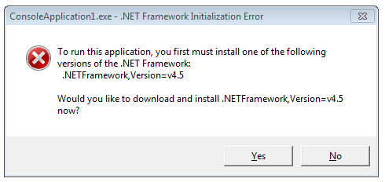

###Как пометить сборку «только .NET 4.5 и выше»

Вольный пересказ публикаций http://blog.lextudio.com/2013/02/how-to-tell-net-4-5-only-assemblies/ и http://www.hanselman.com/blog/NETVersioningAndMultiTargetingNET45IsAnInplaceUpgradeToNET40.aspx.

Microsoft сделала .NET версии 4.5 «заменой на месте» («in-place upgrade») для 4.0, чем обеспечила интересную жизнь как себе, разработчикам, так и рядовым пользователям. Глядя на систему «невооружённым глазом», невозможно сказать, установлен ли у нас «ванильный» .NET 4.0, или же он обновлён до 4.5. Соответственно, пользователи пытаются запускать программы, требующие 4.5 на простом 4.0 и получают массу негативных впечатлений по результатам падений и глюков этих программ.

Чтобы не злить пользователя лишний раз, разработчик должен предусмотреть подобную ситуацию и предотвратить запуск программы в неверном окружении. Одним из способов обеспечить это является использование атрибута System.Runtime.Versioning.TargetFrameworkAttribute.

Пример использования:

```csharp
using System;
using System.Runtime.Versioning;
 
[assembly:TargetFramework(".NETFramework,Version=v4.5")]
 
namespace MyCompany.Utilities
{
   public class StringLibrary
   {
      // Members defined here.
   }
}
```

Можно указать FrameworkDisplayName:

```csharp
using System;
using System.Runtime.Versioning;
 
[assembly:TargetFramework(".NETFramework,Version=v4.5", 
          FrameworkDisplayName = ".NET Framework, Version 4.5")]
 
namespace MyCompany.Utilities
{
   public class StringLibrary
   {
      // Members defined here.
   }
}
```

Конечно, же, никто не отменял привычного указания версии фреймворка в config-файле:

```xml
<?xml version="1.0" encoding="utf-8"?>
<configuration>
    <startup>
        <supportedRuntime version="v4.0" sku=".NETFramework,Version=v4.5" />
    </startup>
</configuration>
```

Тогда при попытке запустить программу, предназначенную для 4.5 на ванильном 4.0 пользователь будет получать сообщение об ошибке.



Однако, config-файл относится к программе в целом, а с помощью атрибута мы можем пометить каждую сборку в отдельности, чтобы исключить её использование в других проектах, предназначенных для «неверных» версий фреймворка.

* * *

Скотт предлагает следующий простой способ определить из программы, выполняется ли она под фреймворком 4.5 или выше:

```csharp
public static bool IsNet45OrNewer ()
{
    // Class "ReflectionContext" exists from .NET 4.5 onwards.
    return Type.GetType("System.Reflection.ReflectionContext", false) != null;
}
```
