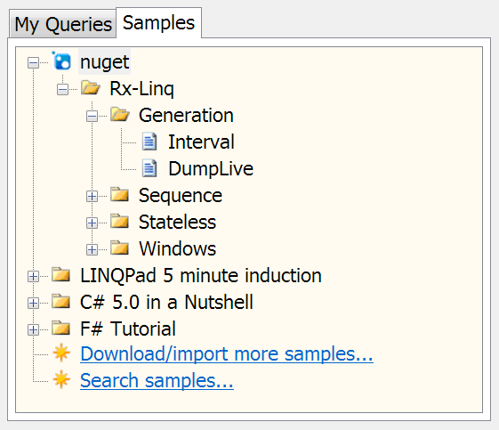
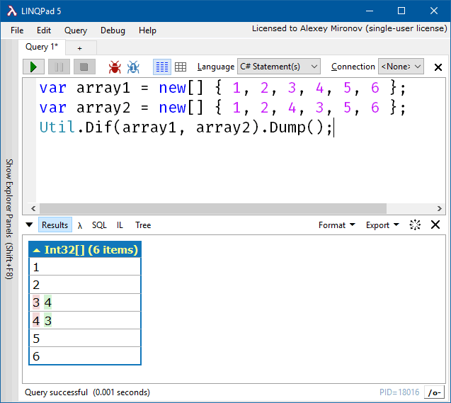
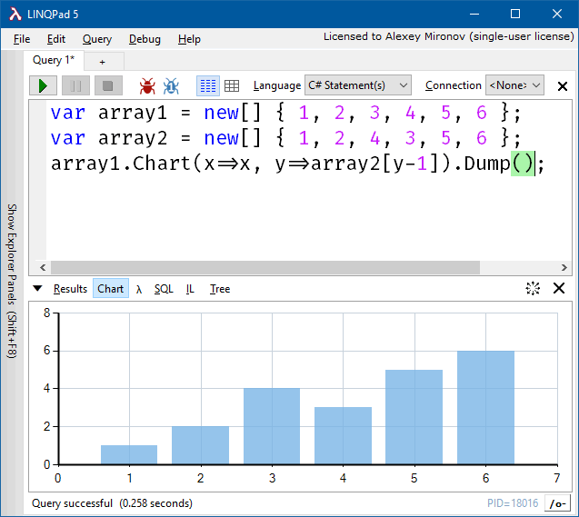
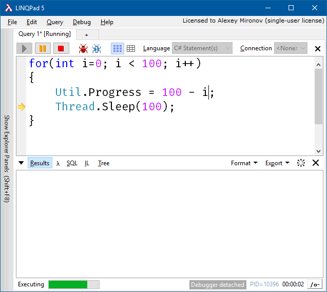
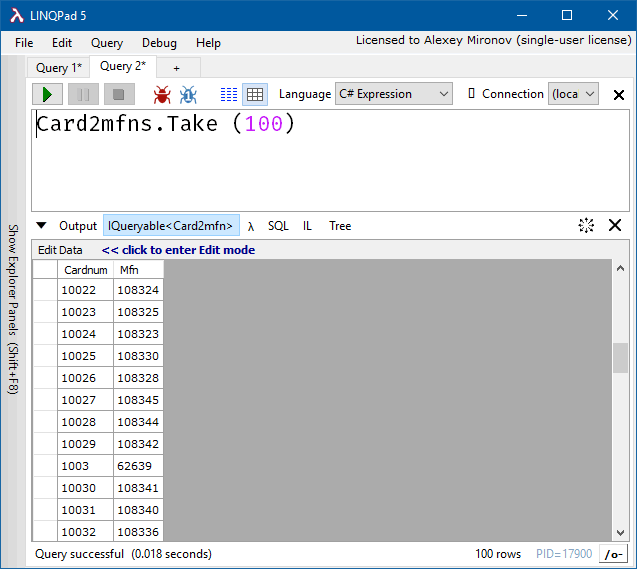
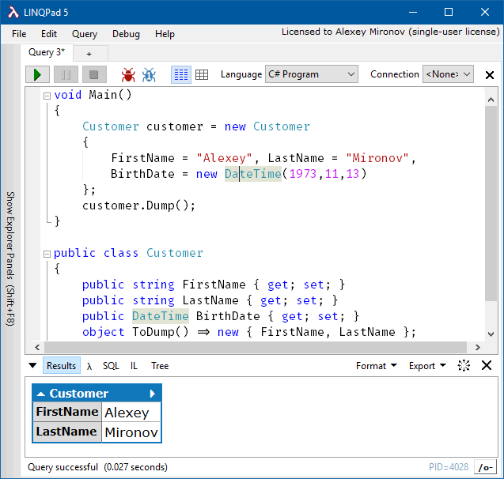
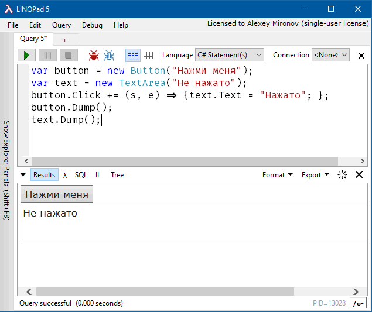
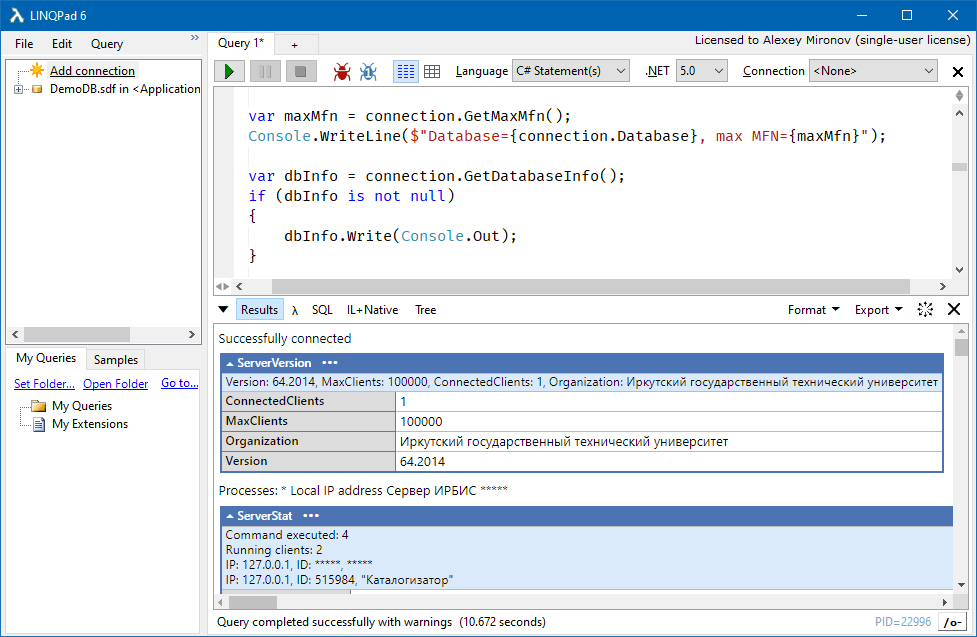

### Маленькие радости LinqPad

[LinqPad](http://linqpad.net/) – необыкновенно мощный инструмент для .NET-разработчика, учитывая его цену и размер. С его помощью можно не только изучать язык C#, но и с помощью мелкой механизации решать множество повседневных задач. В данном посте я собираю заметки о неожиданных (но приятных) особенностях LinqPad. Некоторые картинки позаимствованы с сайта LinqPad.

* Вызовы Console.Write, Console.WriteLine перехватываются и перенаправляются в окно Results.
* Любое значение можно красиво вывести в окно Results с помощью метода-расширения Dump.
* При вызове Dump можно указать заголовок выводимого значения.
* В статус-баре LinqPad выводит общее время выполнения кода: Query successful (00:00.832).
* С помощью сочетания клавиш Ctrl+Shift+C создаётся точная копия текущего кода в новой вкладке. Таким образом можно экспериментировать с кодом, не боясь испортить его.
* Сохранённые скрипты отображаются в окне My Queries, откуда могут быть вызваны в один клик мыши.
* Можно вызвать Dump для любого контрола WinForms или WPF, и LinqPad отрендерит его в окне WinForms.
* Результаты выполнения скрипта могут быть экспортированы в Microsoft Word, Excel и в HTML.
* В окне MyQueries присутствует скрипт с названием My Extensions, в котором есть класс MyExtensions. Любой метод-расширение, добавленный в него, становится доступным для всех классов в других пользовательских скриптах.
* Внутренние (internal) классы пользовательских сборок можно сделать видимыми для LinqPad с помощью атрибута [InternalsVisibleTo(«LINQPadQuery»)].
* Можно настроить, какие поля/свойства будет отображать LinqPad при вызове метода Dump. Для этого нужно реализовать следующий интерфейс:

```csharp
namespace LINQPad
{
  public interface ICustomMemberProvider
  {
    // Each of these methods must return a sequence
    // with the same number of elements:
    IEnumerable<string> GetNames();
    IEnumerable<Type>   GetTypes();
    IEnumerable<object> GetValues();
  }
}
```

* LinqPad также позволяет применять кастомные Data Context Drivers и кастомные визуализаторы.
* LinqPad поддерживает асинхронные методы, реактивные расширения и многопоточный код PLINQ.
* Текст в LinqPad можно масштабировать с помощью Ctrl+колесо мыши или Ctrl+Plus/Minus.
* Можно запустить PowerPoint или PowerPointViewer с помощью следующего кода, добавленного в скрипт:

```csharp
// Second argument = slide number to start at
PowerPoint.ShowSlide (@"c:\docs\MyPresentation.ppt", 1);
```

* В пакеты NuGet можно включать примеры скриптов, и LinqPad будет показывать их автоматически во вкладке Samples, если пакет загрузить в него:



Для этого необходимо сложить все примеры скриптов в папку linqpad-samples в пакете NuGet (можно организовать скрипты в подпапки):

```
lib
    net40
        ...
    net45
        ...
content
    ...
tools
    ...
linqpad-samples
    Getting Started
        Basic usage.linq
        ...
```

* Скрипты можно запускать из командной строки с помощью утилиты lprun.

```
lprun TestScript.linq
lprun TestScript.linq > results.txt
lprun script1.linq | lprun script2.linq
lprun -format=csv script.linq HelloWorld
lprun -format=html foo.linq > output.html
```

Доступны следующие выходные форматы: text, html, htmlfrag (нет стандартных заголовков HTML), csv, csvi (применяется Culture-Insensitive формат).

Ошибки и предупреждения пишутся в stderr.

Можно хранить скрипты в обычных (plaintext) файлах, но для их запуска требуется указать, на каком языке написан скрипт. Доступны следующие языки (прописные буквы означают сокращённую форму): Expression, Statements, Program, VBExpression, VBStatements, VBProgram, FSharpExpression, FSharpProgram, SQL, ESQL. Пример:

```
lprun -lang=e script.txt
```

В plaintext-скриптах можно использовать директиву using:

```csharp
using Foo.Bar;
using Bar.Foo;
     
Customers.Take(100)
```

В plaintext-скриптах можно ссылаться на сборки:

```csharp
ref System.Windows.Forms.dll;
ref System.Drawing, Version=4.0.0.0, Culture=neutral, PublicKeyToken=b03f5f7f11d50a3a;
 
using System.Windows.Forms;
using System.Drawing;
     
new Label().Anchor
```

В plaintext-скриптах можно ссылаться на NuGet-пакеты:

```csharp
ref nuget:Rx-Main;
using System.Reactive.Linq;
             
Observable.Range(1,10)
```

Последний скрипт эквивалентен .linq-файлу:

```xml
<Query Kind="Expression">
   <NuGetReference>Rx-Main</NuGetReference>
   <Namespace>System.Reactive.Linq</Namespace>
</Query>
 
Observable.Range(1,10)
```

Можно передавать аргументы скрипту:

```csharp
<Query Kind="Program" />
 
void Main (string[] args)
{
   args.Dump();
}
```

Если скрипт выполняется утилитой lprun, будет определён символ препроцессора CMD:

```csharp
#if CMD
   "I'm been called from lprun!".Dump();
#else
   "I'm running in the LINQPad GUI!".Dump();
#endif
```

* LinqPad поддерживает SQL Compact Edition.
* LinqPad предоставляет программный интерфейс для расширений (например, для подключения к нестандартным базам данных). Подробнее см. http://www.linqpad.net/Extensibility.aspx.
* LinqPad поддерживает WCF Data Services в качестве источников данных наравне с базами данных.
* Полностью поддерживается SQL Azure.
* Имеются стандартные плагины для подключения к SQLite и MySQL.
* Поддерживаются гиперссылки в результатах выполнения скрипта. По ним можно щелкать мышью, чтобы перейти на соответствующую страницу.
* Имеется перегрузка метода-расширения Dump ( int level ), в которой явно задаётся глубина раскрытия вложенных свойств. По умолчанию эта глубина равна 5.
* Поддерживается Microsoft Reactive Framework. Для Observable sequences можно вызывать Dump, это не приводит к блокировке выполнения скрипта. Можно просматривать несколько последовательностей одновременно.
* При компиляции скрипта определён символ препроцессора LINQPAD.
* LinqPad имеет сборку Any-CPU, которая на 64-битных системах запускается в 64-битном режиме (удобно, если нужно обрабатывать много данных).
* LinqPad имеет поддержу плагинов. DLL и EXE-файлы, помещённые в папку плагинов (по умолчанию My Documents\LINQPad Plugins, настраивается) загружаются и автоматически рефренсятся всеми скриптами.
* LinqPad предоставляет замечательный метод-расширение Disassemble. Использовать его можно так:

```
typeof (Uri).GetMethod ("GetHashCode").Disassemble().Dump();
```

В результате будет выведено:

```
IL_0000:  ldarg.0     
IL_0001:  call        System.Uri.get_IsNotAbsoluteUri
IL_0006:  brfalse.s   IL_0014
IL_0008:  ldarg.0     
...
IL_0073:  ret
```

В LinqPad встроен очень полезный класс Util, расположенный в глобальном пространстве имён.

| Метод/свойство/событие | Описание |
|------------------------|----------|
| `AutoScrollResults` | Включение/выключение автоматической прокрутки результатов
| `Break()` | Подключение отладчика и активизация точки останова
| `Cache<T> (Func<T> dataFetcher)` | Кеширование результата вычислений между запусками скрипта
| `Cleanup` [событие] | Возникает при очистке скрипта
| `ClearResults()` | Очищает панель результата
| `Cmd(command)` + перегрузки | Выполнение внешней программы, вывод возвращается в виде массива строк
| `Compile(filePath)` | Компиляция внешнего скрипта
| `CompileAsync(filePath)` | Асинхронная компиляция
| `CreateXhtmlWriter` | `TextWriter`, который форматирует данные аналогично встроенному форматтеру LinqPad
| `CurrentDataContext` | Текущий контекст подключения к базе данных
| `DisplayWebPage(Uri uri)` + перегрузки | Показ веб-страницы в панели результатов
| `GetFullPath(string fileName)` | Получение полного пути к DLL или EXE
| `GetMyQueries` | Получение списка скриптов
| `GetPassword` | Запрос пароля у пользователя
| `GetWebProxy` | Получение сконфигурированного в системе прокси
| `Highlight(object data)` | Вывод объекта подсвеченным
| `HighlightIf<T>(T data, Func<T, bool> predicate)` | Условный вывод объекта подсвеченным
| `HorizontalRun(bool withGaps, object[] data)` | Вывод массива объектов горизонтально
| `Image(byte[] data)` + перегрузки | Загрузка изображения
| `KeepRunning` | Продолжение выполнения скрипта (возвращается IDisposable, освобождение которого означает отмену режима KeepRunning)
| `Metatext(string data)` | Вывод текста зелёным + курсив
| `NewProcess` | Форсирование создания нового процесса
| `OnDemand(string description, Func<T> eval)` + перегрузки | Выполнение кода при щелчке по гиперссылке
| `Progress` | Условная степень прогресса выполнения скрипта
| `RawHtml(XElement node)` | Получение форматированного вывода
| `ReadLine()` + перегрузки | Запрос строки у пользователя
| `ReadLineAsync` | Асинхронный запрос строки у пользователя
| `Run` | Выполнение внешнего скрипта
| `SetPassword(string name, string password)` | Сохранение (или удаление) пароля во внутреннем хранилище
| `SqlOutputWriter` | TextWriter, в который записываются транзакции SQL
| `ToCsvString(IEnumerable<T> elements)` | Вывод объектов в формате CSV
| `ToHtmlString(params object[] args)` | Вывод объектов в формате HTML
| `VerticalRun(params object[] args)` | Вывод массива объектов вертикально
| `WithStyle(object data, string style)` | Вывод объекта с указанным стилем
| `WordRun(bool withGaps, params object[] args)` | Вывод последовательности объектов
| `WriteCsv(IEnumerable<T> elements, sting path)` | Запись объектов в файл в формате CSV

Другой полезный класс `Hyperlinq`. Его можно использовать двумя способами. Во-первых, можно вставлять гиперссылки в выходной поток:

```csharp
new Hyperlinq ("www.linqpad.net").Dump();
new Hyperlinq ("www.linqpad.net", "Web site").Dump();
new Hyperlinq ("mailto:user@domain.com", "Email").Dump();
```

Во-вторых, можно формировать динамические запросы:

```csharp
// Dynamically build simple expression:
new Hyperlinq (QueryLanguage.Expression, "123 * 234").Dump();
 
// Dynamically build query:
new Hyperlinq (QueryLanguage.Expression, @"from c in Customers
where c.Name.Length > 3
select c.Name", "Click to run!").Dump();
```

Сравнение двух объектов (не обязательно массивов):



Построение простых диаграмм:



Простой индикатор прогресса:



Редактирование данных в виде таблицы (ошеломляюще полезно!):



Полезный метод ToDump, позволяющий контролировать, какие поля будут выведены в дамп:



Можно встраивать контролы и привязывать к ним обработчики событий:



Если некоторые вычисления в скрипте слишком затратны, можно сделать так, чтобы они запускались лишь при необходимости:

```csharp
Util.OnDemand("Some Expensive Query", () => MyExpensiveQuery());
```

### LinqPad 6

Современный LinqPad (версия 6) работает поверх .NET Core 3.1 и .NET 5, поддерживает C# 9 и интерактивную отладку. LinqPad-скрипты могут ссылаться как на NuGet-пакеты, так и на .NET-сборки.



Что же нового и полезного предлагают актуальные версии LinqPad?

* Возможность сослаться на другой .linq-файл с помощью директивы `#load`.
* Новый встроенный драйвер баз данных, поддерживающий Oracle, Postgres, MySQL и SQLite с помощью современного Entity Framework Core.
* Сильно улучшенный подсказчик, в т. ч. автокомплит для имен файлов, улучшенная навигация среди скриптов (в т. ч. загруженных с помощью `#load`, сервис закладок в редакторе и интегрированный «цитатник» Roslyn.
* Поддержка декларации пространств имен, новая возможность выбора кода, который будет выполнен.
* Доработана модель расширения LinqPad, позволяющая создавать драйверы контекста данных. Теперь такие драйверы можно легко и просто публиковать на NuGet.
* Поддержка прерывания исполнения скрипта с помощью `this.QueryCancelToken`.
* Можно не заморачиваться с сохранением скриптов, LinqPad сам «кладет их на полку» и достает оттуда при следующем запуске. Более того, «на полку» помещается и вся история редактирования скрипта. Так что теперь можно просто закрыть LinqPad, сказав ему «Shelve», а назавтра просто нажать `Ctrl` `Z` и продолжить редактирование как ни в чем не бывало.
* Можно написать собственный визуализатор для знаменитого вызова `.Dump()`. Например, можно вывести на панель Output собственный WPF-контрол вроде кнопки нужного цвета.
* Вокруг утилиты `lprun` накрутили целую инфраструктуру.
* Если купить версию LinqPad 6, то апгрейд до версии LinqPad 7 (соответствующий выходу .NET 6) бесплатный! 🙂
