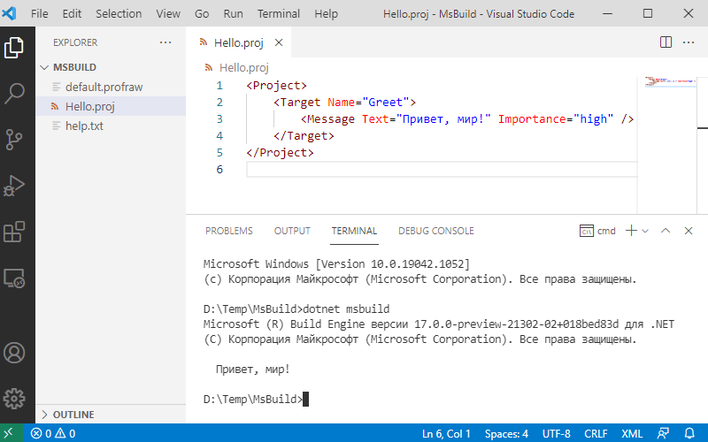

### Hello, MsBuild!

MsBuild — попытка Microsoft создать универсальную систему сборки, проще говоря Make, в котором исправлен «фатальный недостаток». 🙂 Она появилась в 2003 году как замена NMake и была «прибита гвоздями» к Windows и Visual Studio. Со временем ее портировали с .NET Framework на .NET Core, так что теперь она работает везде, в т. ч. на Linux и на OS X.

Подобно Make, она ориентирована в первую очередь на сборку программ на языках вроде C/C++/C#, однако MsBuild (как и Make) можно при желании использовать для чего угодно, что можно выразить в терминах командной строки, например, собирать PDF-книгу из россыпи TeX-файлов или архивировать файлы и заливать архивы в облако. Все упирается только в наше желание изучить синтаксис MsBuild.



Теперь «галопом по Европам». Как запускать:

```bash
MSBuild.exe [параметры] [файл проекта | каталог]
# или лучше так
dotnet msbuild [параметры] [файл проекта | каталог]
```

Если файл проекта не указан, MSBuild ищет в текущем рабочем каталоге файл с расширением *proj и использует его. Если указан каталог, MSBuild ищет файл проекта в нем. Если файлов проектов нет или много, MsBuild жалуется.

Пример:

```
dotnet msbuild -t:Clean -p:Configuration=Debug;TargetFrameworkVersion=v3.5 MyApp.csproj
```

Параметры командной строки (только самые нужные):

```
-target:<цели>  
   Краткая форма: -t
 
   -target:Resources;Compile
 
-property:<n>=<v>  
   Свойства уровня проекта. <n> является именем свойства,
   а <v> -  его значением. Краткая форма: -p
 
   -property:WarningLevel=2;OutDir=bin\Debug\
 
-maxCpuCount[:n]   
   Максимальное количество параллельных процессов сборки. 
   Если ключне используется, применяется значение по умолчанию 1.
   Если ключ используется без значения, MSBuild
   будет использовать то количество процессоров,
   которое установлено на компьютере. Краткая форма: -m[:n]
  
-verbosity:<уровень> 
   Отображать эти сведения в журнале событий.
   Доступными уровнями детализации являются: q[uiet], m[inimal],
   n[ormal], d[etailed] и diag[nostic]. (Краткая форма: -v)
 
   -verbosity:quiet  
 
-targets[:file]
   Выводит список доступных целевых объектов без выполнения
   фактического процесса сборки. ПО умолчанию выходные данные записываются в
   окно консоли. Если указан пусть к выходному
   файлу, будет использоваться он. Краткая форма: -ts
    
   -ts:out.txt
   
-interactive[:True|False]
   Указывает, что действию в сборке можно взаимодействовать с пользователем. 
   Указание -interactive равносильно указанию -interactive:true.
   
@<файл>            
   Вставка параметров командной строки из текстового файла. Для задания
   нескольких файлов ответов укажите каждый файл ответов отдельно.
 
   Все файлы ответов с именем "msbuild.rsp" автоматически
   считываются из следующих расположений:
   (1) каталога, где находится файл msbuild.exe
   (2) каталога первой сборки проекта или решения
 
-noAutoResponse    
   Не включать автоматически никакие файлы MSBuild.rsp. 
   Краткая форма: -noAutoRsp
 
-noLogo            
   Не отображать начальный заголовок и сообщение об авторском праве.
 
-version           
   Отображать только данные о версии. Краткая форма: -ver
```

Proj-файлы представляют собой обычные XML-файлы со специальной схемой (`xmlns="http://schemas.microsoft.com/developer/msbuild/2003"`). Вот простейший proj-файл, выводящий традиционное приветствие:

```msbuild
<Project>

    <Target Name="Greet">
        <Message Text="Привет, мир!" Importance="high" />
    </Target>

</Project>
```

То, что у других называется переменной, в MsBuild называется Property и заводится довольно монструозно:

```msbuild
<Project>

    <PropertyGroup>
        <Message>Привет, мир!</Message>
    </PropertyGroup>
 
    <Target Name="Greet">
        <Message Text="$(Message)" Importance="high" />
    </Target>

</Project>
```

Одна проперть соответствует одной строке (`System.String` в терминах .NET). Вообще, в proj-файлах могут присутствовать четыре типа сущностей:

Properties — именованная строка (см. выше);
Targets — цели сборки, должна быть хотя бы одна (иначе зачем вообще заводить шарманку?), можно указать цели по умолчанию в атрибуте DefaultTargets корневого элемента Project;
Items — элементы, объединяемые в списки, например, файлы с исходным кодом;
Tasks — нечто вроде подпрограмм.

Айтемы (элементы):

```msbuild
<Project>

    <ItemGroup>
        <City Include="Иркутск" />
        <City Include="Ангарск" />
        <City Include="Шелехов;Братск" />
    </ItemGroup>
 
    <Target Name="Greet">
        <Message Text="Города Иркутской области: @(City)" Importance="high" />
    </Target>

</Project>
```

По умолчанию в качестве разделителя используется точка с запятой. Чтобы перечислить города через запятую, достаточно указать ее в качестве разделителя внутри `@(City)`:

```msbuild
<Message Text="Города Иркутской области: @(City, ', ')" Importance="high" />
```

Перевод строки в качестве разделителя можно задать так:

```msbuild
<Message Text="Города Иркутской области: @(City, '%0A%0D')" Importance="high" />
```

Более интеллектуальное обращение к элементам списка:

```msbuild
<Project>

    <ItemGroup>
        <City Include="Иркутск" />
        <City Include="Ангарск" />
        <City Include="Шелехов;Братск" />
    </ItemGroup>
 
    <Target Name="Greet">
        <Message Text="@(City->'Город %(Identity)')" Importance="high" />
    </Target>

</Project>
```

Условное задание проперти:

```msbuild
<Project>

    <PropertyGroup>
        <HelloMessage Condition=" '$(Really)' == 'true' ">
            Условный привет!
        </HelloMessage>
    </PropertyGroup>
 
    <Target Name="Greet">
        <Message Text="$(HelloMessage)" Importance="high" />
    </Target>

</Project>
```

Чтобы вывелось сообщение, необходимо задать в командной строке значение `true` для `Really`:

```
dotnet msbuild -p:Really=true
```

MsBuild предоставляет прорву встроенных свойств. Вот некоторые, самые интересные:

* **MSBuildProjectDirectory** — Абсолютный путь к каталогу, где располагается файл проекта.
* **MSBuildProjectDirectoryNoRoot** — Значение свойства `MSBuildProjectDirectory`, за исключением корневого диска.
* **MSBuildLastTaskResult** — Значение true, если предыдущая задача завершилась без ошибок (даже если были предупреждения).
* **MSBuildProjectFile** — Имя файла проекта, включая расширение.
* **MSBuildProjectFullPath** — Абсолютный путь к файлу проекта и его полное имя, включая расширение.
* **MSBuildProjectName** — Имя файла проекта без расширения.
* **MSBuildStartupDirectory** — Абсолютный путь к каталогу, из которого вызывается MSBuild.
