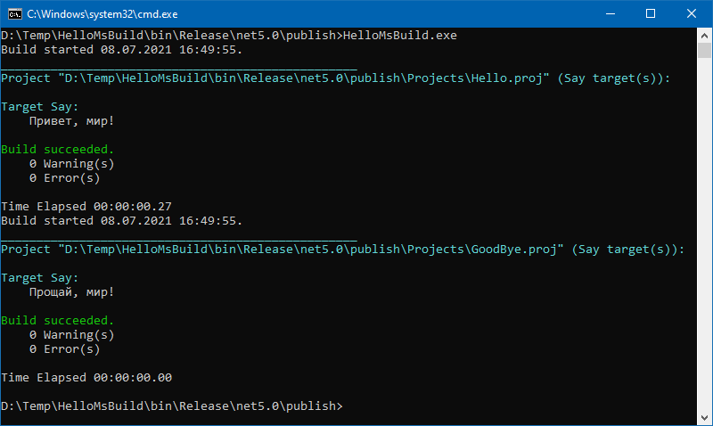

### MsBuild API

MsBuild можно не только использовать как инструмент командной строки, но и вызывать программно, чем и занимается Visual Studio (да и Rider тоже). Настал и наш черед 🙂

Первое, о чем нужно предупредить: есть устаревшая версия API, проживающая в NuGet-пакете `Microsoft.Build.Engine`, ее лучше не использовать, если Вы не любитель читать сообщения «Obsolete API» 🙂

Актуальная версия API проживает в пакете `Microsoft.Build`, однако, в дополнение к нему лучше подключить пакет `Microsoft.Build.Runtime`, содержащий очень нужную «обвязку», например, задачу `Message`, которую мы собираемся использовать в своих проектах.

Пусть у нас есть два псевдо-проекта: `Hello.proj` следующего содержания

```msbuild
<Project>

    <PropertyGroup>
        <HelloText>Привет, мир!</HelloText>
    </PropertyGroup>
 
    <Target Name="Say">
        <Message Text="$(HelloText)" Importance="high" />
    </Target>

</Project>
```

и совершенно аналогичный ему `GoodBye.proj`. Вот как можно заставить нашу (именно нашу, локальную!) копию MsBuild собрать их:

```c#
using System.Collections.Generic;
using System.IO;
 
using Microsoft.Build.Execution;
using Microsoft.Build.Framework;
using Microsoft.Build.Logging;
 
// вот наши проекты
var helloProject = Path.GetFullPath ("Projects/Hello.proj");
var goodByeProject = Path.GetFullPath ("Projects/GoodBye.proj");
var projects = new[] { helloProject, goodByeProject };
 
// будем выводить все сообщения в консоль
var consoleLogger = new ConsoleLogger (LoggerVerbosity.Normal);
var loggers = new ILogger[] { consoleLogger };
 
// предположим, что нам нужны такие настройки сборки
var globalProperties = new Dictionary<string, string>
{
    ["Configuration"] = "Release",
    ["Platform"] = "x64"
};
 
// параметры сборки: тут-то и пригодился наш логгер 
var parameters = new BuildParameters();
parameters.Loggers = loggers;
parameters.GlobalProperties = globalProperties;
var buildManager = BuildManager.DefaultBuildManager;
 
// проходимся по проектам и собираем их
foreach (var project in projects)
{
    var instance = new ProjectInstance (project);
    var targets = new [] { "Say" };
    var request = new BuildRequestData (instance, targets);
    var result = buildManager.Build (parameters, request);
    if (result.OverallResult == BuildResultCode.Failure)
    {
        // останавливаем сборку при ошибке
        break;
    }
}
```

Опубликованное приложение (Framework-Dependent Portable) состоит из 57 файлов общим объемом 8.5 Мб, среди которых большинство — та самая «обвязка», нужная MsBuild для красивого вывода на экран «Build succeeded» 🙂



Проект прилагаю: [HelloMsBuild](HelloMsBuild.zip).
