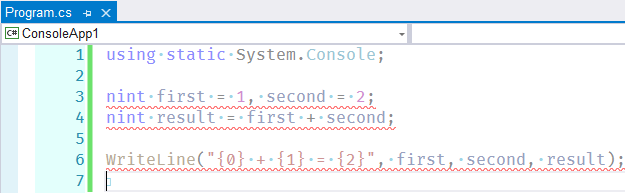

### Нативные целые в .NET 5

В .NET 5 и заодно в C# 9 появилась маленькая, но небесполезная фича — так называемые [нативные целые типы данных](https://docs.microsoft.com/en-us/dotnet/csharp/language-reference/proposals/csharp-9.0/native-integers). Предназначены они, насколько я понял, для Xamarin, чтобы было легче писать обёртки над нативными библиотеками. Но решили, что пригодиться такие типы могут всем, поэтому их включили в общий фреймворк.

На 32-битных системах nint является 32-битным целым со знаком, на 64-битных – соответственно 64-битным целым со знаком. Аналогично обстоят дела с беззнаковым nuint. В остальном это обычные целочисленные типы, которые можно складывать, умножать, выводить в консоль и т. д.

```c#
using static System.Console;
 
nint first = 1, second = 2;
nint result = first + second;
 
WriteLine("{0} + {1} = {2}", first, second, result);
```

Вот только Visual Studio (даже 19.6 Preview 1) эти типы не признаёт и подчёркивает красным. :(



Компилируется и запускается этот код нормально.
