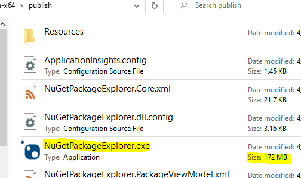
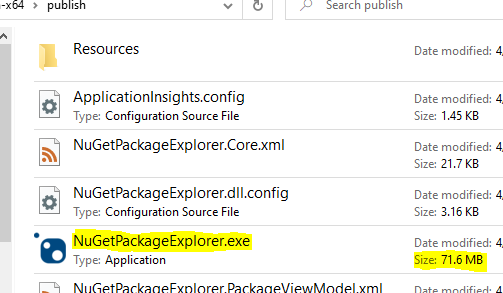

### Сжатие при публикации

Single-file bundles now support compression, which can be enabled by setting the property EnableCompressionInSingleFile to true. At runtime, files are decompressed to memory as necessary. Compression can provide huge space savings for some scenarios.

Let’s look at single file publishing, with and without compression, used with NuGet Package Explorer.

Without compression: 172 MB

With compression: 71.6 MB

Compression can significantly increase the startup time of the application, especially on Unix platforms (because they have a no-copy fast start path that can’t be used with compression). You should test your app after enabling compression to see if the additional startup cost is acceptable.
