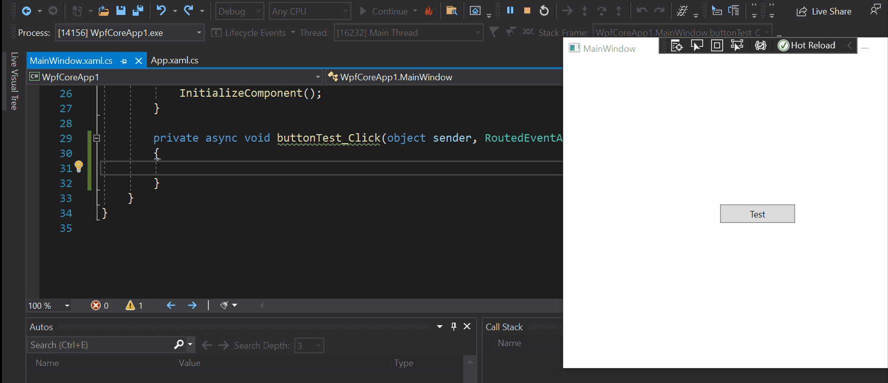

### Hot Reload

https://devblogs.microsoft.com/dotnet/introducing-net-hot-reload/

Today, we are excited to introduce you to the availability of the .NET Hot Reload experience in Visual Studio 2019 version 16.11 (Preview 1) and through the dotnet watch command-line tooling in .NET 6 (Preview 4). In the rest of this blog post, we’d like this opportunity to walk you through what is .NET Hot Reload, how you can get started using this feature, what our vision is for future planned improvements and clarity on what type of edits and languages are currently supported.

#### What is .NET Hot Reload?

With Hot Reload you can now modify your apps managed source code while the application is running, without the need to manually pause or hit a breakpoint. Simply make a supported change while your app is running and in our new Visual Studio experience use the “apply code changes” button to apply your edits.
