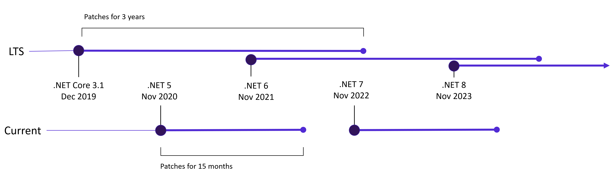

### .NET 6

.NET 6 является LTS (Long Term Support) релизом и будет поддерживаться 3 года, т. е. до ноября 2024 года.

Поддерживаются операционные системы: Windows, Linux, OS X, Android, iOS/tvOS:

Операционная система | Версии                  | Архитектуры
---------------------|-------------------------|------------------
Windows              | 7 (SP1), 8.1, 10        | x86, x64, arm64
OS X                 | 10.14+                  | x64, arm64
Linux                | см. ниже                | x64, arm32, arm64
Android              | API 21+ (Lollipop, 5.0) | x64, arm32, arm64
iOS/tvOS             | 10.0+                   | x64, arm32, arm64

**Windows**

Система           | Версии       | Архитектуры
------------------|--------------|-----------------
Client            | 7 (SP1), 8.1 | x64, x86
Windows 10 Client | 1607+        | x64, x86, arm64
Server            | 2012 R2+     | x64, x86
Server Core       | 2012 R2+     | x64, x86
Nano Server       | 1809+        | x64

**Linux**

Дистрибутив | Версии               | Арихитектуры
------------|----------------------|------------------
Alpine      | 3.13+                | x64, arm32, arm64
CentOS      | 7+                   | x64
Debian      | 10+                  | x64, arm32, arm64
Fedora      | 32+                  | x64
openSUSE    | 15+                  | x64
Red Hat     | 7+                   | x64, arm64
SUSE (SLES) | 12 SP2+              | x64
Ubuntu      | 16.04, 18.04, 20.04+ | x64, arm32, arm64

#### Образы Docker

* **dotnet/sdk**: .NET SDK
* **dotnet/aspnet**: ASP.NET Core Runtime
* **dotnet/runtime**: .NET Runtime
* **dotnet/runtime-deps**: .NET Runtime Dependencies - *предназначен для self-contained приложений*
* **dotnet/samples**: .NET Samples

#### Tarfet framework monikers

* net6.0
* net6.0-android
* net6.0-ios
* net6.0-maccatalyst
* net6.0-macos
* net6.0-tvos
* net6.0-windows

#### Фичи

* [MAUI](MAUI/README.md) (Multi-platform Application UI)
* Blazor desktop apps
* Crossgen2
* [Новые API для математических вычислений](Math.md)
* [Изменения в System.Text.Json](Json.md)
* [PriorityQueue](PriorityQueue.md)
* [Hot Reload](HotReload.md)
* [Microsoft.Extensions.Logging compile-time source generator](Logging.md)
* [Сжатие при публикации](Compression.md)
* [Встроенная проверка .NET SDK](Checking.md)
* [Response files](ResponseFiles.md)
* [Crossgen2](Crossgen2.md)
* [Ready to run](ReadyToRun.md)
* [Loop alignment](LoopAlignment.md)
* [Async](Async.md)
* [DateOnly](DateOnly.md)
* [FileStream](FileStream.md)
* [Profile guided optimization](PGO.md)
* [Что нового в dotnet monitor](Monitor.md)

#### Блог

* https://devblogs.microsoft.com/dotnet/announcing-net-6-preview-1/
* https://devblogs.microsoft.com/dotnet/announcing-net-6-preview-2/
* https://devblogs.microsoft.com/dotnet/announcing-net-6-preview-3/
* https://devblogs.microsoft.com/dotnet/announcing-net-6-preview-4/
