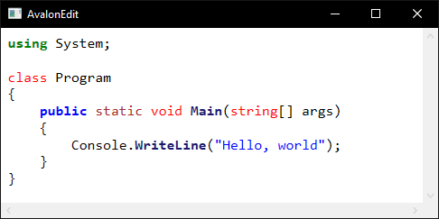

### AvalonEdit

AvalonEdit — редактор кода для WPF. Это проект с открытым кодом, часть проекта [SharpDevelop](http://www.icsharpcode.net/OpenSource/SD/Default.aspx).

Сайт проекта: http://avalonedit.net/, GitHub: https://github.com/icsharpcode/AvalonEdit, NuGet: https://www.nuget.org/packages/AvalonEdit

Использовать его довольно легко. Простейший пример:

```xml
<Window x:Class="WpfApp1.MainWindow"
        xmlns="http://schemas.microsoft.com/winfx/2006/xaml/presentation"
        xmlns:x="http://schemas.microsoft.com/winfx/2006/xaml"
        xmlns:d="http://schemas.microsoft.com/expression/blend/2008"
        xmlns:mc="http://schemas.openxmlformats.org/markup-compatibility/2006"
        xmlns:local="clr-namespace:WpfApp1"
        mc:Ignorable="d"
        Title="AvalonEdit" Height="250" Width="500">
    <Grid>
        <avalonEdit:TextEditor
            xmlns:avalonEdit="http://icsharpcode.net/sharpdevelop/avalonedit"
            Name="textEditor"
            Padding="0.2cm"
            FontFamily="Consolas"
            SyntaxHighlighting="C#"
            FontSize="12pt"/>
    </Grid>
</Window>
```

Вот что получается:


