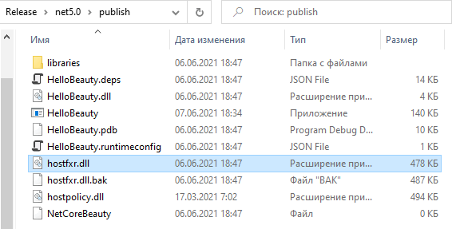

### Привет, красотка!

Да, в настоящее время есть возможность публикации .NET-приложения в виде большого EXE-файла, но, к сожалению, это может приводить к сложностям, например, при вызове методов через Reflection. Приходится публиковать приложение в виде россыпи пары сотен DLL-файлов. Это не страшно, но немного неэстетично.

К радости программистов-эстетов, есть способ «объехать» это ограничение «на кривой козе», т. е. с помощью патчинга `hostfxr.dll`. Динамические библиотеки аккуратно складываются в папку `libraries`, и приложение становится невыносимо прекрасным 🙂

Руками патчить ничего не надо, за нас всё проделали китайцы 🙂 Они создали NuGet-пакет [NetCoreBeauty](https://github.com/nulastudio/NetCoreBeauty). Достаточно включить его в свой проект и дописать несколько строк в csproj-файл:

```msbuild
<Project Sdk="Microsoft.NET.Sdk">
 
    <PropertyGroup>
        <OutputType>Exe</OutputType>
        <TargetFramework>net5.0</TargetFramework>
        <BeautyLibsDir>libraries</BeautyLibsDir>
        <DisableBeauty>False</DisableBeauty>
        <NoBeautyFlag>False</NoBeautyFlag>
        <ForceBeauty>False</ForceBeauty>
        <DisablePatch>False</DisablePatch>
        <BeautyLogLevel>Error</BeautyLogLevel>
    </PropertyGroup>
 
    <ItemGroup>
      <PackageReference Include="nulastudio.NetCoreBeauty" Version="1.2.9.2" />
    </ItemGroup>
 
</Project>
```

И это всё, что от нас требуется! При публикации приложения в режиме Self-Contained «красавица» автоматически переместит системные DLL в заданную папку и пропатчит `hostfxr.dll`. С точки зрения приложения происходит «магия» — нужные DLL находятся сами. Это ли не чудо?!


