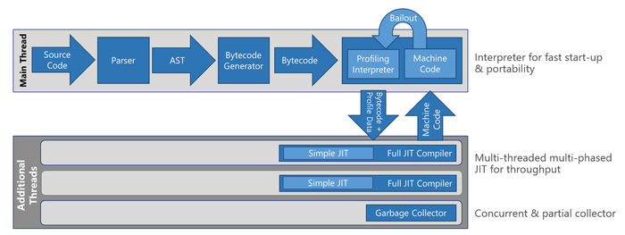

### Движок ChakraCore

JavaScript-движок ChakraCore используется в браузере Edge, СУБД Azure DocumentDB, Cortana и других продуктах Microsoft. Теперь его код открыт под лицензией MIT и размещён на GitHub. В репозитории имеется: JIT-компилятор для JavaScript (с поддержкой x86, x64 и ARM!), сборщик мусора, JavaScript Runtime, интерпретатор и парсер с поддержкой ECMAScript 2015.



Вот (официальный) пример программы на C#, которая загружает и использует ChakraCore:

```csharp
using System;
using System.Runtime.InteropServices;
// wrapper namespace
using ChakraHost.Hosting;
 
public class HelloWorld
{
    static void Main() {
        JavaScriptRuntime runtime;
        JavaScriptContext context;
        JavaScriptSourceContext currentSourceContext 
          = JavaScriptSourceContext.FromIntPtr(IntPtr.Zero);
        JavaScriptValue result;
 
        // Your script, try replace the basic 
        // hello world with something else
        string script = "(()=>{return \'Hello world!\';})()";
 
        // Create a runtime. 
        Native.JsCreateRuntime(JavaScriptRuntimeAttributes.None, 
           null, out runtime);
 
        // Create an execution context. 
        Native.JsCreateContext(runtime, out context);
 
        // Now set the execution context as being the current 
        // one on this thread.
        Native.JsSetCurrentContext(context);
 
        // Run the script.
        Native.JsRunScript(script, currentSourceContext++, 
           "", out result);
 
        // Convert your script result to String in JavaScript; 
        // redundant if your script returns a String
        JavaScriptValue resultJSString;
        Native.JsConvertValueToString(result, 
           out resultJSString);
 
        // Project script result in JS back to C#.
        IntPtr resultPtr;
        UIntPtr stringLength;
        Native.JsStringToPointer(resultJSString, 
          out resultPtr, 
          out stringLength);
 
        string resultString = Marshal.PtrToStringUni(resultPtr);
        Console.WriteLine(resultString);
        Console.ReadLine();
 
        // Dispose runtime
        Native.JsSetCurrentContext(JavaScriptContext.Invalid);
        Native.JsDisposeRuntime(runtime);
    }
}
```

Подробнее см. [новость на Хабре](https://habrahabr.ru/company/microsoft/blog/275067/).
