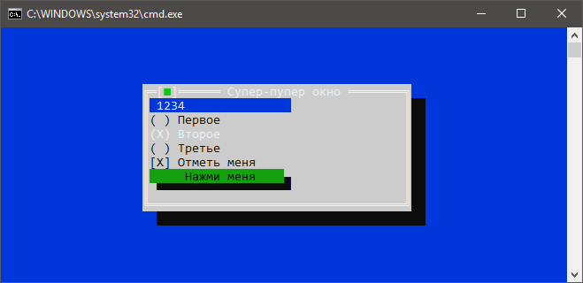
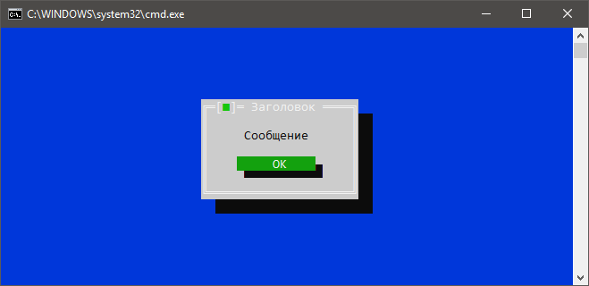

### ConsoleFramework

Статья: https://www.codeproject.com/Articles/750873/Turbo-Vision-resurrected-for-Csharp-and-with-XAML

GitHub: https://github.com/elw00d/consoleframework. NuGet-пакета, к сожалению, нет, придётся собирать DLL самому.

Поддерживает .NET Standard 2.0.

Попробуем изобразить следующее приложение:



```csharp
using System;
 
using ConsoleFramework;
using ConsoleFramework.Controls;
 
class Program
{
    static void Main()
    {
        WindowsHost host = new WindowsHost();
        Window window = new Window
        {
            Width = 40,
            Height = 10,
            Title = "Супер-пупер окно"
        };
        Panel panel = new Panel();
        window.Content = panel;
        TextBox textBox = new TextBox
        {
            Name = "textBox",
            Width = 20
        };
        panel.XChildren.Add(textBox);
        RadioGroup radioGroup = new RadioGroup();
        radioGroup.XChildren.Add(new RadioButton { Caption = "Первое" });
        radioGroup.XChildren.Add(new RadioButton { Caption = "Второе" });
        radioGroup.XChildren.Add(new RadioButton { Caption = "Третье" });
        panel.XChildren.Add(radioGroup);
        panel.XChildren.Add(new CheckBox { Caption = "Отметь меня" });
        Button button = new Button { Name="button", Caption = "Нажми меня" };
        panel.XChildren.Add(button);
        button.OnClick += (sender, args) =>
        {
            host.CloseWindow(window);
            ConsoleApplication.Instance.Exit();
        };
        window.Created();
        host.Show(window);
 
        ConsoleApplication.Instance.Run(host);
 
        Console.Clear();
        TextBox foundBox = window.FindChildByName<TextBox>("textBox");
        Console.WriteLine(foundBox.Text);
    }
}
```

Можно всё то же самое сделать через XAML. Для этого создаём файл main.xml следующего содержания

```xml
<Window xmlns:x="http://consoleframework.org/xaml.xsd"
        Width="40"
        Height="10">
  <Panel>
    <TextBox Name="textBox" Width="20" />
    <RadioGroup>
      <RadioButton Caption="Первое"/>
      <RadioButton Caption="Второе"/>
      <RadioButton Caption="Третье"/>
      <CheckBox Caption="Отметь меня"/>
    </RadioGroup>
    <Button Name="button" Caption="Нажми меня"/>
  </Panel>
</Window>
```

и устанавливаем для него Build Action=Embedded Resource. Теперь мы можем заменить весь код, наполняющий окно window контролами, одним вызовом LoadFromXaml:

```csharp
using System;
 
using ConsoleFramework;
using ConsoleFramework.Controls;
 
class Program
{
    static void Main()
    {
        WindowsHost host = new WindowsHost();
        Window window = (Window)ConsoleApplication.LoadFromXaml
            (
                "ConsoleApp1.main.xml",
                null
            );
        Button button = window.FindChildByName<Button>("button");
        button.OnClick += (sender, args) =>
        {
            host.CloseWindow(window);
            ConsoleApplication.Instance.Exit();
        };
        host.Show(window);
 
        ConsoleApplication.Instance.Run(host);
 
        Console.Clear();
        TextBox foundBox = window.FindChildByName<TextBox>("textBox");
        Console.WriteLine(foundBox.Text);
    }
}
```

Можно показывать сообщения с помощью класса MessageBox:

```csharp
MessageBox.Show
    (
        "Заголовок",
        "Сообщение",
        result =>
        {
            Console.WriteLine($"Нажато: {result}");
        }
    );
```


