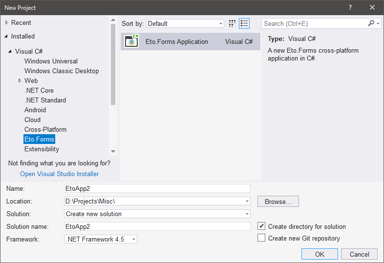
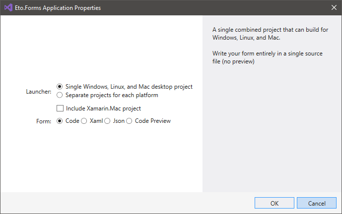
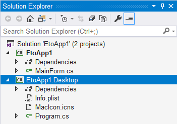
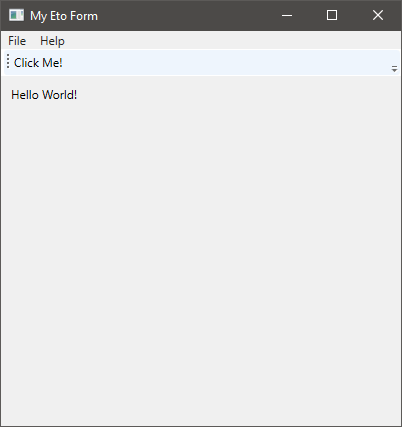

### Eto.Forms

Eto.Forms — опенсорсный кроссплатформенный фреймворк для создания пользовательского интерфейса десктопных и мобильных приложений.

GitHub: https://github.com/picoe/Eto, NuGet: https://www.nuget.org/packages/Eto.Forms/.

Лучше установить специальное расширение для Visual Studio, которое добавляет соответствующие шаблоны проектов, но при желании можно обойтись без него.

Код простейшего приложения на Eto.Forms выглядит примерно так:

```csharp
using Eto.Forms;
using Eto.Drawing;
 
public class MyForm : Form
{
    public MyForm ()
    {
        Title = "My Cross-Platform App";
        ClientSize = new Size(200, 200);
        Content = new Label { Text = "Hello World!" };
    }
     
    [STAThread]
    static void Main()
    {
        new Application().Run(new MyForm());
    }
}
```

Шаблонов не то, чтобы очень много



Да и вопросов они задают немного:



Вот какой проект генерирует шаблон:



**Program.cs**

```csharp
using System;
using Eto.Forms;
using Eto.Drawing;
 
namespace EtoApp1.Desktop
{
    class Program
    {
        [STAThread]
        static void Main(string[] args)
        {
            new Application(Eto.Platform.Detect).Run(new MainForm());
        }
    }
}
```

**MainForm.cs**

```csharp
using System;
using Eto.Forms;
using Eto.Drawing;
 
namespace EtoApp1
{
    public partial class MainForm : Form
    {
        public MainForm()
        {
            Title = "My Eto Form";
            ClientSize = new Size(400, 350);
 
            Content = new StackLayout
            {
                Padding = 10,
                Items =
                {
                    "Hello World!",
                    // add more controls here
                }
            };
 
            // create a few commands that can be used for the menu and toolbar
            var clickMe = new Command
            {
                MenuText = "Click Me!",
                ToolBarText = "Click Me!"
            };
            clickMe.Executed += (sender, e)
                => MessageBox.Show(this, "I was clicked!");
 
            var quitCommand = new Command
            {
                MenuText = "Quit",
                Shortcut = Application.Instance.CommonModifier | Keys.Q
            };
            quitCommand.Executed += (sender, e)
                => Application.Instance.Quit();
 
            var aboutCommand = new Command { MenuText = "About..." };
            aboutCommand.Executed += (sender, e)
                => new AboutDialog().ShowDialog(this);
 
            // create menu
            Menu = new MenuBar
            {
                Items =
                {
                    // File submenu
                    new ButtonMenuItem
                    {
                        Text = "&File",
                        Items = { clickMe }
                    },
                    // new ButtonMenuItem
                    //{
                    //    Text = "&Edit",
                    //    Items = { /* commands/items */ }
                    // },
                    // new ButtonMenuItem
                    //{
                    //    Text = "&View",
                    //    Items = {/* commands/items */ }
                    //},
                },
                ApplicationItems =
                {
                    // application (OS X) or file menu (others)
                    new ButtonMenuItem { Text = "&Preferences..." },
                },
                QuitItem = quitCommand,
                AboutItem = aboutCommand
            };
 
            // create toolbar
            ToolBar = new ToolBar { Items = { clickMe } };
        }
    }
}
```

Вот как выглядит то, что получается в итоге.



