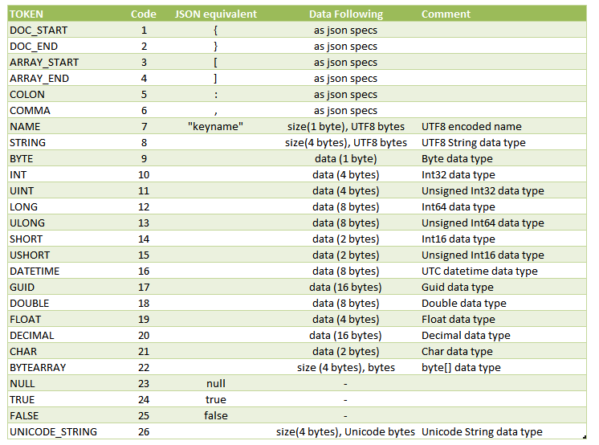

### FastBinaryJSON

Строго говоря, это не совсем JSON, однако, библиотечка любопытная.

* CodePlex: http://fastbinaryjson.codeplex.com/
* Github : https://github.com/mgholam/fastBinaryJSON
* NuGet: https://www.nuget.org/packages/fastBinaryJSON/
* Статья на CodeProject: http://www.codeproject.com/Articles/345070/fastBinaryJSON (на всякий случай, в виде PDF: fastBinaryJSON.pdf)

Типичный код:

```csharp
// объект в массив байтов
byte[] bytes = fastBinaryJSON.BJSON.ToJSON(obj);
// оптимизированный датасет, строки в Unicode
byte[] bytes = fastBinaryJSON.BJSON.ToJSON(obj, true, true);
 
// массив байт в объект
object obj = fastBinaryJSON.BJSON.ToObject(bytes);
// типизированная версия
SalesInvoice obj = fastBinaryJSON.BJSON.ToObject<SalesInvoice>(bytes);
```

Формат файла:




