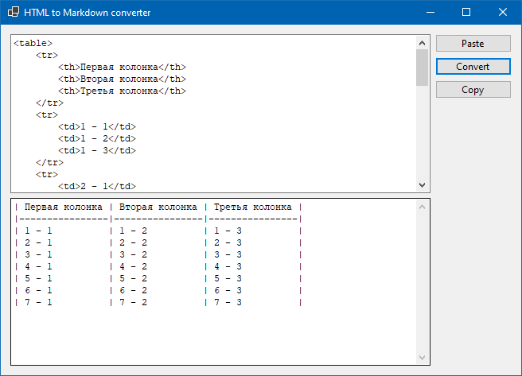

### Библиотека HtmlAgilityPack

Библиотека [HtmlAgilityPack](https://html-agility-pack.net/) сущеcтвует уже очень давно, но написать о ней я сподобился только сейчас.

Что дает эта библиотека? Возможность легко и просто разбирать HTML-разметку, например, с целью парсинга сайтов. Недавно мне понадобилось преобразовывать скопированные с сайта таблицы в формат Markdown.



С помощью HtmlAgilityPack эта задача решается элементарно:

```c#
private static string Convert
    (
        string html
    )
{
    int SafeGet (IList<int> list, int index, int value)
    {
        for (var i = list.Count; i <= index; i++)
        {
            list.Add (value);
        }
 
        return list[index];
    }
     
    bool IsTableCell (HtmlNode node)
    {
        var name = node.Name.ToLowerInvariant();
        return name == "th" || name == "td";
    }
     
    var result = new StringBuilder();
 
    var document = new HtmlDoc();
    document.LoadHtml (html);
 
    var tables = document.DocumentNode.Descendants ("table");
    var firstTable = true;
    foreach (var table in tables)
    {
        if (!firstTable)
        {
            // добавляем перевод строки перед второй
            // и последующими таблицами
            result.AppendLine();
        }
         
        firstTable = false;
         
        var rows = table.Descendants ("tr");
        var firstRow = true;
        var columnWidth = new List<int>();
        foreach (var row in rows)
        {
            // мы будем проходиться по этим ячейкам дважды
            var cells = row.Descendants().Where (IsTableCell)
                .ToArray();
            result.Append ('|');
            var index = 0;
            foreach (var cell in cells)
            {
                var cellText = cell.InnerText;
                var textLength = SafeGet (columnWidth, index++, cellText.Length + 2);
 
                result.Append (' ');
                result.Append (cellText.PadRight(textLength - 2));
                result.Append (' ');
                result.Append ('|');
            }
             
            result.AppendLine();
 
            index = 0;
            if (firstRow)
            {
                result.Append ('|');
                foreach (var _ in cells)
                {
                    var filler = new string ('-', columnWidth[index++]) + "|";
                    result.Append (filler);
                }
 
                result.AppendLine();
                firstRow = false;
            }
        }
    }
 
    return result.ToString();
     
}
```

#### * * *

Библиотека интуитивно понятна, это очень радует.

```c#
// загрузка документа из файла
var doc = new HtmlDocument();
doc.Load (filePath);
 
// из строки
var doc = new HtmlDocument();
doc.LoadHtml (html);
 
// прямо с сайта
var url = "http://html-agility-pack.net/";
var web = new HtmlWeb();
var doc = web.Load (url);
 
// отбор узлов с помощью XPath
var value = doc.DocumentNode
 .SelectNodes ("//td/input")
 .First()
 .Attributes["value"].Value;
  
// отбор с помощью LINQ
var nodes = doc.DocumentNode.Descendants ("input")
 .Select (y => y.Descendants()
 .Where (x => x.Attributes["class"].Value == "box"))
 .ToList();
 
// доступ к тексту в узлах
var innerHtml = doc.DocumentNode.InnerHtml;
var innerText = doc.DocumentNode.InnerText;
 
// добавление узлов в документ
var body = doc.DocumentNode.SelectSingleNode ("//body");    
var newNode = HtmlNode.CreateNode ("<h2> This is h2 heading</h2>");
body.AppendChild (newNode);
```
