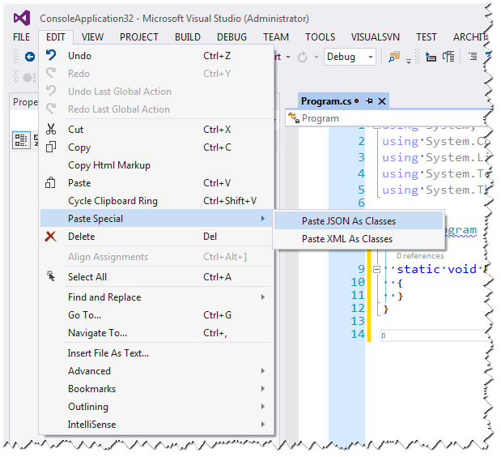
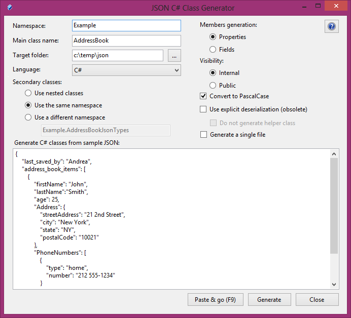

### JSON

#### JSONPath в Json.Net

Замечательная библиотека Json.NET поддерживает запросы к объектам в стиле JsonPath:

```csharp
using System;
using System.Collections.Generic;
 
using Newtonsoft.Json.Linq;
 
class Program
{
    static void Main()
    {
        JObject o = JObject.Parse(@"{
  ""Manufacturers"": [
    {
      ""Name"": ""Acme Co"",
      ""Products"": [
        {
          ""Name"": ""Anvil"",
          ""Price"": 50
        }
      ]
    },
    {
      ""Name"": ""Contoso"",
      ""Products"": [
        {
          ""Name"": ""Elbow Grease"",
          ""Price"": 99.95
        },
        {
          ""Name"": ""Headlight Fluid"",
          ""Price"": 4
        }
      ]
    }
  ]
}");
        var acme = o.SelectToken("$.Manufacturers[?(@.Name == 'Acme Co')]");
        Console.WriteLine(acme);
 
        // Напечатает:
        //{
        //  "Name": "Acme Co",
        //  "Products": [
        //    {
        //      "Name": "Anvil",
        //      "Price": 50
        //    }
        //  ]
        //}
 
        IEnumerable<JToken> pricyProducts 
            = o.SelectTokens("$..Products[?(@.Price >= 50)].Name");
        foreach (JToken item in pricyProducts)
        {
            Console.WriteLine(item);
        }
 
        // Напечатает:
        // Anvil
        // Elbow Grease
    }
}
```

JsonPath аналогичен XPath. Синтаксис XPath легко трансформируется в JsonPath. Так, выражение XPath

```
/store/book[1]/title
```

интуитивно преобразуется в

```
$.store.book[0].title
```

что эквивалентно выражению на C#:

```csharp
o["store"]["book"][0]["title"]
```

Вот табличка соответствия синтаксиса JsonPath и XPath:

| XPath | JSONPath | Описание |
|-------|----------|----------|
| / | $ | Корень, корневой объект/элемент |
| . | @  | Текущий объект-элемент |
| / | . или [] | Прямой потомок |
| .. | n/a | Родитель |
| // | .. | Рекурсивный потомок |
| *  | * | wildcard - любой элемент/объект независимо от его имени |
| @ | n/a | Доступ к атрибуту |
| [] | [] | Доступ по индексу |
| \| | [,] | Объединение запросов, например, использование альтернативного имени или индекса |
| n/a | [start:end:step] | Срез массива |
| [] | ?() | Фильтр (скрипт) |
| n/a | () | Некий скрипт |
| () | n/a | Группировка |

 
Примеры перевода XPath в JSONPath:

| XPath | JSONPath | Описание |
|-------|----------|----------|
| /store/book/author | $.store.book[\*].author | Все авторы книг в магазине |
| //author | $..author | Вообще все авторы |
| /store/\* | $.store.\* | Все товары в магазине, в том числе книги и красный велосипед |
| //store//price | $.store..price | Цены всех товаров в магазине |
| //book[3] | $..book[2] | Третья книга |
| //book[last()] | $..book[@.length-1] <br/>или<br/> $..book[-1:] | Последняя книга в заказе |
| //book[position()&lt;3] | $..book[0,1] | Первые две книги |
| //book[isbn] | $..book[?(@.isbn)] | Все книги, имеющие ISBN |
| //book[price&lt;10] | $..book[@.price&lt;10] | Все книги дешевле 10 монет |
| \* | $..\* | Вообще все элементы JSON-структуры |

#### Класс C# из JSON-объекта

Допустим, у нас есть некоторый «развесистый» JSON-объект, например, такой:

```
{
    "glossary": {
        "title": "example glossary",
        "GlossDiv": {
            "title": "S",
            "GlossList": {
                "GlossEntry": {
                    "ID": "SGML",
                    "SortAs": "SGML",
                    "GlossTerm": "Standard Generalized Markup Language",
                    "Acronym": "SGML",
                    "Abbrev": "ISO 8879:1986",
                    "GlossDef": {
                        "para": "A meta-markup language, used to create markup languages such as DocBook.",
                        "GlossSeeAlso": ["GML", "XML"]
                    },
                    "GlossSee": "markup"
                }
            }
        }
    }
}
```

Нам нужно превратить его в обычный строго типизированный класс C#. Как сделать это с наименьшими трудозатратами, желательно (полу)автоматически? Оказывается, проблема уже решена программистами Microsoft, т. к. они, видимо, тоже устали набирать классы вручную. 🙂 В Visual Studio 2013 достаточно создать новый файл с расширением cs и задействовать пункт меню «EDIT -> Paste Special -> Paste JSON as Classes»:



Вот что генерирует Visual Studio по вышеприведённому JSON:

```csharp
public class Rootobject
{
    public Glossary glossary { get; set; }
}
 
public class Glossary
{
    public string title { get; set; }
    public Glossdiv GlossDiv { get; set; }
}
 
public class Glossdiv
{
    public string title { get; set; }
    public Glosslist GlossList { get; set; }
}
 
public class Glosslist
{
    public Glossentry GlossEntry { get; set; }
}
 
public class Glossentry
{
    public string ID { get; set; }
    public string SortAs { get; set; }
    public string GlossTerm { get; set; }
    public string Acronym { get; set; }
    public string Abbrev { get; set; }
    public Glossdef GlossDef { get; set; }
    public string GlossSee { get; set; }
}
 
public class Glossdef
{
    public string para { get; set; }
    public string[] GlossSeeAlso { get; set; }
}
```

В принципе, можно использовать и так, но лучше немного порефакторить:

```csharp
public class RootObject
{
    public Glossary Glossary { get; set; }
}
 
public class Glossary
{
    public string Title { get; set; }
    public GlossDiv GlossDiv { get; set; }
}
 
public class GlossDiv
{
    public string Title { get; set; }
    public GlossList GlossList { get; set; }
}
 
public class GlossList
{
    public GlossEntry GlossEntry { get; set; }
}
 
public class GlossEntry
{
    public string ID { get; set; }
    public string SortAs { get; set; }
    public string GlossTerm { get; set; }
    public string Acronym { get; set; }
    public string Abbrev { get; set; }
    public GlossDef GlossDef { get; set; }
    public string GlossSee { get; set; }
}
 
public class GlossDef
{
    public string Para { get; set; }
    public string[] GlossSeeAlso { get; set; }
}
```

JSON.NET достаточно умна, чтобы правильно распихать элементы по полям, отличающимся лишь регистром символов.

* * *

Можно обойтись без Visual Studio: на CodeProject есть замечательный проект хJSON C# Class Generator](http://jsonclassgenerator.codeplex.com/).



Среди достоинств этой утилиты – способность генерировать имена полей в ПаскалевскойНотации.
