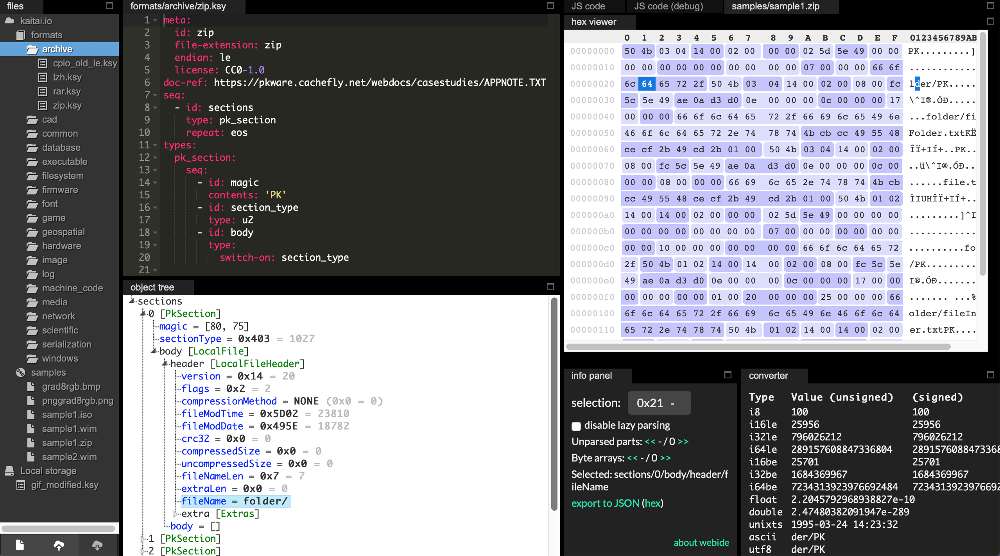
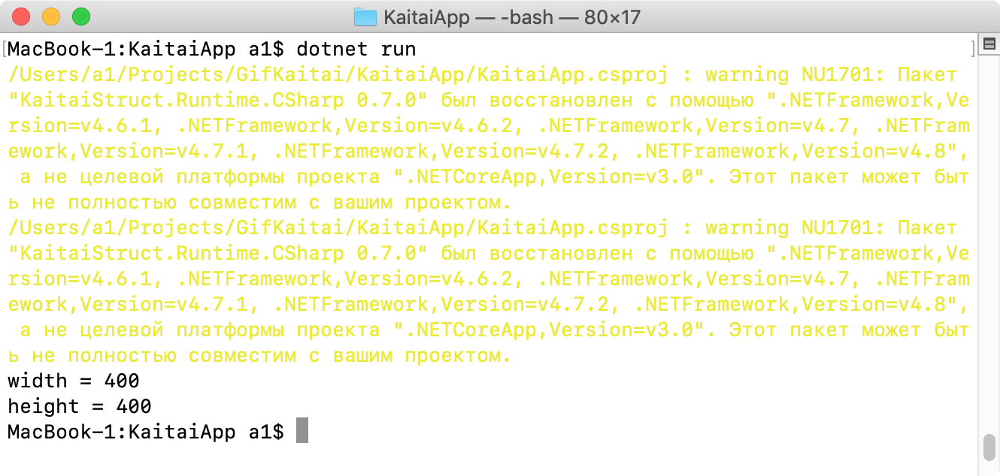
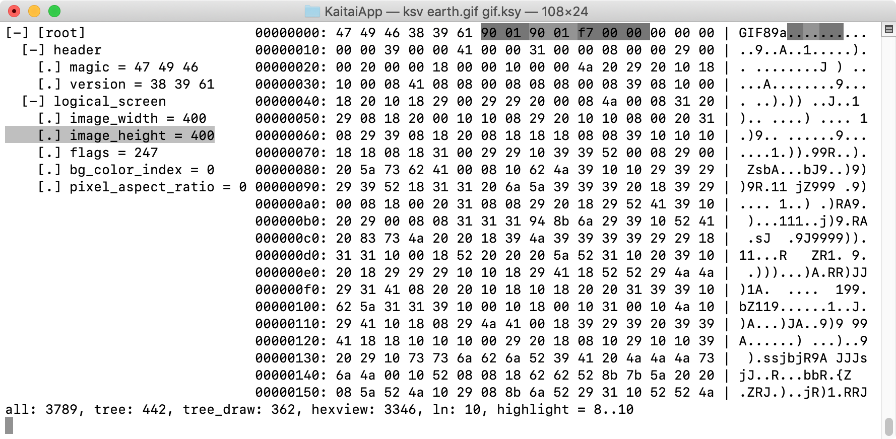

### Kaitai Struct

Читать-писать двоичные файлы довольно морочно, особенно, если это формат обмена данными, и он должен работать для разных языков и платформ. [Проект Kaitai Struct](https://kaitai.io/) призван упростить эту работу. Нужно всего лишь описать двоичный формат, и тогда каждый сможет использовать его на своём языке и на своей платформе.

Идея заключается в том, что формат описывают на специальном языке Kaitai Struct (файл .ksy), а затем компилируют с помощью kaitai struct compiler в исходные файлы на одном из поддерживаемых языков программирования. Эти модули будут содержать сгенерированный код для синтаксического анализатора, который может считывать описанную структуру данных из файла / потока и предоставлять доступ к ней в удобном и понятном API.

Работа с Kaitai Struct предполагает следующие шаги:

1. Описать формат, т. е. создать файл .ksy.
2. С помощью визуализатора убедиться, что описание верно.
3. Скомпилировать файл .ksy в исходный файл целевого языка и включить этот файл в свой проект.
4. Подключить библиотеку Kaitai Struct к своему проекту.
5.Использовать сгенерированные классы для чтения/записи данных.

Пройдёмся по шагам на примере GIF – традиционного формата движущихся картинок в Интернет. Описание на языке Kaitai выглядит так:

```yaml
meta:
  id: gif
  file-extension: gif
  endian: le
seq:
  - id: header
    type: header
  - id: logical_screen
    type: logical_screen
types:
  header:
    seq:
      - id: magic
        contents: 'GIF'
      - id: version
        size: 3
  logical_screen:
    seq:
      - id: image_width
        type: u2
      - id: image_height
        type: u2
      - id: flags
        type: u1
      - id: bg_color_index
        type: u1
      - id: pixel_aspect_ratio
        type: u1
```

Обычный YAML. Тут даже пояснять ничего не надо, настолько интуитивно понятный формат. 🙂

Для удобной разработки KSY-файлов есть специальная [Web IDE](https://ide.kaitai.io/)



Установка компилятора на OS X заключается в волшебном заклинании, после которого всё необходимое само скачивается, компилируется и устанавливается в папку `/usr/local/Cellar/kaitai-struct-compiler/0.8_1`:

```
brew install kaitai-struct-compiler
```

Командная строка компилятора:

```
kaitai-struct-compiler [options] <file>
```

Опции

* `<file>`​ — исходный KSY-файл
* `-t <language>` | `--target <language>` — язык назначения (cpp_stl, csharp, java, javascript, perl, php, python, ruby, all)
  * all сгененировать для всех доступных языков
* `-d <directory>` | `--outdir <directory>` — выходная директория (имена файлов генерируются автоматически)

Специфичные для языка опции:

* `--dotnet-namespace <namespace>` — пространство имён для .NET (только для C#, по умолчанию: Kaitai)
* `--java-package <package>` — пакет Java (по умолчанию: корневой пакет)
* `--php-namespace <namespace>` — пространство имён PHP (по умолчанию без пространства имён)

Прочие опции:

* `--verbose` — «болтливый» режим
* `--help` — показать подсказку и завершиться
* `--version` — показать версию и завершиться

Для вышеприведённого описания GIF был сгенерирован следующий Java-файл:

```java
// This is a generated file! Please edit source .ksy file and use kaitai-struct-compiler to rebuild
 
import io.kaitai.struct.ByteBufferKaitaiStream;
import io.kaitai.struct.KaitaiStruct;
import io.kaitai.struct.KaitaiStream;
import java.io.IOException;
 
public class Gif extends KaitaiStruct {
    public static Gif fromFile(String fileName) throws IOException {
        return new Gif(new ByteBufferKaitaiStream(fileName));
    }
 
    public Gif(KaitaiStream _io) {
        this(_io, null, null);
    }
 
    public Gif(KaitaiStream _io, KaitaiStruct _parent) {
        this(_io, _parent, null);
    }
 
    public Gif(KaitaiStream _io, KaitaiStruct _parent, Gif _root) {
        super(_io);
        this._parent = _parent;
        this._root = _root == null ? this : _root;
        _read();
    }
    private void _read() {
        this.header = new Header(this._io, this, _root);
        this.logicalScreen = new LogicalScreen(this._io, this, _root);
    }
    public static class Header extends KaitaiStruct {
        public static Header fromFile(String fileName) throws IOException {
            return new Header(new ByteBufferKaitaiStream(fileName));
        }
 
        public Header(KaitaiStream _io) {
            this(_io, null, null);
        }
 
        public Header(KaitaiStream _io, Gif _parent) {
            this(_io, _parent, null);
        }
 
        public Header(KaitaiStream _io, Gif _parent, Gif _root) {
            super(_io);
            this._parent = _parent;
            this._root = _root;
            _read();
        }
        private void _read() {
            this.magic = this._io.ensureFixedContents(new byte[] { 71, 73, 70 });
            this.version = this._io.readBytes(3);
        }
        private byte[] magic;
        private byte[] version;
        private Gif _root;
        private Gif _parent;
        public byte[] magic() { return magic; }
        public byte[] version() { return version; }
        public Gif _root() { return _root; }
        public Gif _parent() { return _parent; }
    }
    public static class LogicalScreen extends KaitaiStruct {
        public static LogicalScreen fromFile(String fileName) throws IOException {
            return new LogicalScreen(new ByteBufferKaitaiStream(fileName));
        }
 
        public LogicalScreen(KaitaiStream _io) {
            this(_io, null, null);
        }
 
        public LogicalScreen(KaitaiStream _io, Gif _parent) {
            this(_io, _parent, null);
        }
 
        public LogicalScreen(KaitaiStream _io, Gif _parent, Gif _root) {
            super(_io);
            this._parent = _parent;
            this._root = _root;
            _read();
        }
        private void _read() {
            this.imageWidth = this._io.readU2le();
            this.imageHeight = this._io.readU2le();
            this.flags = this._io.readU1();
            this.bgColorIndex = this._io.readU1();
            this.pixelAspectRatio = this._io.readU1();
        }
        private int imageWidth;
        private int imageHeight;
        private int flags;
        private int bgColorIndex;
        private int pixelAspectRatio;
        private Gif _root;
        private Gif _parent;
        public int imageWidth() { return imageWidth; }
        public int imageHeight() { return imageHeight; }
        public int flags() { return flags; }
        public int bgColorIndex() { return bgColorIndex; }
        public int pixelAspectRatio() { return pixelAspectRatio; }
        public Gif _root() { return _root; }
        public Gif _parent() { return _parent; }
    }
    private Header header;
    private LogicalScreen logicalScreen;
    private Gif _root;
    private KaitaiStruct _parent;
    public Header header() { return header; }
    public LogicalScreen logicalScreen() { return logicalScreen; }
    public Gif _root() { return _root; }
    public KaitaiStruct _parent() { return _parent; }
}
```

Для C# было сгенерировано:

```c#
// This is a generated file! Please edit source .ksy file and use kaitai-struct-compiler to rebuild
 
namespace Kaitai
{
    public partial class Gif : KaitaiStruct
    {
        public static Gif FromFile(string fileName)
        {
            return new Gif(new KaitaiStream(fileName));
        }
 
        public Gif(KaitaiStream p__io, KaitaiStruct p__parent = null, Gif p__root = null) : base(p__io)
        {
            m_parent = p__parent;
            m_root = p__root ?? this;
            _read();
        }
        private void _read()
        {
            _header = new Header(m_io, this, m_root);
            _logicalScreen = new LogicalScreen(m_io, this, m_root);
        }
        public partial class Header : KaitaiStruct
        {
            public static Header FromFile(string fileName)
            {
                return new Header(new KaitaiStream(fileName));
            }
 
            public Header(KaitaiStream p__io, Gif p__parent = null, Gif p__root = null) : base(p__io)
            {
                m_parent = p__parent;
                m_root = p__root;
                _read();
            }
            private void _read()
            {
                _magic = m_io.EnsureFixedContents(new byte[] { 71, 73, 70 });
                _version = m_io.ReadBytes(3);
            }
            private byte[] _magic;
            private byte[] _version;
            private Gif m_root;
            private Gif m_parent;
            public byte[] Magic { get { return _magic; } }
            public byte[] Version { get { return _version; } }
            public Gif M_Root { get { return m_root; } }
            public Gif M_Parent { get { return m_parent; } }
        }
        public partial class LogicalScreen : KaitaiStruct
        {
            public static LogicalScreen FromFile(string fileName)
            {
                return new LogicalScreen(new KaitaiStream(fileName));
            }
 
            public LogicalScreen(KaitaiStream p__io, Gif p__parent = null, Gif p__root = null) : base(p__io)
            {
                m_parent = p__parent;
                m_root = p__root;
                _read();
            }
            private void _read()
            {
                _imageWidth = m_io.ReadU2le();
                _imageHeight = m_io.ReadU2le();
                _flags = m_io.ReadU1();
                _bgColorIndex = m_io.ReadU1();
                _pixelAspectRatio = m_io.ReadU1();
            }
            private ushort _imageWidth;
            private ushort _imageHeight;
            private byte _flags;
            private byte _bgColorIndex;
            private byte _pixelAspectRatio;
            private Gif m_root;
            private Gif m_parent;
            public ushort ImageWidth { get { return _imageWidth; } }
            public ushort ImageHeight { get { return _imageHeight; } }
            public byte Flags { get { return _flags; } }
            public byte BgColorIndex { get { return _bgColorIndex; } }
            public byte PixelAspectRatio { get { return _pixelAspectRatio; } }
            public Gif M_Root { get { return m_root; } }
            public Gif M_Parent { get { return m_parent; } }
        }
        private Header _header;
        private LogicalScreen _logicalScreen;
        private Gif m_root;
        private KaitaiStruct m_parent;
        public Header header { get { return _header; } }
        public LogicalScreen logicalScreen { get { return _logicalScreen; } }
        public Gif M_Root { get { return m_root; } }
        public KaitaiStruct M_Parent { get { return m_parent; } }
    }
}
```

Как говорится, что совой об пень, что пнём об сову – результат примерно одинаковый. Но лично мне больше нравится C#, так что выберем его. Попробуем сделать простое консольное приложение .NET Core для разбора структуры GIF-файла:

```
mkdir KaitaiApp
cd KaitaiApp
dotnet new console
dotnet add package KaitaiStruct.Runtime.CSharp
```

Пишем Program.cs следующего содержания:

```c#
using System;
using Kaitai;
 
namespace KaitaiApp
{
    class Program
    {
        static void Main(string[] args)
        {
            Gif g = Gif.FromFile("earth.gif");
 
            Console.WriteLine("width = " + g.logicalScreen.ImageWidth);
            Console.WriteLine("height = " + g.logicalScreen.ImageHeight);
        }
    }
}
```

Кладём рядом earth.gif, позаимствованный у Википедии, запускаем и видим результат:



GitHub проекта: https://github.com/kaitai-io/kaitai_struct, NuGet: https://www.nuget.org/packages/KaitaiStruct.Runtime.CSharp/

#### Консольный визуализатор

Консольный визуализатор написан на Ruby и устанавливается так:

```
sudo gem install kaitai-struct-visualizer
```

Командная строка для вызова визуализатора:

```
ksv earth.gif gif.ksy
```


