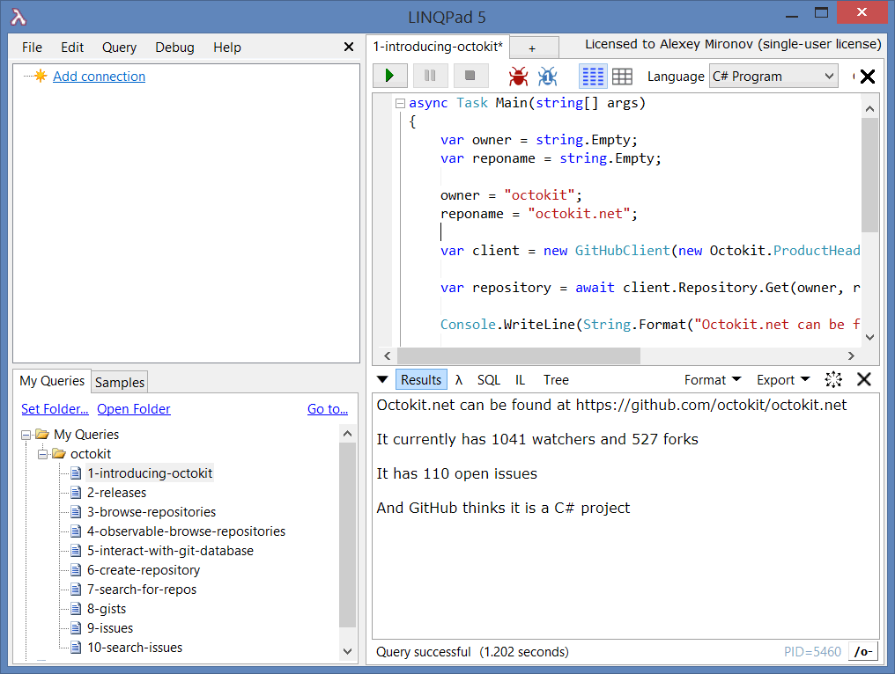
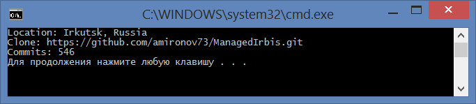

### Octokit - GitHub API

GitHub, как известно, крупнейший хостинг для программистских и не только проектов. По состоянию на апрель с. г. он насчитывал 14 млн. пользователей и 35 млн. проектов. Ко всему этому богатству можно получить доступ как через веб-сайт, так и через API: https://developer.github.com/.

Нас интересует язык C#, для него специально создан проект octokit.net (с открытыми исходниками, что радует): https://github.com/octokit/octokit.net, который опубликован в NuGet: https://www.nuget.org/packages/Octokit/. В исходниках любезно подготовлены примеры для LinqPad, которые можно скопировать в папку «%Documents%\LINQPad Queries» и изучать в интерактивном режиме:



Чтобы получить доступ к API на чтение, нигде не нужно регистрироваться. На запись (например, коммит в репозиторий), само собой, нужно иметь учётку GitHub с соответствующими правами.

Вот пример простой программы, которая выводит на консоль сведения о том, где я живу, какой URL для клонирования проекта ManagedIrbis и сколько в нём всего коммитов:

```csharp
using System;
using System.Collections.Generic;
using System.Linq;
using System.Text;
using System.Threading.Tasks;
 
using Octokit;
 
class Program
{
    static void Main()
    {
        ProductHeaderValue header 
            = new ProductHeaderValue("ConsoleApplication1");
        GitHubClient github = new GitHubClient(header);
 
        User user = github.User.Get("amironov73").Result;
        Console.WriteLine("Location: " + user.Location);
 
        Repository repository
           = github.Repository.Get("amironov73", "ManagedIrbis")
            .Result;
        Console.WriteLine("Clone: " + repository.CloneUrl);
 
        var commits = github.Repository.Commit
            .GetAll(repository.Id).Result;
        Console.WriteLine("Commits: " + commits.Count);
    }
}
```

Вот что получается:



По-моему, очень неплохо.

* * * 

Кроме прочего, официальный клиент GitHub может рендерить Markdown-разметку:

```csharp
string markdown = @"### Header
Mary have a **little** lamb.
 
* sugar;
* salt;
* pepper";
 
string rendered = github.Miscellaneous
            .RenderRawMarkdown(markdown).Result;
Console.WriteLine(rendered);
```
