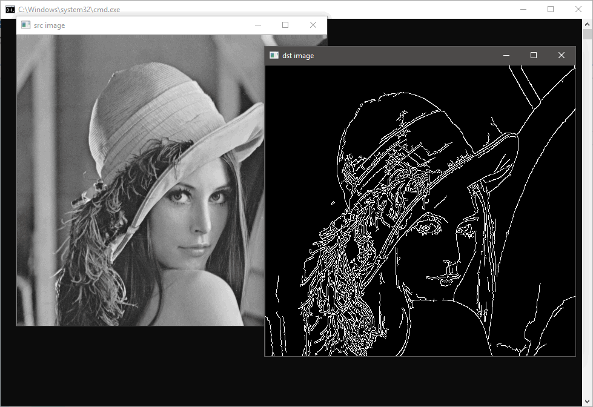

### OpenCvSharp

GitHub: https://github.com/shimat/opencvsharp

NuGet:

* [OpenCV3.3.1 All-in-one package - включает нативные DLL](https://badge.fury.io/nu/OpenCvSharp3-AnyCPU)
* [OpenCV3.3.1 Minimum package](https://badge.fury.io/nu/OpenCvSharp3-WithoutDll)

OpenCV: https://opencv.org/

Документация: https://shimat.github.io/opencvsharp_docs/index.html

```csharp
using OpenCvSharp;

class Program
{
    static void Main()
    {
        Mat src = new Mat("lenna.jpg", ImreadModes.GrayScale);
        Mat dst = new Mat();

        Cv2.Canny(src, dst, 50, 200);
        using (new Window("src image", src))
        using (new Window("dst image", dst))
        {
            Cv2.WaitKey();
        }
    }
}

```



Системные требования:

* OpenCV 3.4.1
* Visual C++ 2017 Redistributable Package
* .NET Framework 2.0 or later / .NET Core 2.0 / Mono

