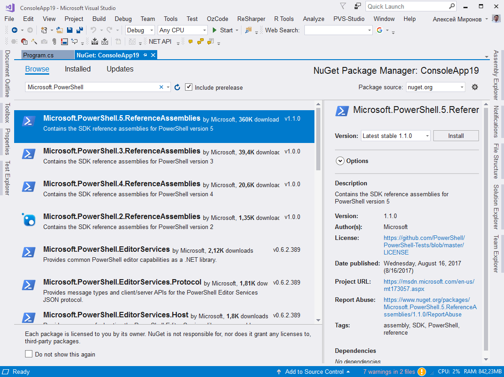
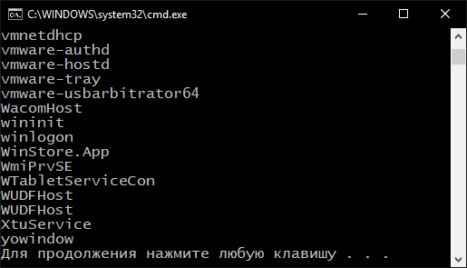

### PowerShell

См. статью https://blogs.msdn.microsoft.com/kebab/2014/04/28/executing-powershell-scripts-from-c/



```csharp
using System;
using System.Management.Automation;

class Program
{
    static void Main()
    {
        using (PowerShell shell = PowerShell.Create())
        {
            shell.AddScript("get-process | foreach {$_.Name}");
            var objects = shell.Invoke();
            foreach (PSObject pso in objects)
            {
                Console.WriteLine(pso);
            }
        }
    }
}
```


