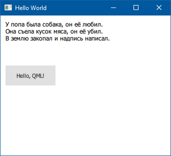

### Библиотека Qml.Net

Как известно, Qt включает в себя новый механизм создания пользовательских интерфейсов — QML. Библиотека Qml.Net позволяет подцепить этот механизм и задействовать в приложениях .NET Standard на платформах Windows, Linux и OSX. Поддерживаются: .NET Framework, .NET Core и Mono.

GitHub: https://github.com/qmlnet/qmlnet, NuGet: https://www.nuget.org/packages/Qml.Net/. Кроме основного пакета необходимо подключить один из следующих: Qml.Net.WindowsBinaries, Qml.Net.OSXBinaries или Qml.Net.LinuxBinaries (содержат соответствующий рантайм Qt 5.10 или выше).



Это окно получается из следующей разметки в файле Main.qml:

```
import QtQuick 2.7
import QtQuick.Controls 2.0
 
ApplicationWindow {
    id: applicationWindow
    visible: true
    width: 340
    height: 280
    title: qsTr("Hello World")
 
    Button {
        x: 10
        y: 100
        width: 100
        height: 40
        text: "Hello, QML!"
    }
 
    Text {
        id: element
        x: 10
        y: 10
        width: 600
        height: 150
        text: qsTr("У попа была собака, он её любил.\nОна съела кусок мяса, он её убил.\nВ землю закопал и надпись написал.")
        font.pixelSize: 12
    }
}
```

Чтобы показать его, достаточно следующего кода:

```csharp
using System;
 
using Qml.Net;
 
class Program
{
    [STAThread]
    static int Main(string[] args)
    {
        using (var app = new QGuiApplication(args))
        {
            using (var engine = new QQmlApplicationEngine())
            {
                engine.Load("Main.qml");
 
                return app.Exec();
            }
        }
    }
}
```

Можно зарегистрировать свой .NET-тип:

```csharp
public class NetObject
{
    public string Prop { get; set; }
 
    public int Add(int value1, int value2)
    {
        return value1 + value2;
    }
}
 
...
 
Qml.RegisterType<YourNetObject>("YourApp", 2, 1);
```

После этого он становится доступным в QML-разметке (в том числе его свойства и методы можно будет вызывать из QML):

```
import YourApp 2.1
 
YourNetObject {
    id: o
    prop: "hello"
    Component.onCompleted: {
        // Outputs "2"
        console.log(o.add(1, 1))
        // Outputs "hello!"
        console.log(o.Prop)
    }
}
```

Кроме того, доступна инфраструктура сигналов и слотов:

```csharp
[Signal("signalName", NetVariantType.String, NetVariantType.Int)]
public class NetObject
{
}
 
// You can raise signals from .NET.
 
public void YourMethod()
{
    netObject.ActivateSignal("signalName", "param", 3);
}
 
// You can attach signal handlers from both .NET and QML.
 
public void YourMethod()
{
    app.AttachToSignal("signalName", new Action<string, int>((param1, param2) =>
    {
        Console.WriteLine("Signal raised!");
    }));
}
```

```
import YourApp 2.1
 
YourNetObject {
    onSignalName: function(param1, param2) {
        console.log("Signal raised!")
    }
}
```