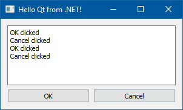

### Библиотека QtSharp

Оказывается, это не столь трудно — совместить Qt с .NET (кто из них конь, а кто лань — решайте сами). Хотя и не без заморочек.



Как было сделано это окно?

1. Устанавливаем 32-битную версию Qt 5.8 для MinGW 5.3.
2. Идём на GitHub и скачиваем релиз QtSharp для нашей версии Qt.
3. Создаём 32-битный проект WinForms для FW 4.5 или выше. Включаем поддержку unsafe.
4. Текст программы см. ниже.
5. Добавляем директорию C:\Qt\5.8\mingw53_32\bin в PATH.
6. Запускаем и наслаждаемся результатом.

```csharp
using System;
 
using QtGui;
using QtWidgets;
 
class Program
{
    [STAThread]
    static unsafe void Main()
    {
        int count = 0;
 
        QApplication app = new QApplication(ref count, null);
        QWidget window = new QWidget();
        window.WindowTitle = "Hello Qt from .NET!";
        window.SetGeometry(300, 150, 300, 150);
        QVBoxLayout vbox = new QVBoxLayout(window);
        QHBoxLayout hbox = new QHBoxLayout();
        QPushButton ok = new QPushButton("OK");
        hbox.AddWidget(ok);
        QPushButton cancel = new QPushButton("Cancel");
        hbox.AddWidget(cancel);
        QPlainTextEdit edit = new QPlainTextEdit();
        vbox.AddWidget(edit);
        vbox.AddLayout(hbox);
        ok.Clicked += b => { edit.AppendPlainText("OK clicked"); };
        cancel.Clicked += b => { edit.AppendPlainText("Cancel clicked"); };
        window.Show();
        QGuiApplication.Exec();
    }
}
```