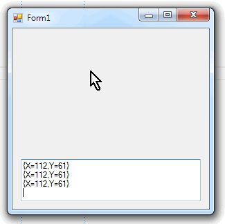

### Reactive Extensions в WinForms

RX можно применить для организации в программе потоков событий, приходящих, например, от компонентов WinForms. В примере ниже организуется поток событий от мыши (координаты при движении) (здесь и далее версия RX-Main 1.0.11226 на десктопном .NET 4.0):



```csharp
using System;
using System.Reactive.Linq;
using System.Windows.Forms;
 
public partial class Form1 : Form
{
    public Form1()
    {
        InitializeComponent();
    }
 
    private void Form1_Load(object sender, EventArgs e)
    {
        var input = Observable
            .FromEventPattern<MouseEventHandler, MouseEventArgs>
                (
                    handler => MouseMove += handler,
                    handler => MouseMove -= handler
                )
            .Select
                (
                    pattern => pattern.EventArgs.Location
                );
        input
            .Throttle(TimeSpan.FromMilliseconds(100))
            .ObserveOn(SynchronizationContext.Current)
            .SubscribeOn(SynchronizationContext.Current)
            .Subscribe
            (
                location => textBox1.AppendText
                    (
                        location + Environment.NewLine
                    )
            );
    }
}
```

Обратите внимание на вызовы Throttle, ObserveOn и SubscribeOn!
