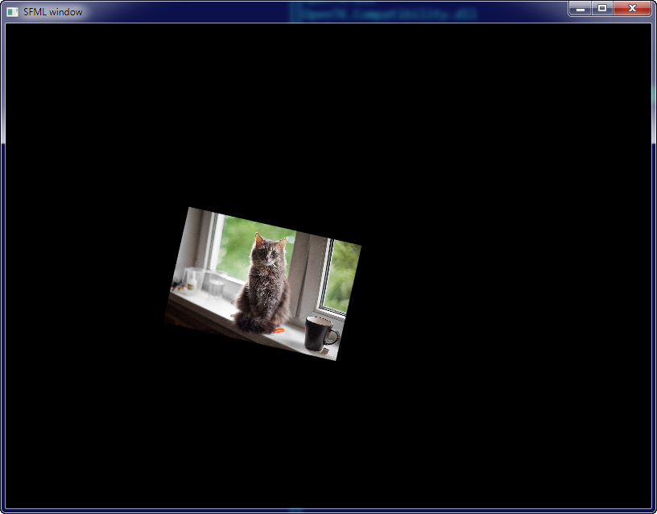

### Simple and Fast Multimedia Library

Это и впрямь простая и быстрая (в плане освоения) мультимедийная библиотека. Свободная кроссплатформенная мультимедийная библиотека, написанная на C++, имеется обёртка для .NET. Представляет собой объектно-ориентированный аналог SDL. SFML содержит ряд модулей для простого программирования игр и мультимедиа приложений. Исходный код библиотеки предоставляется под лицензией zlib/png license.

Домашняя страница: http://www.sfml-dev.org/, NuGet для обёртки: https://www.nuget.org/packages/SFML.Net/, репозиторий GitHub: https://github.com/SFML/SFML.

Содержит модули:

* System — управление временем и потоками, он является обязательным, так как все модули зависят от него;
* Window — управление окнами и взаимодействием с пользователем;
* Graphics — делает простым отображение графических примитивов и изображений, для своей работы требует модуль Window;
* Audio — предоставляет интерфейс для управления звуком;
* Network — для сетевых приложений.
* 
Вики русскоязычная: https://ru.wikipedia.org/wiki/SFML, англоязычная: https://en.wikipedia.org/wiki/Simple_and_Fast_Multimedia_Library

Простое окошко с летающим спрайтом-котиком.



```csharp
using System;
using System.Runtime.InteropServices;
 
using SFML;
using SFML.Graphics;
using SFML.Window;
using SFML.System;
using OpenTK;
using OpenTK.Graphics;
 
static class Program
{
    [STAThread]
    static void Main()
    {
        ContextSettings contextSettings = new ContextSettings ();
        RenderWindow window = new RenderWindow
            (
                new VideoMode(800, 600),
                "SFML window",
                Styles.Default,
                contextSettings
            );
 
        Toolkit.Init();
        GraphicsContext context = new GraphicsContext
            (
                new ContextHandle(IntPtr.Zero), 
                null
            );
 
        window.Closed += new EventHandler(OnClosed);
        window.KeyPressed += new EventHandler<KeyEventArgs>(OnKeyPressed);
 
        Texture texture = new Texture("cuteImage.jpg");
        Sprite sprite = new Sprite(texture)
        {
            Scale = new Vector2f(0.1f, 0.1f),
            Position = new Vector2f(100f,100f)
        };
 
        float deltaX = 0.1f;
        float deltaY = 0.1f;
 
        while (window.IsOpen)
        {
            window.DispatchEvents();
 
            window.Clear();
 
            float x = sprite.Position.X + deltaX;
            float y = sprite.Position.Y + deltaY;
 
            FloatRect bounds = sprite.GetGlobalBounds();
 
            if (bounds.Left <= 0)
            {
                deltaX = Math.Abs(deltaX);
            }
            if ((bounds.Left + bounds.Width) >= window.Size.X)
            {
                deltaX = -Math.Abs(deltaX);
            }
            if (bounds.Top <= 0)
            {
                deltaY = Math.Abs(deltaY);
            }
            if ((bounds.Top + bounds.Height) >= window.Size.Y)
            {
                deltaY = -Math.Abs(deltaY);
            }
 
            sprite.Position = new Vector2f(x, y);
 
            sprite.Rotation += 0.04f;
 
            window.Draw(sprite);
 
            window.Display();
        }
    }
 
    static void OnClosed(object sender, EventArgs e)
    {
        Window window = (Window)sender;
        window.Close();
    }
 
    static void OnKeyPressed(object sender, KeyEventArgs e)
    {
        Window window = (Window)sender;
        if (e.Code == Keyboard.Key.Escape)
            window.Close();
    }
}
```


